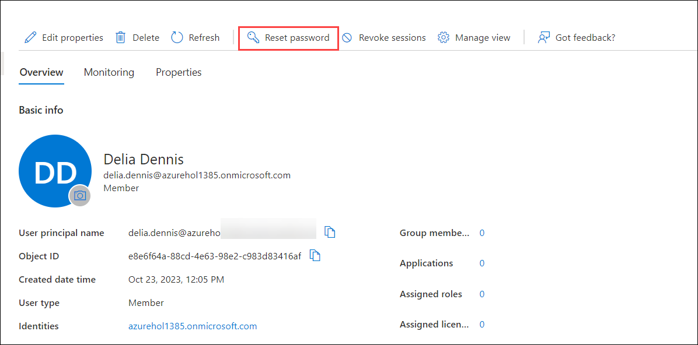
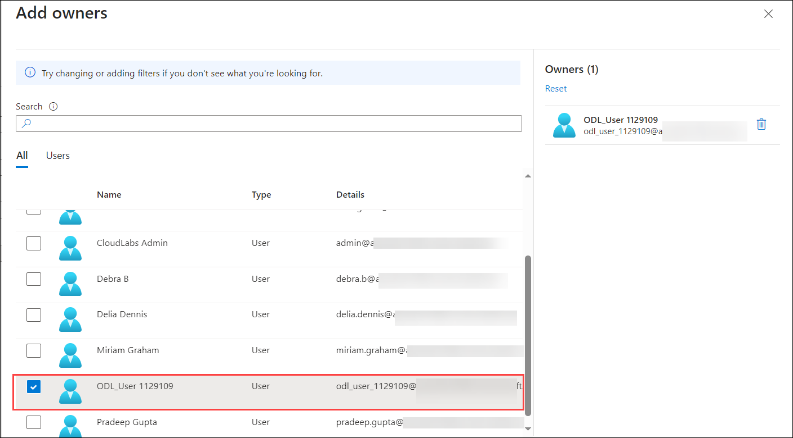
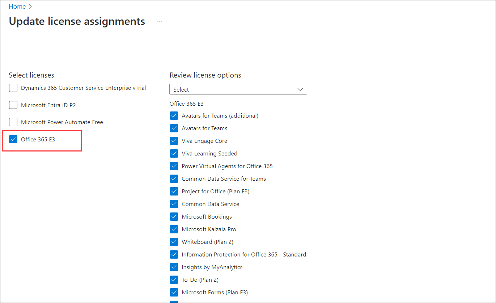
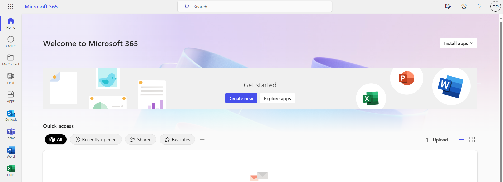
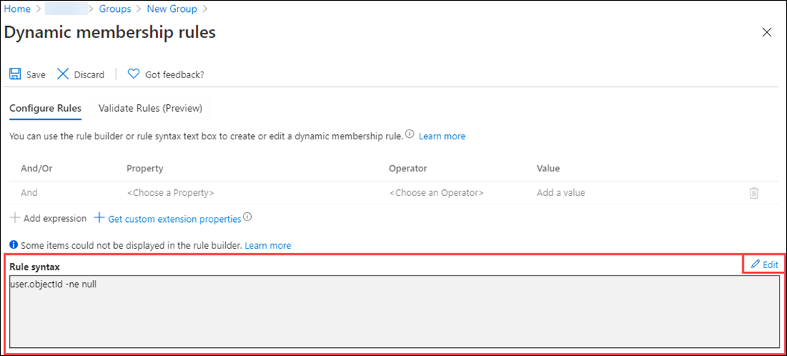

# Lab 03: Assigning licenses using group membership

## Lab scenario

Your organization has decided to use security groups in Azure AD to manage licenses. You need to configure a new security group and assign a license to that group and verify group member license's have been updated.

## Lab Objectives

After completing this lab, you will be able to:

- Create a security group and add a user
- Create a Microsoft 365 group in Microsoft Entra ID
- Creating a dynamic group with all users as members

#### Estimated time: 25 minutes

### Exercise 1 - Create a security group and add a user

#### Task 1 - Check to see if Delia Dennis has access to Office 365
 
1. Launch a new InPrivate browser window.
2. Connect to [https://www.office.com](https://www.office.com).
3. Select Sign in and connect as Delia Dennis.

   | **Setting**| **Value**|
   | :--- | :--- |
   | Username | DeliaD@`your domain name.com`|
   | Password| Enter the password for Delia Dennis|

   >**Note:** To find the username for Delia Dennis, login to the Azure portal using the credentials given in the Environment Details page and navigate to the Users section of the Microsoft Entra ID, and copy the user name.

   >**Note:** From the Microsoft Entra ID **Users** section,click on **Delia Dennis** user and from the upper tab click on **Reset Password** and copy the temporary password and login to office.com and reset the password to **Pa55w.rd@123**

    

  4. You should connect to the Office.com website, but see a message indicating you don't have a license.

      
    
5. Close the browser window.

#### Task 2 -  Create a security group in Microsoft Entra ID

1. In the search resources tab in the azure portal, type **Microsoft Entra ID** and navigate to it.
2. In the left navigation, under **Manage**, select **Groups**.
3. In the Groups page, on the menu, select **New group**.
4. Create a group using the following information:

   | **Setting**| **Value**|
   | :--- | :--- |
   | Group type| Security|
   | Group name| sg-SC300-O365|
   | Membership type| Assigned|
   | Owners| *Assign your own administrator account as the group owner*|

   

5. Select the **No members selected** text under Members.
6. Select **Delia Dennis** from the list of users.
7. Select the **Select** button.
8. Select the **Create** button.
9. When complete, verify the group named **sg-SC300-O365** is shown in the **All groups** list.

   >**Note:** Kindly click the refresh button if you are not able to see the newly created group.
   
     > **Congratulations** on completing the task! Now, it's time to validate it. Here are the steps:
     > - Navigate to the Lab Validation Page, from the upper right corner in the lab guide section.
     > - Hit the Validate button for the corresponding task. If you receive a success message, you can proceed to the next task. 
     > - If not, carefully read the error message and retry the step, following the instructions in the lab guide.
     > - If you need any assistance, please contact us at labs-support@spektrasystems.com. We are available 24/7 to help


#### Task 3 - Assign a license to a group

1. In the **All groups** list, select **sg-SC300-O365**.
2. In the Marketing page, under **Manage**, select **Licenses**.
3. On the menu, select **+ Assignments**.
4. In the update license assignments page, under **Select licenses**, review the list of available licenses and then select the check box for **Office 365 E3**.

   **Tip** - When multiple licenses are selected, you can use the Review license options menu to select a specific license and view the license option for that license.

   

6. Select **Save**.

#### Taks 4 - Confirm the Office 365 license

1. Launch a new InPrivate browser window.
2. Connect to [https://www.office.com](https://www.office.com).
3. Select Sign in and connect as Delia Dennis.

   | **Setting**| **Value**|
   | :--- | :--- |
   | Username | DeliaD@`your domain name.com`|
   | Password| **Pa55w.rd@123** |

   >**Note:** To find the username for Delia Dennis, login to the Azure portal and navigate to the Users section of the Microsoft Entra ID, and copy the user name.

4. You should connect to the Office.com website, and see no messages regarding license. All of the Office applications are available on the left.

   
    
5. Close the browser window. 

### Exercise 2 - Create a Microsoft 365 group in Microsoft Entra ID

#### Task 1 - Create the group

Part of your duties as an Azure AD administrator is to create different types of groups. You need to create a new Microsoft 365 group for your organization's sales department.

1. From the Azure portal, navigate to **Microsoft Entra ID**

2. In the left navigation, under **Manage**, select **Groups**.

3. In the Groups page, on the menu, select **New group**.

4. Create a group using the following information:

   | **Setting**| **Value**|
   | :--- | :--- |
   | Group type| Microsoft 365|
   | Group name| Northwest Sales|
   | Membership type| Assigned|
   | Owners| *Assign your own administrator account as the group owner*(ODL user account)|
   | Members| **Alex Wilber** and **Bianca Pisani**|

   

5. When complete, verify the group named **Northwest sales** is shown in the **All groups** list.

     > **Congratulations** on completing the task! Now, it's time to validate it. Here are the steps:
     > - Navigate to the Lab Validation Page, from the upper right corner in the lab guide section.
     > - Hit the Validate button for the corresponding task. If you receive a success message, you can proceed to the next task. 
     > - If not, carefully read the error message and retry the step, following the instructions in the lab guide.
     > - If you need any assistance, please contact us at labs-support@spektrasystems.com. We are available 24/7 to help

### Exercise 3 - Creating a dynamic group with all users as members

#### Task 1 - Create the dynamic group

As your company grows, manually group management is too time consuming. Since standardizing the directory, you can now take advantage of dynamic groups. You must create a new dynamic group to ensure you're ready for dynamic group creation in production.

1. Sign in to the [https://portal.azure.com](https://portal.azure.com) with an account that is assigned the Global administrator or User administrator role in the tenant.

2. Select **Microsoft Entra ID**.

3. Under **Manage**, select **Groups**, and then select **New group**.

4. On the New Group page, under **Group type**, select **Security**.

5. In the **Group name** box, enter **SC300-myDynamicGroup**.

6. Select the **Membership type** menu and then select **Dynamic User**.

7. Select an **Owner** for the group(ODL user account).

7. Under **Dynamic user members**, select **Add dynamic query**.

8. On the right above the **Rule syntax** box, select **Edit**.

9. In the Edit rule syntax pane, enter the following expression in the **Rule syntax** box:

   ```powershell
   user.objectid -ne null
   ```

   **Warning** - the `user.objectid` is case sensitive.

   

10. Select **Save**. The new dynamic group will now include B2B guest users as well as member users.

11. On the New group page, select **Create** to create the group.

#### Task 2 - Verify the members have been added

**Note** - The population of Dynamic group membership may take up to 15 minutes.

1. Select on the **Home** `Microsoft Entra ID`.
2. Launch **Microsoft Entra ID**.
3. In the **Manage** menu Select on **Groups**.
4. In the filter box type **SC300** and your newly created group will be listed.
5. Select on **SC300-myDynamicGroup** to open the group.
6. Notice that it shows that it contains **Direct members**.
7. Select on **Members** in the **Manage** menu.
8. Review the members.

#### Task 3 - Experiment with alternate rules (Optional)

1. Try making a group with only **Guest** users:

   - (user.objectid -ne null) and (user.userType -eq "Guest")

2. Try make a group with only **Members** of the Azure AD users.

   - (user.objectid -ne null) and (user.userType -eq "Member")

### Review

In this lab you have completed the following tasks:
- Created a security group and add a user
- Created a Microsoft 365 group in Microsoft Entra ID
- Created a dynamic group with all users as members

## You have successfully completed the lab
