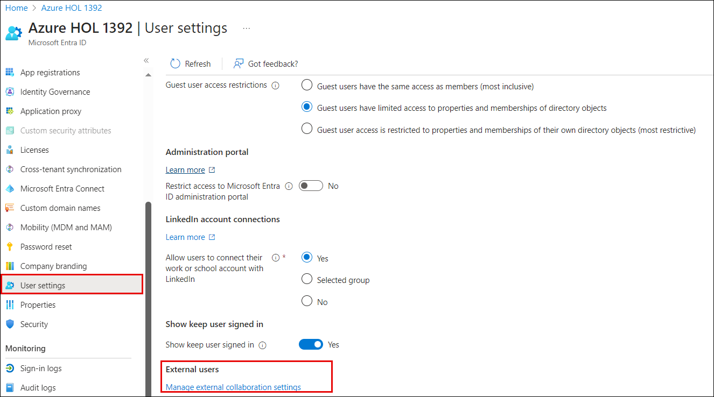
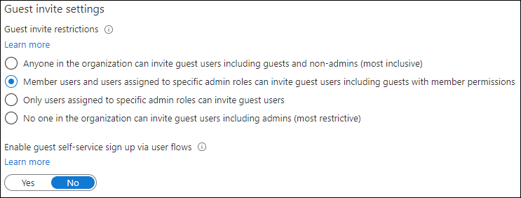

# Lab 04: Configure external collaboration settings

## Lab scenario

You must enable external collaboration settings for your organization for approved guests access.

## Lab scenario

After completing this lab, you will be able to:
- Task 1 - Enable Guest Users to perform self service sign-up
- Task 2 - Configure external collaboration settings
  
#### Estimated timing: 5 minutes

## Architecture Diagram

### Exercise 1 - Allowing guest users to be invited into your organization

#### Task 1 - Enable Guest Users to perform self service sign-up

1. Sign in to the [https://portal.azure.com](https://portal.azure.com) as a tenant administrator.
2. Select **Microsoft Entra ID**.
3. Select **User Settings**.
4. Scroll down and under **External Users** select **Manage external user collaboration settings**.

   

6. Ensure that **YES** is marked for the setting **Enable guest self-service sign up via user flows**.
7. Select **Save** at the top of the screen.

#### Task 2 - Configure external collaboration settings

1. Sign in to the [https://portal.azure.com](https://portal.azure.com) as a tenant administrator.
2. Select **Microsoft Entra ID**.
3. From the left navigation pane, select **External Identities > All identity providers**.

   

4. Select the **Email one-time passcode** notification link you see near the top of the screen.

    **Note** - A one-time passcode is a very secure way to invite a user to join your organization.
    
5. Ensure that **Yes** is selected.
6. Select **Save** if needed.
7. Otherwise, select `Home > Microsoft Entra ID >` **External Identities** to return to the previous screen.
8. Select **External Collaboration Settings** on the left
9. Under **Guest user access**, review access levels that are available and then select **Guest user access is restricted to properties and memberships of their own directory objects (most restrictive)**.

   

    >**NOTE:**
    >- Guest users have the same access as members (most inclusive): This option gives guests the same access to Azure AD resources and directory data as member users.
    >- Guest users have limited access to properties and memberships of directory objects: (Default) This setting blocks guests from certain directory tasks, like enumerating users, groups, or other directory resources. Guests can see membership of all non-hidden groups.
    >- Guest user access is restricted to properties and memberships of their own directory objects (most restrictive): With this setting, guests can access only their own profiles. Guests are not allowed to see other users' profiles, groups, or group memberships.

10. Under **Guest invite settings**,  select **Member users and users assigned to specific admin roles can invite guest users including guests with member permissions**!

    

    >**NOTE:**
    >- Anyone in the organization can invite guest users including guests and non-admins (most inclusive): To allow guests in the organization to invite other guests including those who are not members of an organization, select this radio button.
    >- Member users and users assigned to specific admin roles can invite guest users including guests with member permissions: To allow member users and users who have specific administrator roles to invite guests, select this radio button.
    >- Only users assigned to specific admin roles can invite guest users: To allow only those users with administrator roles to invite guests, select this radio button. The administrator roles include Global Administrator, User Administrator, and Guest Inviter.
    >- No one in the organization can invite guest users including admins (most restrictive): To deny everyone in the organization from inviting guests, select this radio button.
    >- If Members can invite is set to No and Admins and users in the guest inviter role can invite is set to Yes, users in the Guest Inviter role will still be able to invite guests.

11. Under **Collaboration restrictions**, review the available options and accept the default settings.

    >**IMPORTANT:**
    >- You can create either an allow list or a deny list. You can't set up both types of lists. By default, whatever domains are not in the allow list are on the deny list, and vice versa.
    >- You can create only one policy per organization. You can update the policy to include more domains, or you can delete the policy to create a new one.
    >- The number of domains you can add to an allow list or deny list is limited only by the size of the policy. The maximum size of the entire policy is 25 KB (25,000 characters), which includes the allow list or deny list and any other parameters configured for other features.
    >- This list works independently from OneDrive for Business and SharePoint Online allow/block lists. If you want to restrict individual file sharing in SharePoint Online, you need to set up an allow or deny list for OneDrive for Business and SharePoint Online.
    >- The list does not apply to external users who have already redeemed the invitation. The list will be enforced after the list is set up. If a user invitation is in a pending state, and you set a policy that blocks their domain, the user's attempt to redeem the invitation will fail.

12. When finished, **save** your changes.

## Review

In this lab you have completed the following tasks:
- Enabled Guest Users to perform self service sign-up
- Configured external collaboration settings

## You have successfully completed the lab
