# Lab 06: Add a federated identity provider

## Lab scenario

Your company works with many vendors and, on occasion, you need to add some vendor accounts to your directory as a guest and allow them to use their Google account to sign-in.

## Estimated time: 25 minutes

## Lab Objectives

In this lab, you will complete the following tasks:

- Exercise 1 - Configure identity providers
- Exercise 2 - Configure Azure to work with an External identity provider
  
## Architecture Diagram

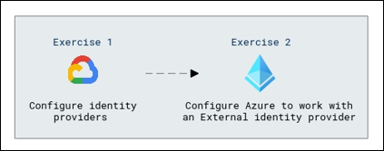

# Exercise 1 - Configure identity providers

In this exercise, you'll configure Google as an identity provider, set it up for authentication, and add a test user to verify the integration and functionality.

### Task 1 - Configure Google to be used as an identity provider

**Important Note** - For this exercise, you will need a Gmail account on Google. You can use your **personnel Gmail account** or  create a **new Google account** and then follow the steps for the exercise.  Be sure to note the email address and password, they are necessary to complete the lab.

   >**Note**: If you are using an existing Gmail account that has Passkeys enable, you will be unable to complete the login processs within the lab environment. Passkey requires BlueTooth, which cannot be enabled through the VM.

1. Open the Microsoft Edge browser and copy and paste the link to go to the Google APIs at https://console.developers.google.com, and sign in with your Google account. We recommend that you use a shared team Google account.

2. Accept the terms of service if you're prompted to do so.

3. Choose **Create Project**.  Leave the remaining fields with the default settings.

   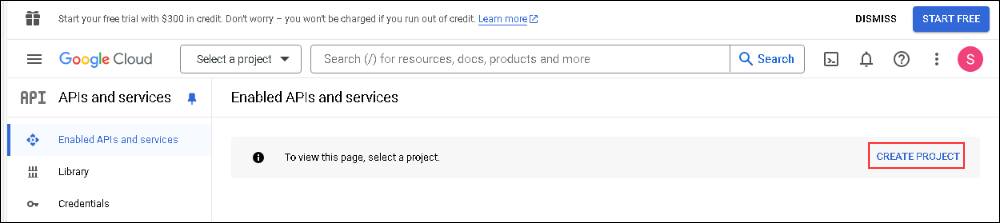 

4. On the New Project page, give the project name **MyB2BApp (1)**, and then select **Create(2)**.

   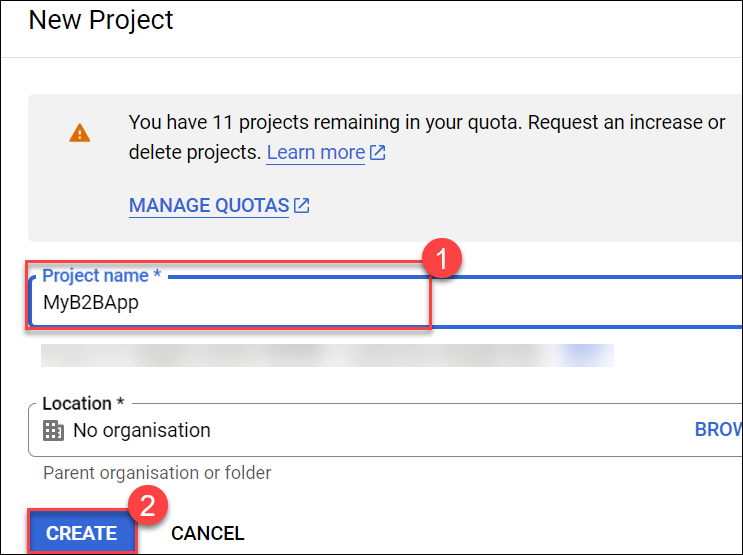

5. Open the new project by selecting the the **Notifications** message box or by using the project menu at the top of the page.

   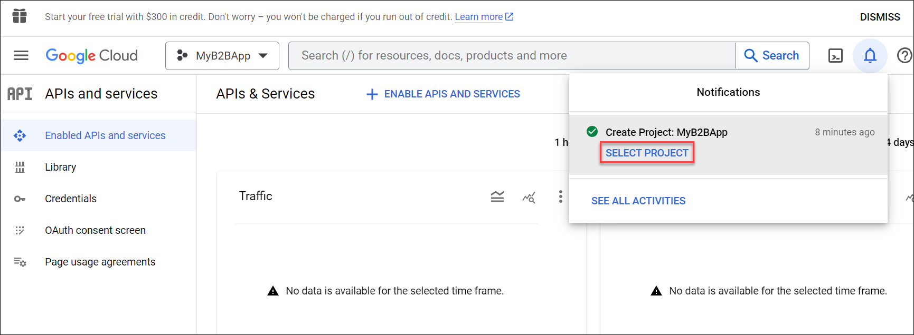

6. In the left menu, under **APIs & Services**, select **OAuth consent screen**.

7. Select the **Get Started** .
   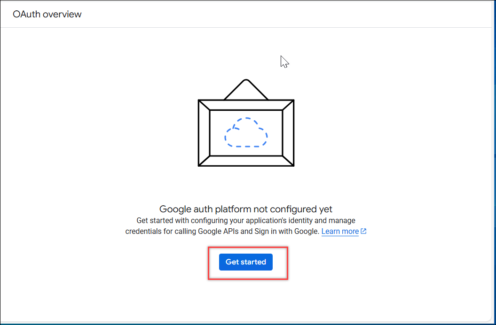

8. On the Application information screen enter the following information:

   | Section | Field Name | Value |
   | :---    | :---    | :---  |
   | 1 App Information | | |
   |            | App name | **Microsoft Entra ID** |
   |            | User support email | Select the email name from the drop down |
   | 2 Audience | | |
   |            | Internal / External | **External** |
   | 3 Contact Information | | |
   |            | Email addresses | Use the same email address as above |
   | 4 Finish | | |
   |            | Agreement | Mark the checkbox |

9. Select the **Create** button to continue.

   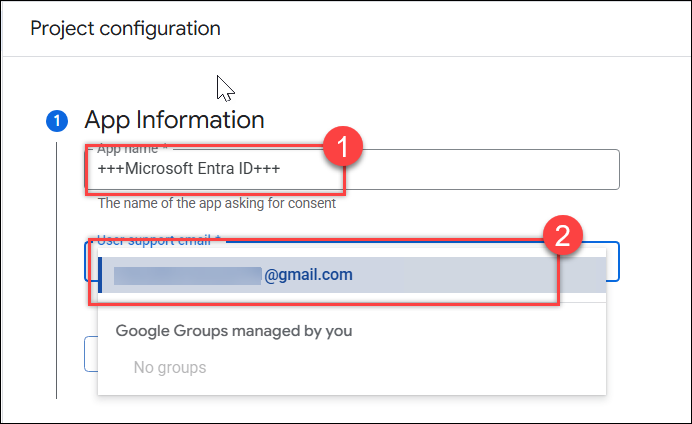

   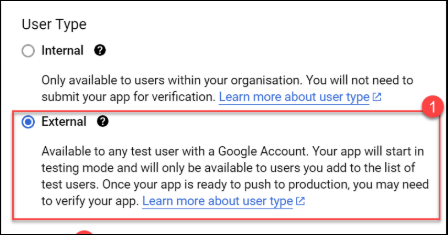

   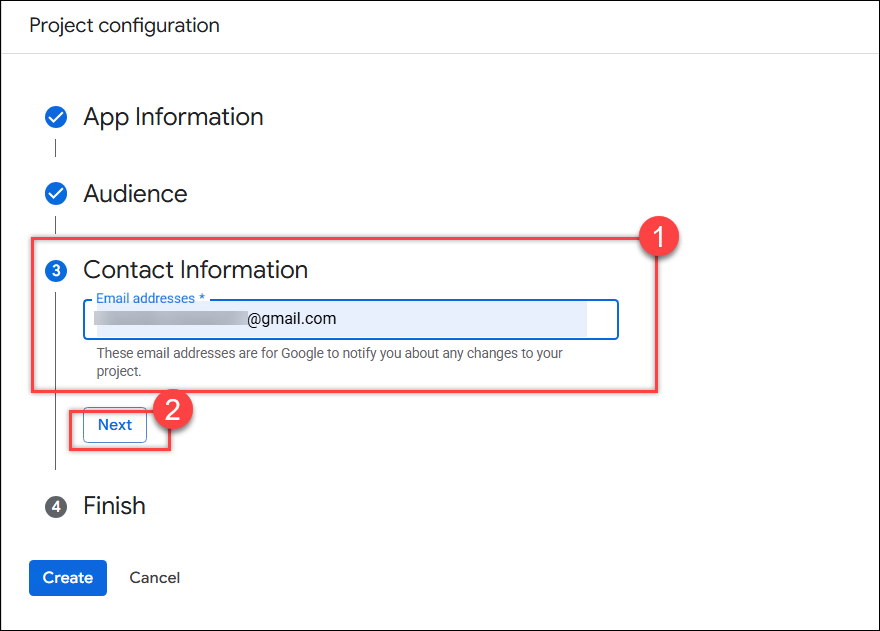

   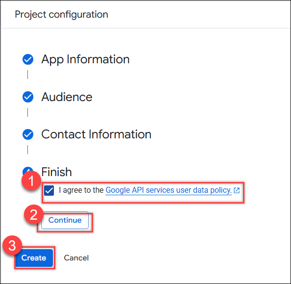

10. Select the **Create OAuth client** button.

11. Click on **Clients (1)** and then Click on the **Creat client (2)**.

    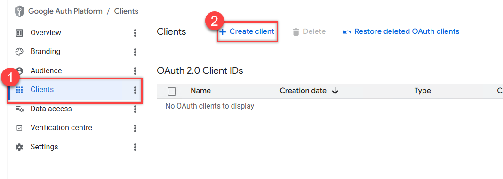

12. Choose **Application type = Web Application**.

    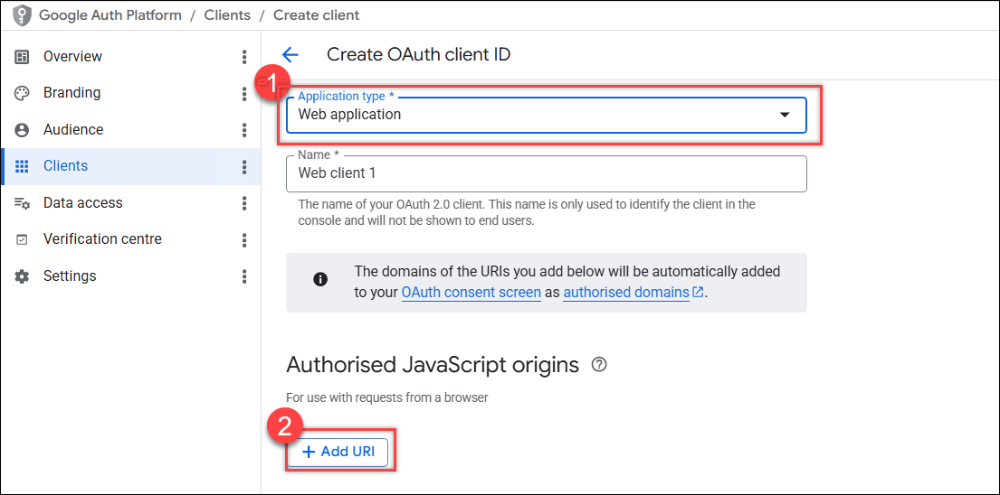

13. Accept the default name for the application.

14. Within the **Authorized JavaScript origins**, select the **+ Add URI** button.

15. Enter the URI **https://microsoftonline.com** for the value.

16. In the Application type menu, select Web application. Give the application a suitable name, **Entra ID B2B**. Under **Authorized redirect URIs**, select **+ ADD URI**, and add the following URIs (select **ADD URI**, after adding each URIs):

      ```
      https://login.microsoftonline.com
      ```

      ```
      https://login.microsoftonline.com/te/**tenant ID**/oauth2/authresp
      ```
      
      ```
      https://login.microsoftonline.com/te/**tenant name**.onmicrosoft.com/oauth2/authresp
      ```
     
      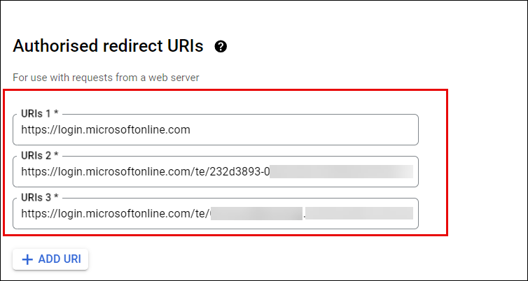 
   
   
      >**Note:** Replace the Tenant ID and Tenant Name with the your Tenant ID and Tenant Name. Go to Azure portal and search for and select **Microsoft Entra ID** in the overview page copy the **Tenant ID** and **Tenant Name**.

      >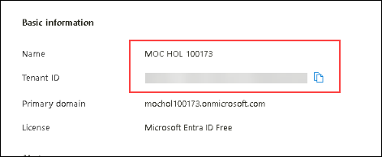 


16. Select **Create**.

17. After creating the client copy your **client ID (1)** and **client secret (2)**. You'll use them when you add the identity provider in the Azure portal. Select **OK**.

    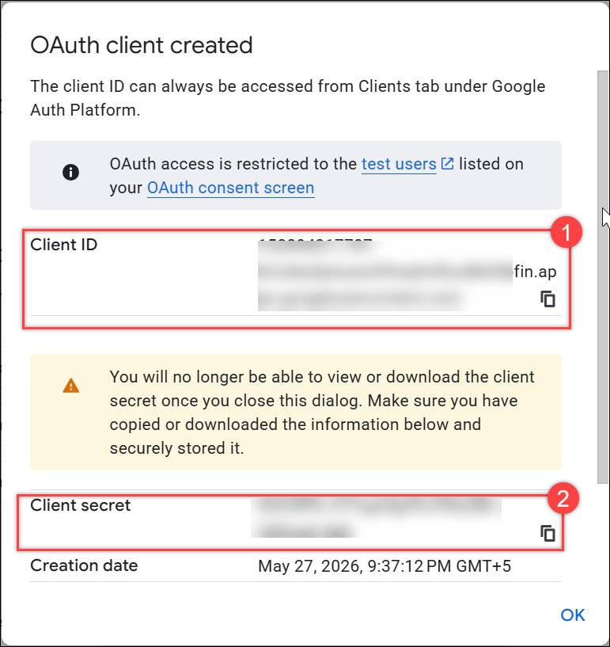 

18. You can leave your project at a publishing status of Testing.

### Task 2 - Add a test user

1. From the menu on the left, select the **Audience (1)** item.

2. In the **Test Users** section of the page, choose **+ Add Users(2)**.

3. Enter the gmail account you are using for this lab **(3)**.

4. Select **Save (4)**.

   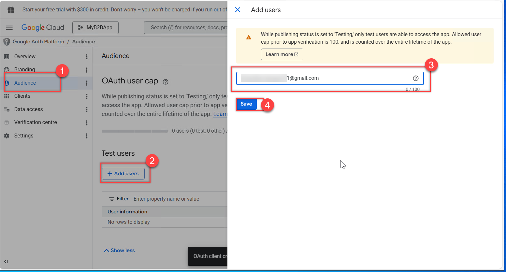

### Task 3 - Add authorized domain to Branding

1. From the menu on the left, select the **Branding** item.

2. Scroll to the very bottom of the page.

3. In the **Authorized domains** section, add the domain **microsoftonline.com**.

4. In the **Developer contact information** add they email address you are using for this lab.

   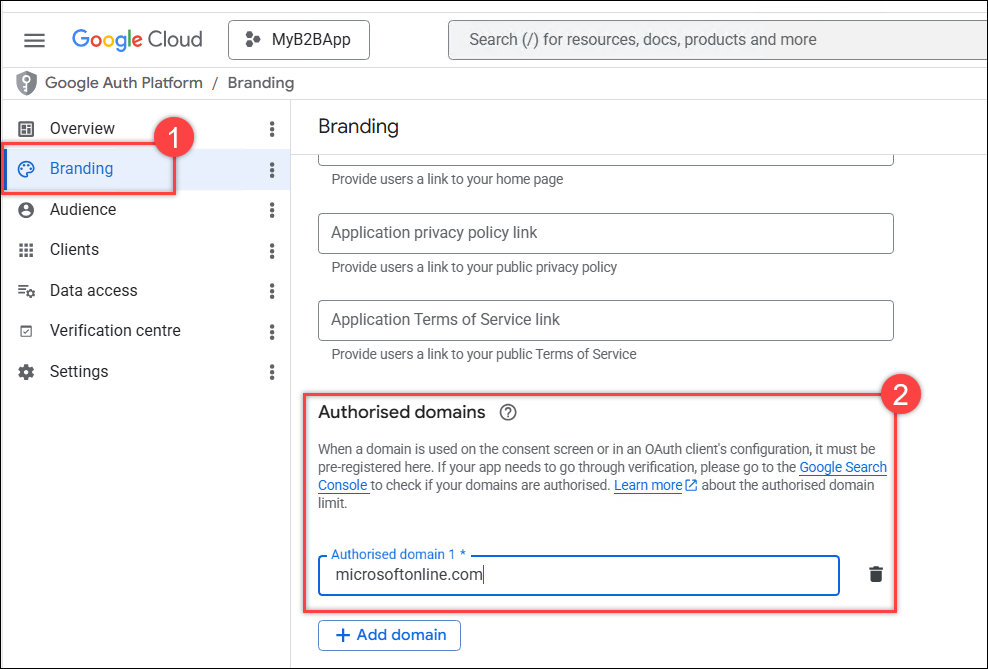


## Exercise 2 - Configure Azure to work with an External identity provider

In this exercise, you'll configure Azure to work with an external identity provider by setting up Microsoft Entra ID for Google federation. You'll invite a test user account, accept the invitation, and log in to Microsoft 365 using your Google account to verify the integration.

   >**Note**: Before stepping into the next task make sure you hold the **Client Id** and **Client secret** of the Client you have created by following the below steps.

1. Click on the **Client (1)** and select the client that you have created like here **Web client 1 (2)**.

    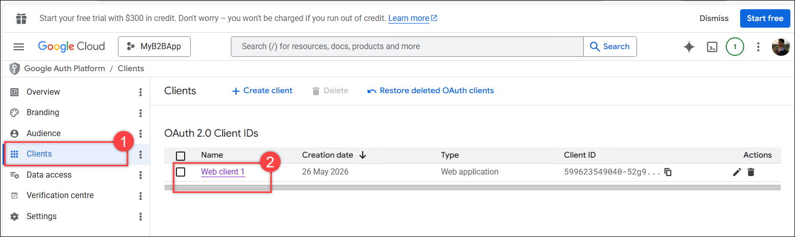

2. Copy the **Client ID (1)** and **Client Secret (2)**. and make them noted in some notepad or document.

    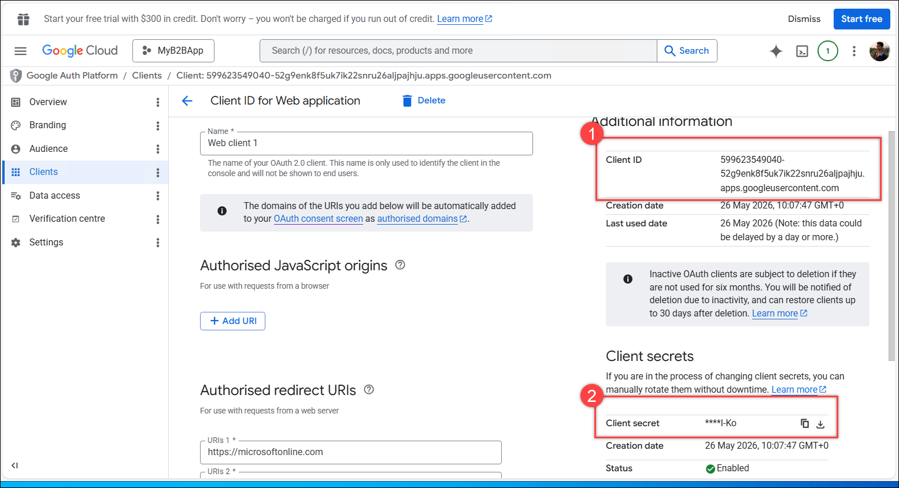

### Task 1 - Configure Microsoft Entra ID for Google federation

1. Sign in to the [https://entra.microsoft.com](https://entra.microsoft.com) as an admin.

2. Select **Microsoft Entra ID**.

3. Under **Entra ID**, select **External Identities (1)**.

4. Choose **All identity providers (2)** from the menu on the left.

5. Microsoft provides a direct federation for **Google** as an identity provider.  This can be initiated by selecting **+ Google (3)** from the **External Identities | All identity providers** page.

   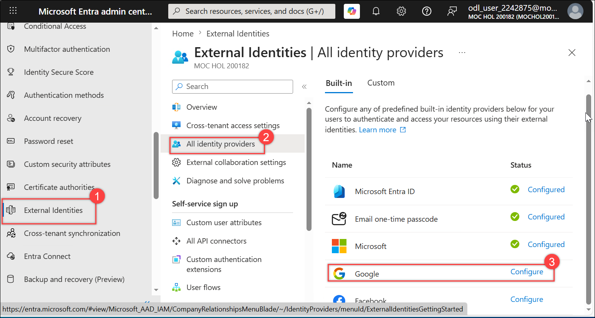 

6. After selecting + Google, another page will open with additional information that is required to configure Google as an identity provider.  

7. Make sure you see **Name (1)** Field as Google. Enter the **Client ID (2)** and **Client secret (3)** you obtained earlier.

8. Select **Save (4)**.

   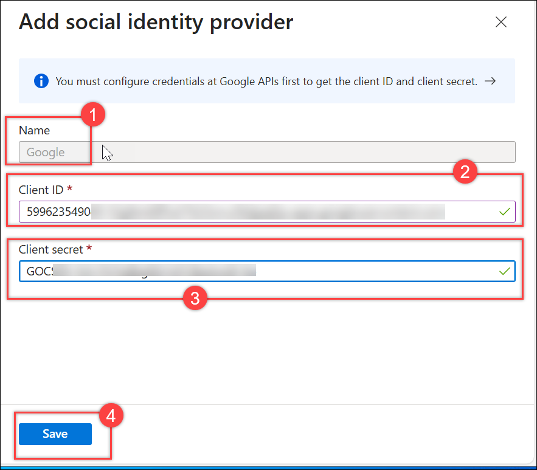

9. This completes the configuration of Google as an identity provider.

### Task 2 - Invite you Test User account

1. If you used an existing Gmail account, remember to delete the account with **External Identities | All identity providers**. You can also return to the Google developer console and delete the project that you created.

2. Open Microsoft Entra ID.

3. Go to Users and select **All users**.

4. Select **+ New User**.

5. Choose **Invite external user** from the dropdown menu.

6. Enter the information for the gmail account you set up as a test user for the Google App in Exercise 1 Task 2.

7. Enter a personal message as you want.

   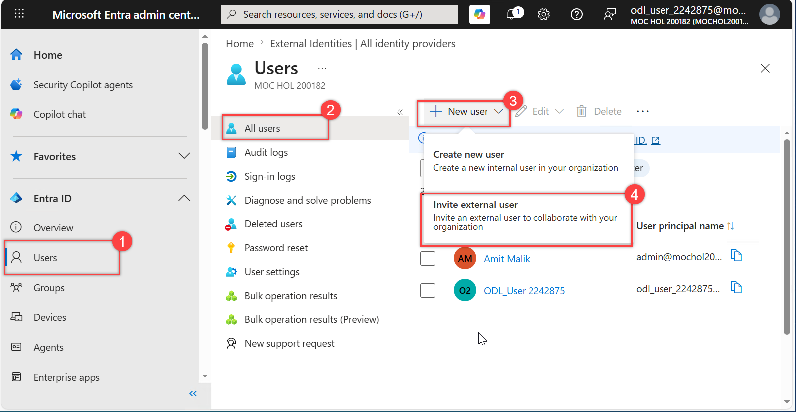

8. Select **Review + Invite** and subsequently click on **Invite**.

    > **Congratulations** on completing the task! Now, it's time to validate it. Here are the steps:
    > - Hit the Validate button for the corresponding task. If you receive a success message, you can proceed to the next task.
    > - If not, carefully read the error message and retry the step, following the instructions in the lab guide. 
    > - If you need any assistance, please contact us at cloudlabs-support@spektrasystems.com. We are available 24/7 to help you out.

     <validation step="7cf29cba-eb1e-4f7d-b267-186788edd5f7" />

### Task 3 - Accept the invitation and login

1. Open an InPrivate browser to log into your gmail account.

2. Open the **Microsoft Invitation on behalf of** in the Inbox.

3. Select the **Accept invitation** link in the message.

4. Enter your username and password as requested in the login dialog (if requested).

   >**NOTE**: If the federation is working correctly, this is where you will see the first results of your new Google External Identity provider.  You will go to the login screen and be able to log in with your gmail credentials.  If the federation is not work, or has not been set up, the user would be sent and ACCOUNT VERIFICATION email after the log in, to confirm the account.  With the federation, no extra verification is needed.

   >**NOTE**: If you get an access error 500, wait about 30 seconds and refresh the page.  Choose to RESUBMIT.  This error is a timing issue only in the lab environment.

5. Read over the new **Permissions requested by:** message that you get.  This message is coming from your Azure Lab Domain.

6. Choose **Accept**.

7. Once login is complete, **My Apps** page will display.

### Task 4 - Login to Microsoft 365 using your Google account

1. Once you have finished the external user invite process of Task 3, you can log directly into Microsoft Online.

2. Open a new tab in the browser you have open.

   >**NOTE** If you did not open a new InPrivate browser in Task 3, you should do so for this step.

3. Enter the following web address:

   ```
   login.microsoftonline.com
   ```

   >**Note:** If you are already signed in with the odl user account,sign out from the top right corner.

4. Click on **Sign in** and choose **Sign in with another account** and subsequently click on **Sign-in options** on the dialog.

   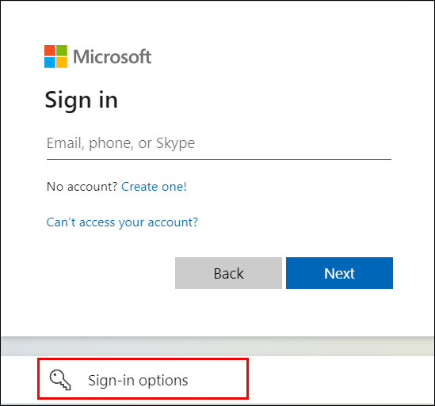
 
5. Choose **Sign in to an organization**.

6. Enter your **lab tenant domain name** in the box and select **Next**.

   >**Note:** To find the domain name, navigate to the Azure Portal where you are signed in as as the ODL user. Go to Microsoft Entra ID and from the Overview page copy the entry next to the **Primary Domain Name**.

    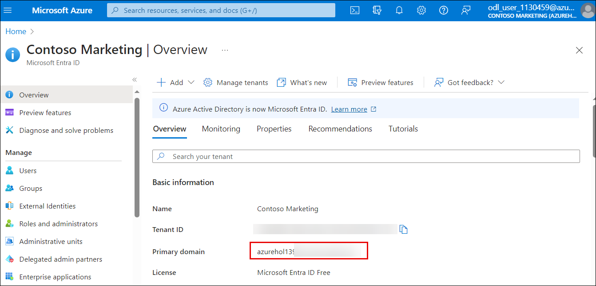  

7. Enter the **Google** email address and password that you created if prompted.

8. At this point, you should see your account passed to Google for confirmation; then enter the Microsoft Office portal.

## Review

In this lab you have completed the following tasks:

- Configured identity providers
- Configured Azure to work with an External identity provider

## You have successfully completed the lab