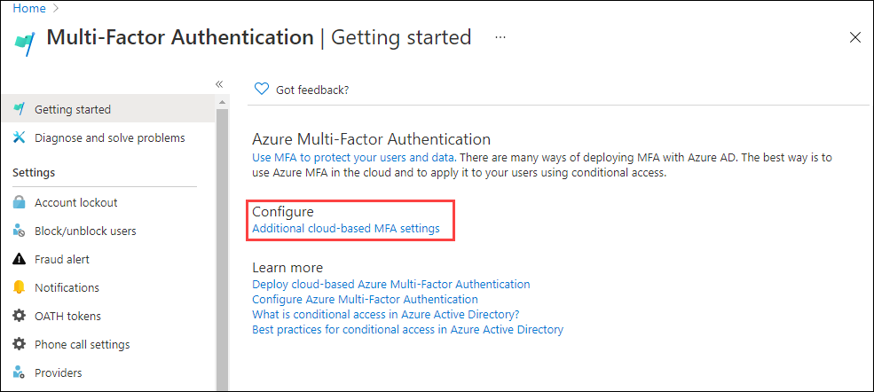
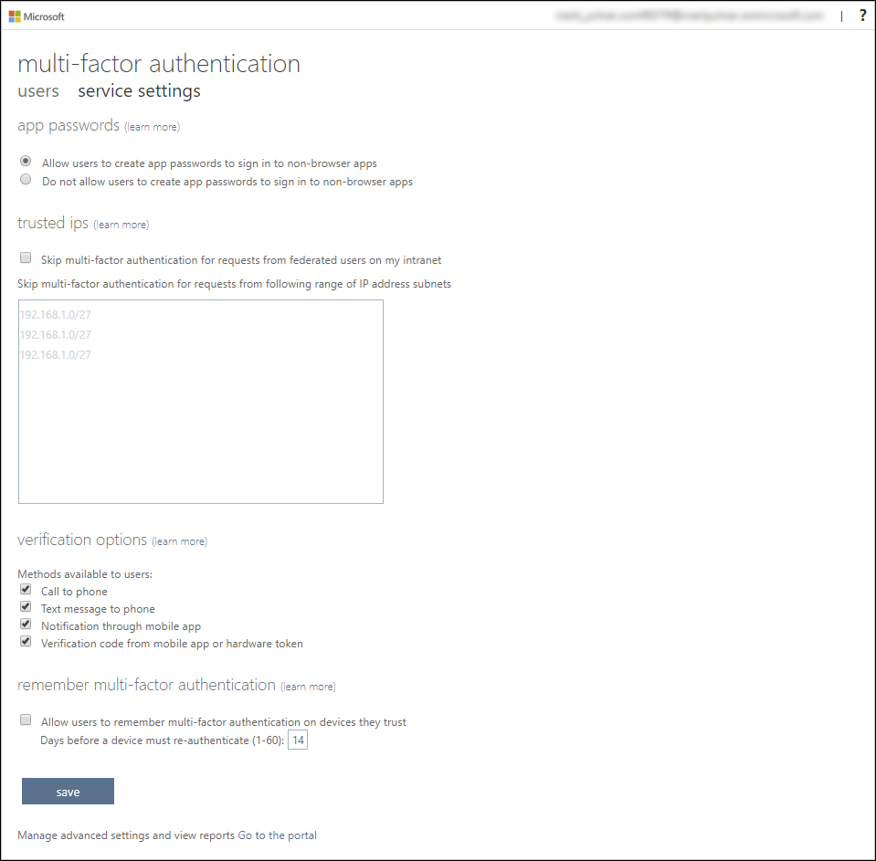
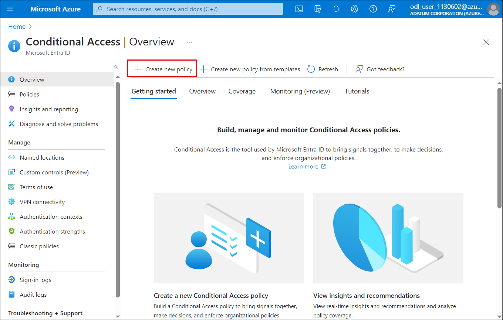
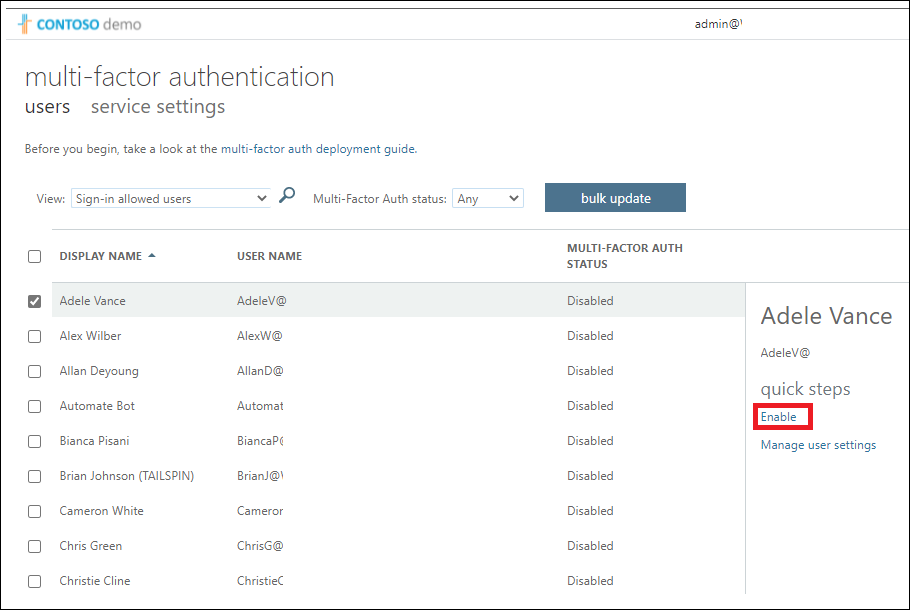

# Lab 08 - Enable Azure AD multi-factor authentication

## Lab scenario

To improve security in your organization, you've been directed to enable multi-factor authentication for Azure Active Directory.

#### Estimated time: 15 minutes

**IMPORTANT** - An Azure AD Premium license is required for this exercise.

### Exercise 1 - Review and enable Multi-factor Authentication in Azure

#### Task 1 - Review Azure Multi-Factor Authentication options

1. Browse to the [https://portal.azure.com](https://portal.azure.com) and sign in using a Global administrator account for the directory.

2. Use the search feature and search for **multi-factor**.

3. In the search results, select **Multi-Factor Authentication**.

4. On the Getting started page, under **Configure**, select **Additional cloud-based MFA settings**.

    

5. In the new browser page, you can see the MFA options for Azure users and service settings.

    

6. This is where you would select the supported authentication methods, in the screen above, all of them are selected.

7. You can also enable or disable app passwords here, which allow users to create unique account passwords for apps that don't support multi-factor authentication. This feature lets the user authenticate with their Azure AD identity using a different password specific to that app.

#### Task 2 - Setup conditional access rules for MFA for Delia Dennis

Next let's examine how to set up Conditional Access policy rules that would enforce MFA for guest users accessing specific apps on your network.

1. Switch back to the Azure portal and select **Azure Active Directory**, then **Security**, and then **Conditional access**.

2. On the menu, Select **+ New policy**. From the drop down select **Create new policy**.

    

3. Name your policy, for example **MFA_for_Delia**.

4. Under Assignments:

    - Select **0 users and groups selected**  
    - On the right side screen, select **Select users and groups** check box to configure.
    - Check **Users and groups** (available users will be populated to the right)
    - Choose **Delia Dennis** from the list of users then choose **Select** button.

5. Under **Target Resources** click on **No target resources selected**

   - In the dropdown, make sure **Cloud apps** is selected.
   - Under Include, mark **All cloud apps** and note the warning the pops up about possibly locking yourself out. 
   - Now under Include, change your choice to **Select apps** item and then under Select click on **None**.
   - In the newly opened dialog, choose **Office 365**.
   - Choose **Select**.

6. Review the Conditions section.

   - Under **Conditions** click on **0 conditions selected** Under **Locations** click on **Any Location** and then configure it to **Yes**  and ensure that under **Include** ,**Any location** is selected.

      

7. Under **Access Controls** click on  **0 controls selected** and verify **Grant access** is selected.

8. Select the **Require multi-factor authentication** check box to enforces MFA.

9. Ensure that **Require all the selected controls** is selected.

10. Select **Select**.

11. Set **Enable policy** to **On**.

12. Hit **Create** to create the policy.

    

13. MFA is now enabled for your selected user and application(s). The next time a guest tries to sign into that app they will be prompted to register for MFA.

#### Task 3 - Test Delia's login

1. Open a new InPrivate Browsing windows.
2. Connect to https://www.office.com.
3. Select the sign-in option.
4. Enter **DeliaD@** `<<your domain address>>`.
5. Enter the password = Enter the Global admin password of the tenant (Note : Refer the 'Lab Resources' tab to retrieve the admin password).

>**Note:** There is a chance that you might get a login failure message with several options on how to proceed.  Select the **Try Again** option in this case.
>**Note:** You can find the username and password for Delina from the Azure portal in the **Microsoft Entra ID** Users section.
6. You can see that because of the Conditional Access rule we created for Delia, MFA is required to launch Office 365 home page.

   

### Exercise 2 - Configure MFA to be required for login

#### Task 1 - Configure Azure AD Per-User MFA

Finally, let's look at how to configure MFA for user accounts. This is another way to get to the multi-factor auth settings.

1. Switch back to the Azure Active Directory dashboard in the Azure portal.

2. Select **Users**.

3. At the top of the Users pane, select **Per-user MFA**.

   

4. A new browser tab/window will open with a multi-factor authentication user settings dialog.

   You can enable or disable MFA on a user basis by selecting a user and then using the quick steps on the right side.

   

5. Select **Adele Vance** with a check-mark.
6. Select the **Enable** option under quick steps.
7. Read the notification popup if you get it, then select **enable multi-factor auth** button.
8. Select **Close**.
9. Notice that Adele now has **Enabled** as her MFA status.
10. You can select **service settings** to see the MFA setting screen, seen earlier in the lab.
11. Close the MFA setting tab.

#### Task 2 -- Try logging in as Adele

1. If you want to see another example of MFA login process, you can try to log in a Adele.
