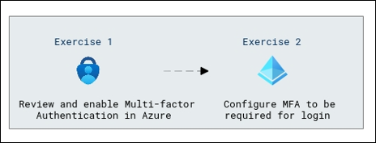
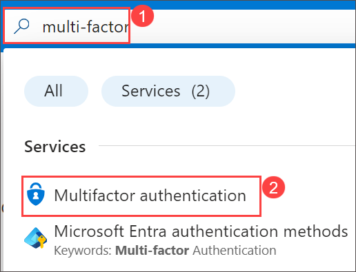
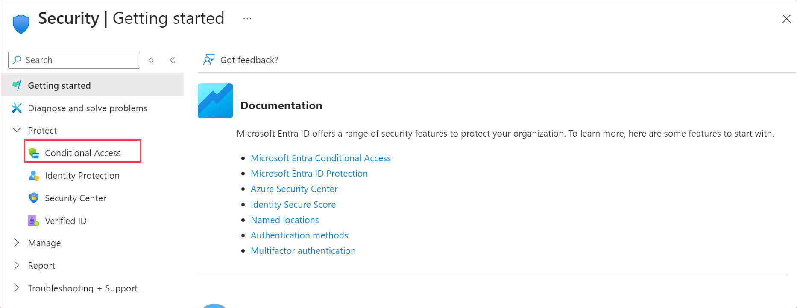
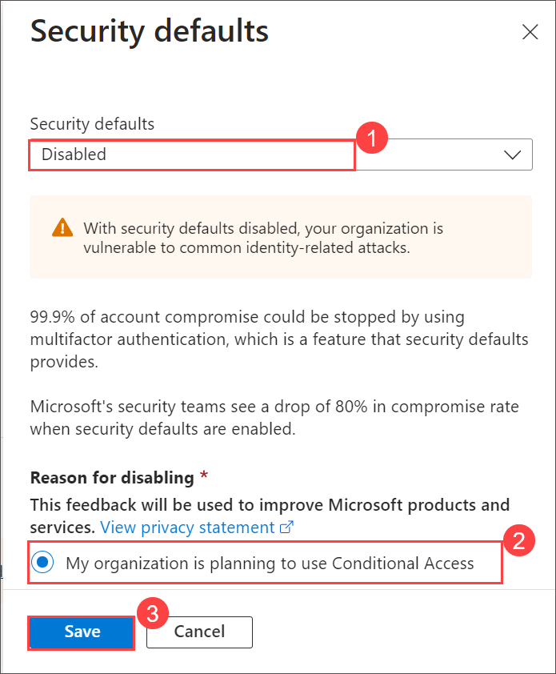
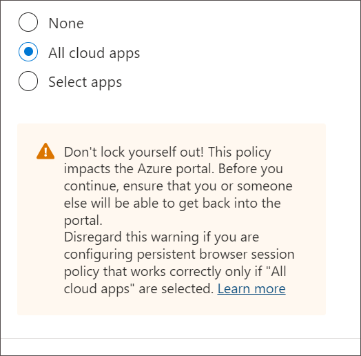
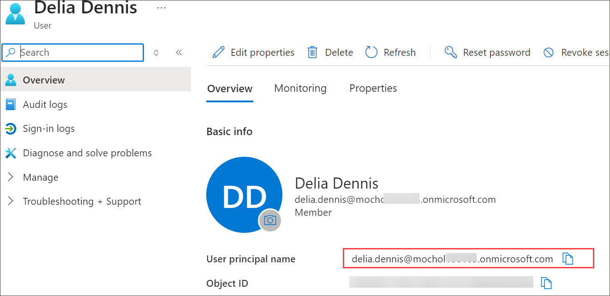
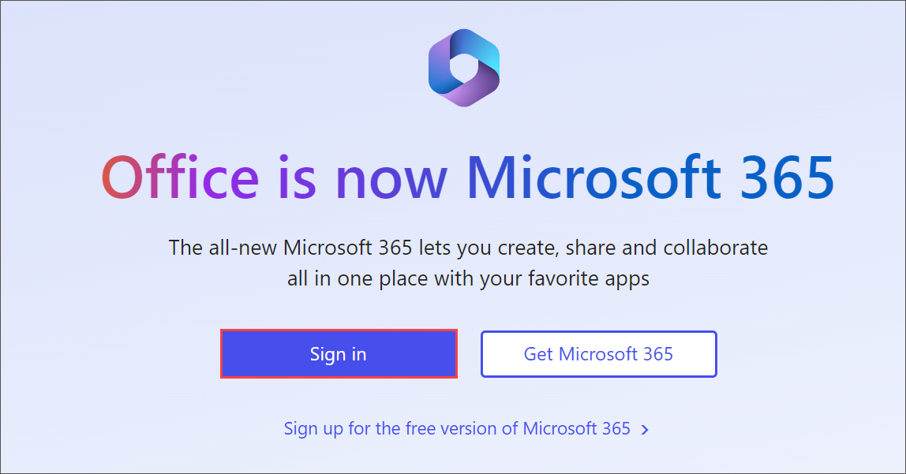
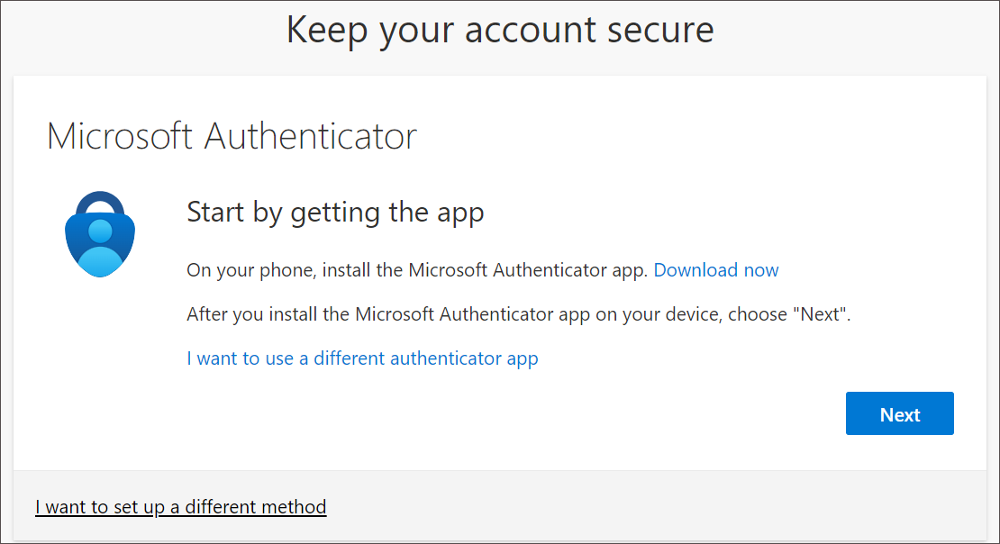
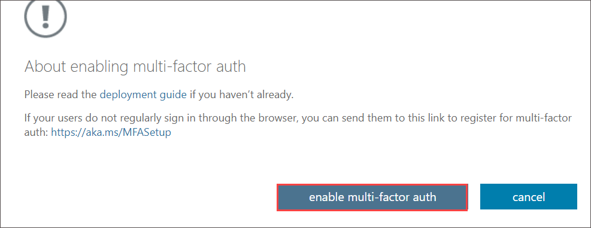

# Lab 08 - Enable Microsoft Entra ID  multi-factor authentication

## Lab scenario

To improve security in your organization, you've been directed to enable multi-factor authentication for Microsoft Entra ID.

## Lab Objectives

After completing this lab, you will be able to complete the following exercises:

- Exercise 1 - Review and enable Multi-factor Authentication in Azure
- Exercise 2 - Configure MFA to be required for login

## Architecture Diagram

### Estimated time: 30 minutes

>**IMPORTANT** - A Microsoft Entra ID Premium license is required for this exercise.

## Exercise 1 - Review and enable Multi-factor Authentication in Azure

  In this exercise, you will learn how to  enhance security, and ensure Multi-factor Authentication (MFA) is configured and enabled in your Azure environment, adding an extra layer of protection for your accounts and data.

### Task 1 - Review Azure Multi-Factor Authentication options

1. On Azure Portal page, in **Search resources, services and docs (G+/)** box at the top of the portal, enter **multi-factor**, and then select **Multi-Factor Authentication (2)** under services.

    

1. On the **Multi-Factor Authentication | Getting started** page, under **Configure**, select **Additional cloud-based MFA settings**.

    

1. In the new browser page, you can see the MFA options for Azure users and service settings.

    

1. This is where you would select the supported authentication methods, in the screen above, all of them are selected.

1. You can also enable or disable app passwords here, which allow users to create unique account passwords for apps that don't support multi-factor authentication. This feature lets the user authenticate with their Microsoft Entra ID identity using a different password specific to that app.

### Task 2 - Setup conditional access rules for MFA for Delia Dennis

Next, let's examine how to set up Conditional Access policy rules that would enforce MFA for guest users accessing specific apps on your network.

1. On Azure Portal page, in **Search resources, services and docs (G+/)** box at the top of the portal, enter **Microsoft Entra ID (1)**, and then select **Microsoft Entra ID (2)** under services.

    

1. On the **Overview** page, under the **Manage** section select **Security**.

1. On the **Security | Getting started** page, from left navigation pane under **Protect** section, **Conditional Access**.

    
   
1. From the menu, click on **+ Create new policy**.
   
    

1. If you encounter following error, click on **Disable security policy**, on **Security default** specify the following:

    - Security defaults **Disabled(1)** 

    - Reason for disabling Select **My organization is planning to use Conditional Access (2)**.

    - Click on **Save (3)**

    

    

1. On **Disable security policy** pop up, click on Disable.
   
    

1. Again navigate to **Conditional access** blade, from the menu, click on **+ Create new policy**.
   
    
   
1. Name your policy, for example **MFA_for_Delia**

1. Under Assignments:

    - Select **0 users and groups selected**  
    - On the right side screen, select **Select users and groups** check box to configure.
    - Check **Users and groups** (available users will be populated to the right)
    - Choose **Delia Dennis** from the list of users then choose **Select** button.

1. Under **Target Resources** click on **No target resources selected**

   - In the dropdown, make sure **Cloud apps** is selected.
   - Under Include, mark **All cloud apps** and note the warning the pops up about possibly locking yourself out.

      

   - Now under Include, change your choice to **Select apps** item and then under Select click on **None**.
   - In the newly opened dialog, choose **Office 365**.
   - Choose **Select**.

1. Review the Conditions section.

   - Under **Conditions** click on **0 conditions selected** then under **Locations** click on **Not Configured** and then under  **Configure** toggle  it to **Yes**  and ensure that under **Include** ,**Any location** is selected.

      

1. Under **Access Controls** click on  **0 controls selected** and verify **Grant access** is selected.

1. Select the **Require multi-factor authentication** check box to enforce MFA.

1. Ensure that **Require all the selected controls** is selected.

1. Select **Select**.

1. Set **Enable policy** to **On (1)**. Hit **Create (2)** to create the policy.

    

1. MFA is now enabled for your selected user and application(s). The next time a guest tries to sign into that app they will be prompted to register for MFA.

     > **Congratulations** on completing the task! Now, it's time to validate it. Here are the steps:
     > - Navigate to the Lab Validation Page, from the upper right corner in the lab guide section.
     > - Hit the Validate button for the corresponding task. If you receive a success message, you can proceed to the next task. 
     > - If not, carefully read the error message and retry the step, following the instructions in the lab guide.
     > - If you need any assistance, please contact us at labs-support@spektrasystems.com. We are available 24/7 to help

### Task 3 - Test Delia's login

1. Open a new **InPrivate** browsing window.
1. Connect to https://www.office.com.
1. Select the sign-in option.
1. Enter **DeliaD@** `<<your domain address>>`.

    - To get the username for **Delina** follow the below steps:
  
    - In Azure portal search and select **Microsoft Entra ID** and from left navigation pane under **Manage** section and select **Users** then choose **Delia Dennis**.
    - On the **Delia Dennis** user blade, copy the **User principal name** record in notepad.

      
    
    - To find the password, from the top navigation pane  click on **Reset Password** and copy the temporary password record in notepad.

       

1. Navigate back to https://www.office.com in **InPrivate** browsing window then click on **Sign in**.

    

1. Sign in **Delia Dennis** Username and temporary password which you recorded in notepad.
   
 
   >**Note:** There is a chance that you might get a login failure message with several options on how to proceed.  Select the **Try Again** option in this case.

1. Click on **Next** on **More information required** pop up.

    

1. You can see that because of the Conditional Access rule we created for Delia, MFA is required to launch Office 365 home page.

   

## Exercise 2 - Configure MFA to be required for login

  By enforcing MFA, you significantly reduce the risk of unauthorized access and data breaches, enhancing the overall security of your Azure environment.

### Task 1 - Configure Microsoft Entra ID Per-User MFA

Finally, let's look at how to configure MFA for user accounts. This is another way to get to the multi-factor auth settings.

1. Switch back to the **Microsoft Entra ID** dashboard in the Azure portal.

1. Select **Users**.

1. At the top of the Users pane, select **Per-user MFA**.

   

1. A new browser tab/window will open with a multi-factor authentication user settings dialog.

   

1. Select **Adele Vance** with a check-mark. Select the **Enable** option under quick steps.

   
   
1. Read the notification popup if you get it, then select **enable multi-factor auth** button.
    
    

1. Select **Close**.

1. Notice that Adele now has **Enabled** as her MFA status.

   

1. Close the MFA setting tab.

## Review

In this lab you have completed the following tasks:
- Reviewed and enabled Multi-factor Authentication in Azure
- Configured MFA to be required for login

## You have successfully completed the lab

