# Lab: Implement and test a conditional access policy

## Lab scenario

Your organization needs to be able to limit user access to its internal applications. You must deploy the Microsoft Entra ID conditional access policy.

>**Note** - For Conditional Access Policies, you can turn off Security Defaults, the key points to remember are from the training.  Additional information on Security defaults can be found at this link: <https://docs.microsoft.com/en-us/azure/active-directory/fundamentals/concept-fundamentals-security-defaults>

## Lab objectives

In this lab, you will complete the following tasks:

- Exercise 1: Set a conditional access policy to block an user from accessing Sway
- Exercise 2: Test conditional access policies with "What if"
- Exercise 3: Configure sign in frequency controls using a conditional access policy

## Estimated time: 45 Minutes

## Architecture diagram

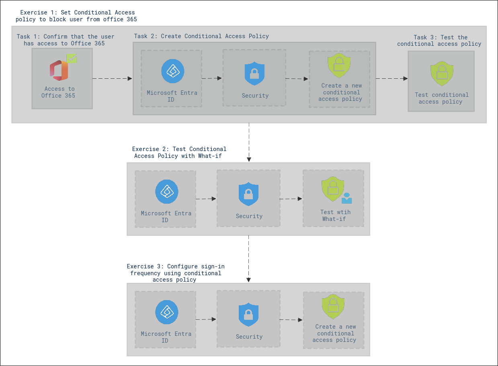

## Exercise 1: Set a conditional access policy to block a user from accessing Sway

In this exercise, you will learn to create a conditional access policy in Microsoft Entra ID which allows you to tailor access control measures to meet specific security requirements. 

### Task 1: Confirm that the user has access to Sway

In this task, you will try to access Microsoft Sway website.

1. Launch a new **InPrivate** browser window.

2. Connect to [https://sway.cloud.microsoft/](https://sway.cloud.microsoft/) and click on Get Started 
    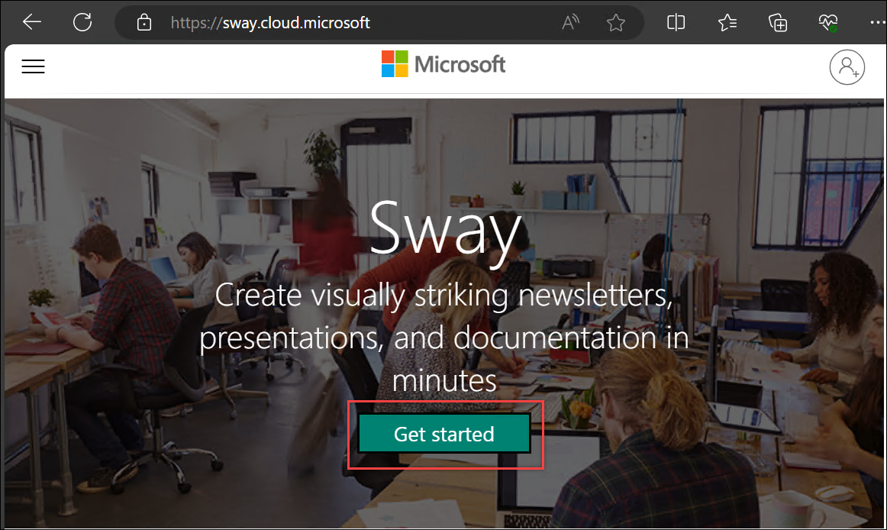

3. When prompted, log in with the following credentials which are also provided in the Environment details page:

   | Setting | Value |
   | :--- | :--- |
   | Username | **<inject key="AzureAdUserEmail" enableCopy="true" />** |
   | Password | **<inject key="AzureAdUserPassword" enableCopy="true" />** |

4. Ensure that you are able to access the Sway website via browser.

     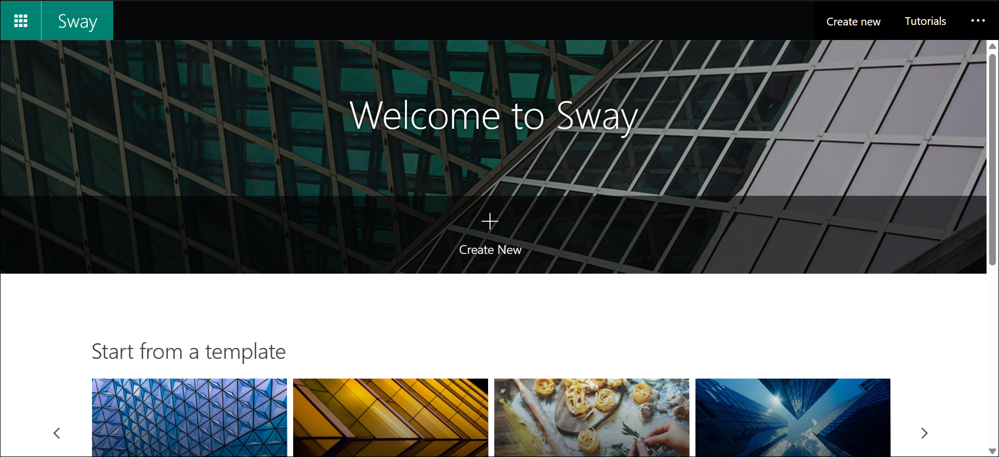

### Task 2: Create a conditional access policy

In this task, you'll configure Microsoft Entra ID Conditional Access policies to control access to your resources. You'll specify detailed conditions such as groups, device types, locations, and user roles to protect applications and ensure secure access management.
 
1. Open the **Microsoft Entra admin center** in a new browser tab by selecting the link below.

   ```
   https://entra.microsoft.com/
   ```

2. When prompted, log in with the following credentials which are also provided in the Environment details page:

    | Setting | Value |
    | :--- | :--- |
    | Username | **<inject key="AzureAdUserEmail" enableCopy="true" />** |
    | Password | **<inject key="AzureAdUserPassword" enableCopy="true" />** |
   
3. On the menu, under **Entra ID (1)**, select **Conditional Access(2)**.
   
    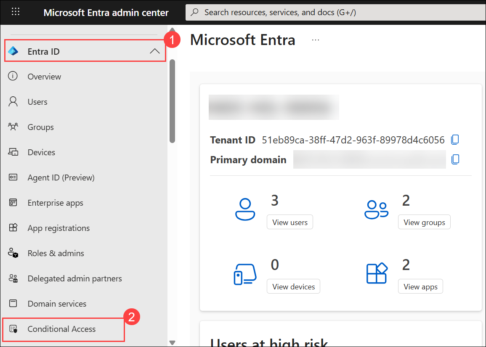

5. On the **Overview** page, click **+ Create new policy**.

    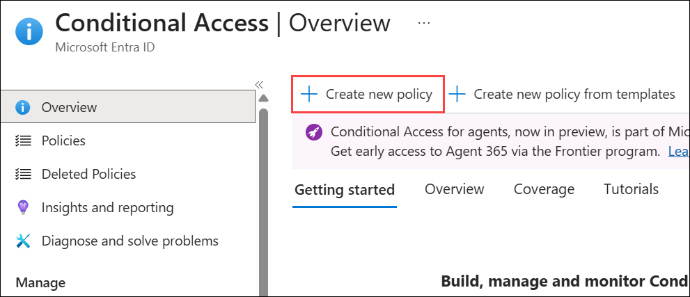

6. Within the new policy page, configure the following:
    
    - In the **Name** box, enter **Block Office 365 for odl_user <inject key="DeploymentId" enableCopy="false" /> (1)**. 
      
      >**Note:** Using such naming conventions/formats help you to quickly recognize the policy and its function.
    
    - Under **Assignments**, click on **Users or agents (Preview) (2)**.
    - Within the **Include** tab, ensure to choose **Select users and groups (3)** radio button.
    - Select the **Users and groups (4)** checkbox.
    - In the **Select users and groups** pane, select **ODL_user <inject key="DeploymentId" enableCopy="false" /> (5)** account and then click on **Select (6)**.

       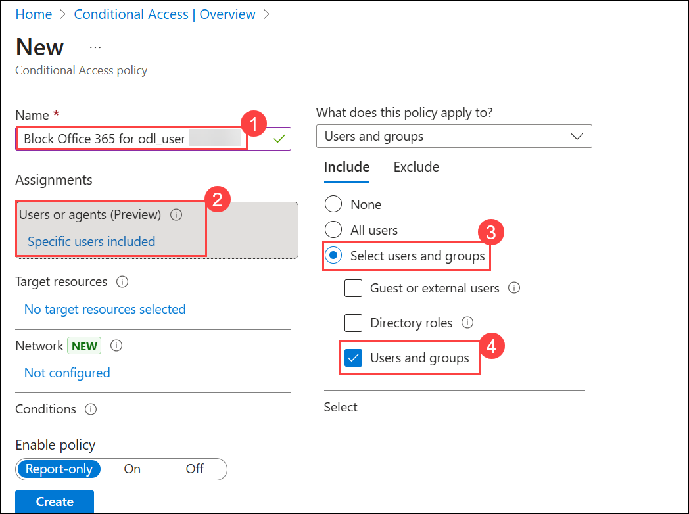

       

        - If **Select users and groups** in not opened, Under **Select**, click on **0 users and groups selected** to add the new user who would be alligned to this conditional access policy.

7. In order to block a specific app from the user, execute the following configurations while creating the conditional access policy:
    
    - Under the **Target resources** section, click on **No target resources selected (1)**.
    - Ensure to have **Resources (formerly cloud apps)** option selected from the dropdown list.
    - Within the **Include** tab, choose the **Select Resources (2)** radio button.
    - Click on **None (3)** under **Select specific resources** which opens the Resources pane.
    - In the Select pane, search for and select **Sway (4)** and then click on **Select (5)**.

      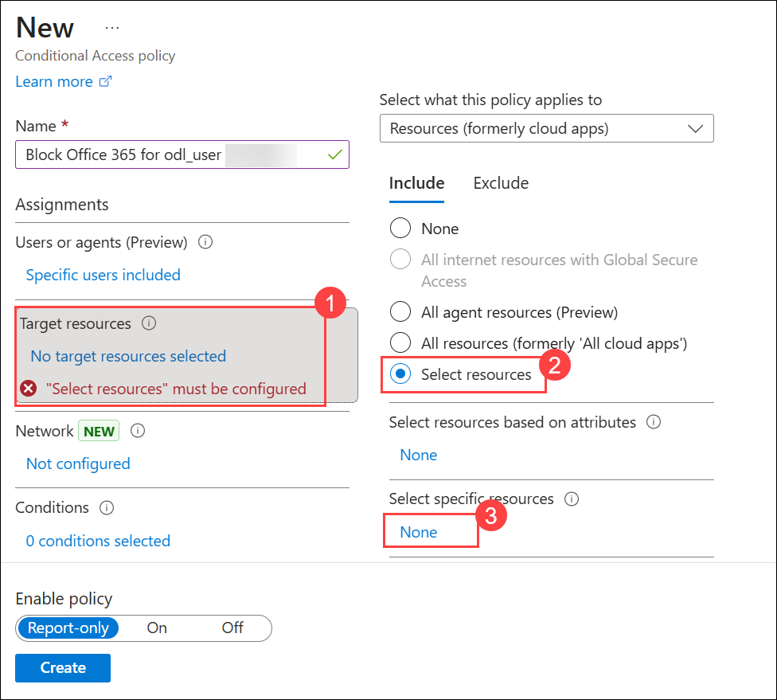

      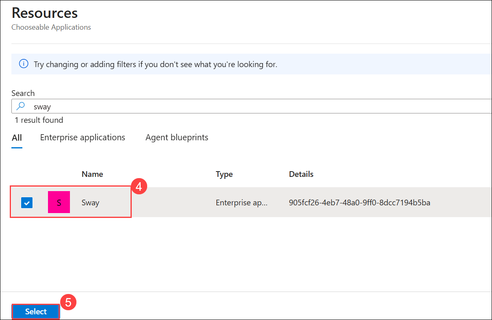

8. To provide control access enforcement to block or grant access, perform the following:
    
    - Under **Access controls**, select **0 controls selected (1)**.
    - In the Grant pane, select **Block access (2)** and then click on **Select (3)**.

      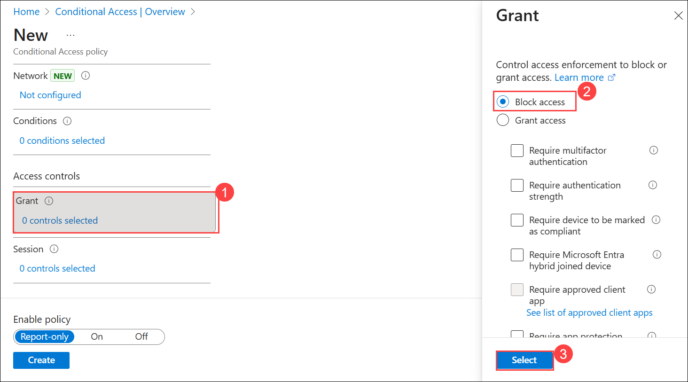

      >**Note:** This policy is configured solely for the purpose of demonstration in an exercise, intended to quickly showcase a conditional access policy.

9. Under **Enable policy**, select **On (1)**, and then select **Create (2)**.

    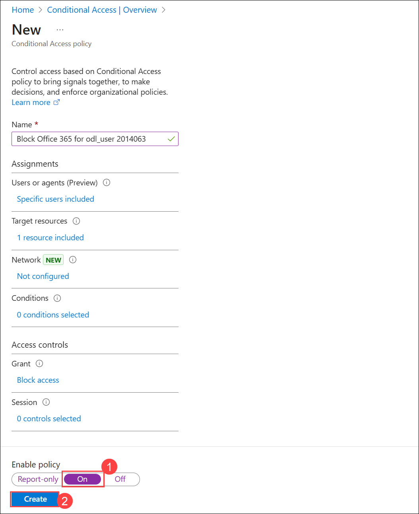

    >**Note:** There may be scenarios in which you may be produced with an error message stating that the Security defaults must be disabled to enable conditional access policy. In such cases, the account being provided may have the security defaults set to enabled for MFA functionality. It is recommended to disable the security default before proceeding with this lab. Follow the below instructions:
    - Click on the **disable security defaults** from the warning that displays as shown in the below screenshot.
    
       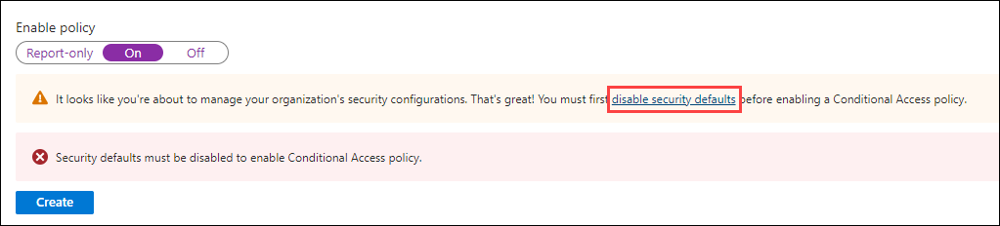
    
    - Within the Security defaults page, ensure that the option - **Disabled (1)** is selected.
    - Select a reason for disabling - **Too many sign-in multifactor authentication challenges (2)**
    - Click on **Save (3)** and subsequently click on **Disable** in the pop up that apperas.

       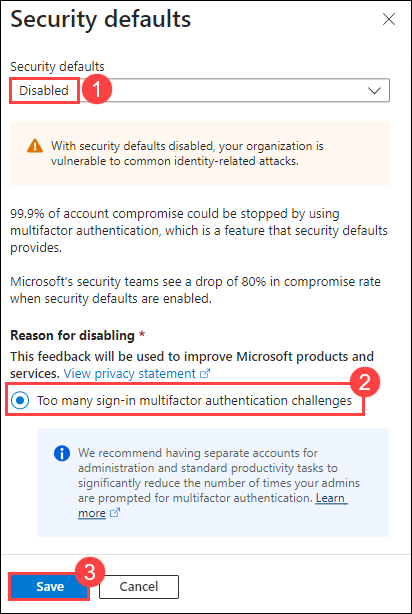

    > **Congratulations** on completing the task! Now, it's time to validate it. Here are the steps:
    > - Hit the Validate button for the corresponding task. If you receive a success message, you can proceed to the next task. 
    > - If not, carefully read the error message and retry the step, following the instructions in the lab guide.
    > - If you need any assistance, please contact us at cloudlabs-support@spektrasystems.com. We are available 24/7 to help you out.

    <validation step="58da6f73-286e-4c2e-9506-09649fb7ba6d" />

### Task 3: Test the conditional access policy

In this task, you'll test your Conditional Access policies to ensure they are working as expected. This will involve verifying that the policies correctly enforce access restrictions based on the specified conditions, such as user roles, device types, and locations.

1. Open a new **Inprivate** browser tab and then browse to [https://sway.cloud.microsoft](https://sway.cloud.microsoft)
    
    - When prompted, log in as:

   | Setting | Value |
   | :--- | :--- |
   | Username | **<inject key="AzureAdUserEmail" enableCopy="true" />** |
   | Password | **<inject key="AzureAdUserPassword" enableCopy="true" />** |
     
2. Verify you are prevented from successfully access Microsoft Sway.

   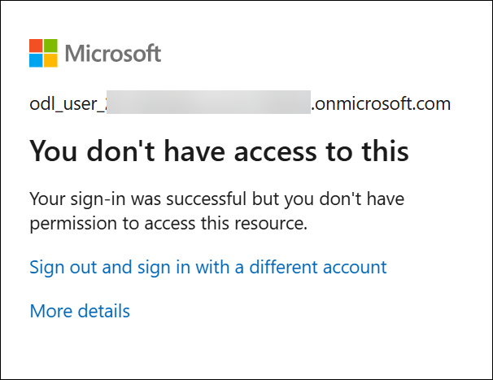

3. If you are signed in, close the tab, wait for about a minute, and then retry.
    
   >**Note** - If you are auto-logged into Sway as the user, then you will need to manually log out. Your credentials/access were cached. Once you log out and sign-in, your Sway should deny access as per the conditional policy assigned.

4. Close the tab and return to the Conditional Access page that displays the list of available policies **(1)**.

5. On the **Conditional Access | Policies** page, select the **Block Office 365 for odl_user <inject key="DeploymentId" enableCopy="false" /> (2)** policy.

    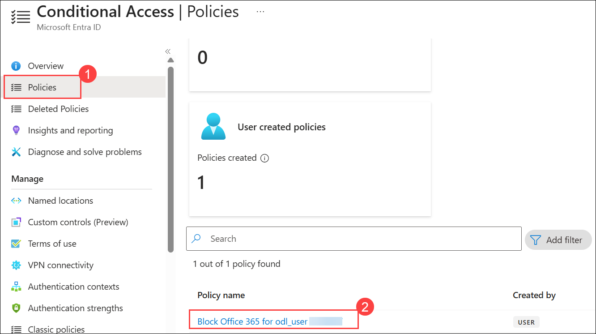

6. Under **Enable policy**, select **Off (1)** and then select **Save (2)**.

   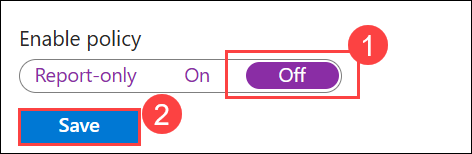

## Exercise 2: Test conditional access policies with "What if"

In this exercise, you'll use the "What if" feature in Microsoft Entra ID's Conditional Access policies to assess the potential impact of your access control policies. This will allow you to simulate how the policies would apply to specific users or scenarios without enforcing them.

### Task 1: Use What if to test conditional access policies

 In this task, you'll test conditional access policies

1. In the **Conditional Access** window in the Microsoft Entra Admin Center,in the navigation pane, select **Policies (1)** and then click on **What if (2)**.

    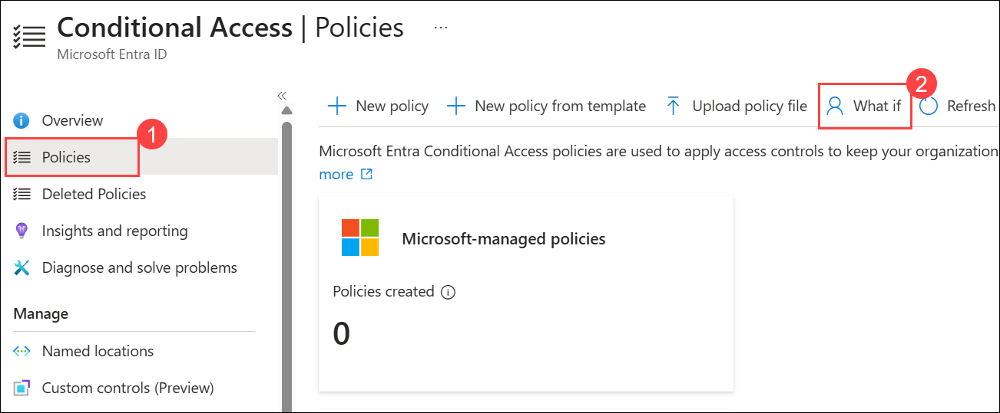

2. To test conditional access policy with What if, perform the following:
    - Under **Select identity type**, select **Users (1)**.
    - Click on **Edit user (2)**

      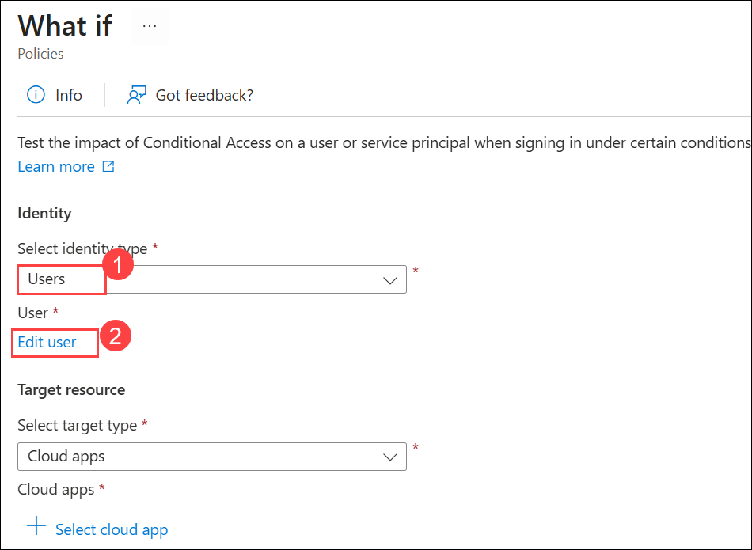

3. Within the Users page, choose **ODL_User <inject key="DeploymentID" enableCopy="false" /> (1)** as the user and then click on **Select (2)**

    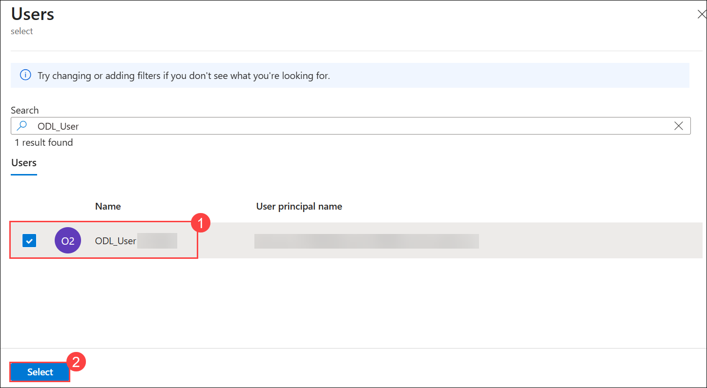

4. On **Tareget resources**, under **Select target type**, 
    
    - Select **Cloud apps (1)** from the dropdown list.
    - Click on **Select cloud app (2)** which opens the Resource page.
    - In the Select pane, search for and select **Sway (1)** and then click on **Select (2)**

      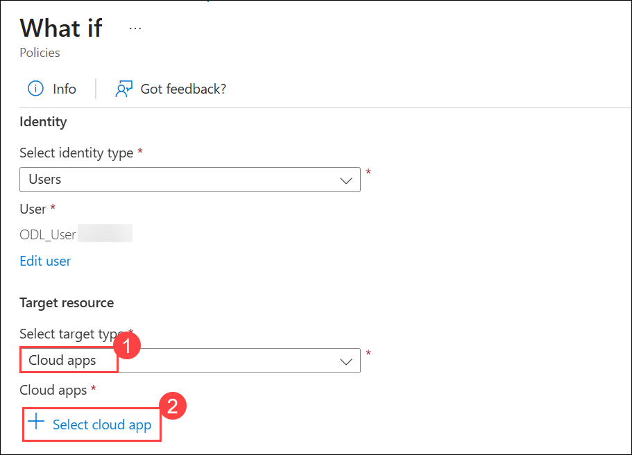

      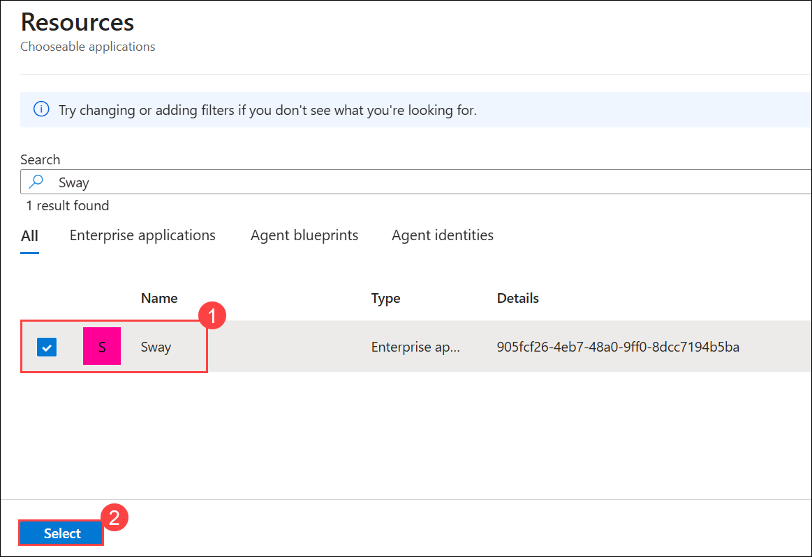

1. Under **Sign-in conditions**, set **Device platform (1)** to **Windows** and **Client app (2)** to **Browser** from the dropdown lists.

    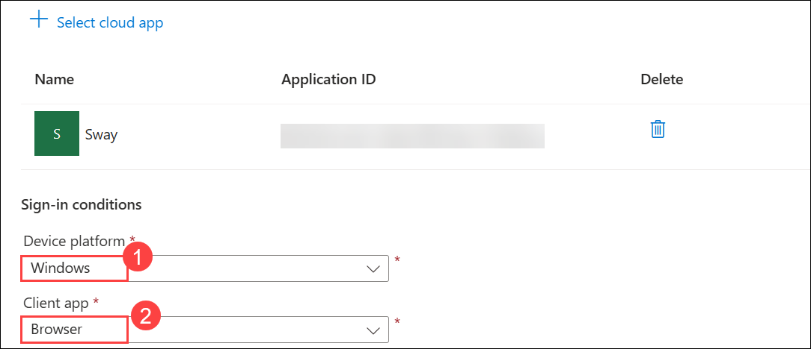

15. Select **What if** present at the bottom of the page. You will be provided with a report at the bottom of the tile for **Policies that will apply** and **Policies that will not apply**.

    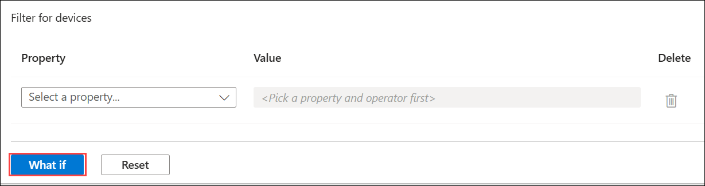

    >**Note:** This allows you to test the policies and their affectiveness before enabling the policies.

     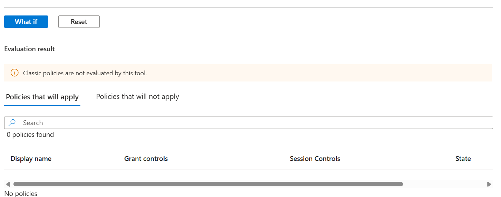

## Exercise 3: Configure sign in frequency controls using a conditional access policy

In this exercise, you'll configure sign-in frequency controls using a Conditional Access policy in Azure to manage and enforce restrictions on how often users can sign in.

### Task 1: Use the Microsoft Admin center to configure conditional access

In this task, you'll use the Microsoft Admin Center to configure Conditional Access policies, enabling you to control access to resources based on specific conditions like user roles, device compliance, and location.As part of your company's larger security configuration, you must test a conditional access policy that can be used to control sign-in frequency.

1. On the **Conditional Access | Overview** page, select **+ Create new policy** to start creating a Conditional Access policy.

    

2. Within the new policy page, configure the following:
    
    - In the **Name** box, enter **Sign in frequency (1)**.    
    - Under **Assignments**, click on **Users or agents (Preview) (2)**.
    - Within the **Include** tab, ensure to choose **Select users and groups (3)** radio button.
    - Select the **Users and groups (4)** checkbox.
    - Under **Select**, click on **0 users and groups selected (5)** to add the new user who would be alligned to this conditional access policy.
    - In the Select pane, select **ODL_user <inject key="DeploymentId" enableCopy="false" /> (1)** account and then click on **Select (2)**.

       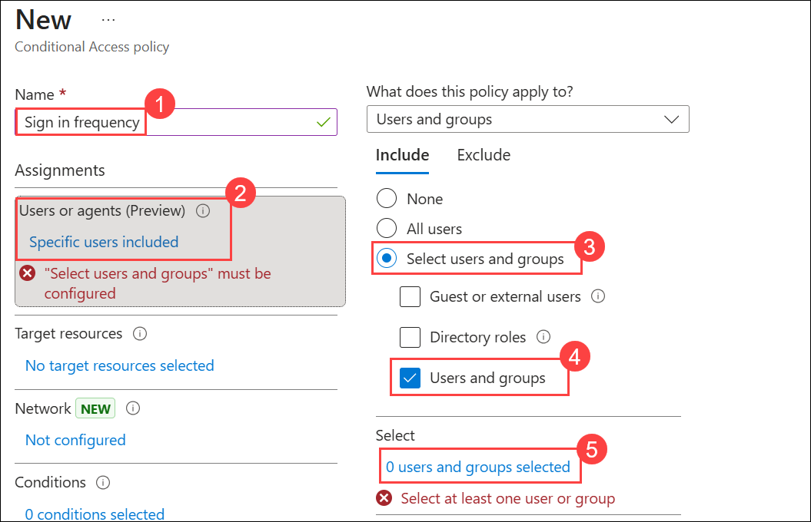
   
       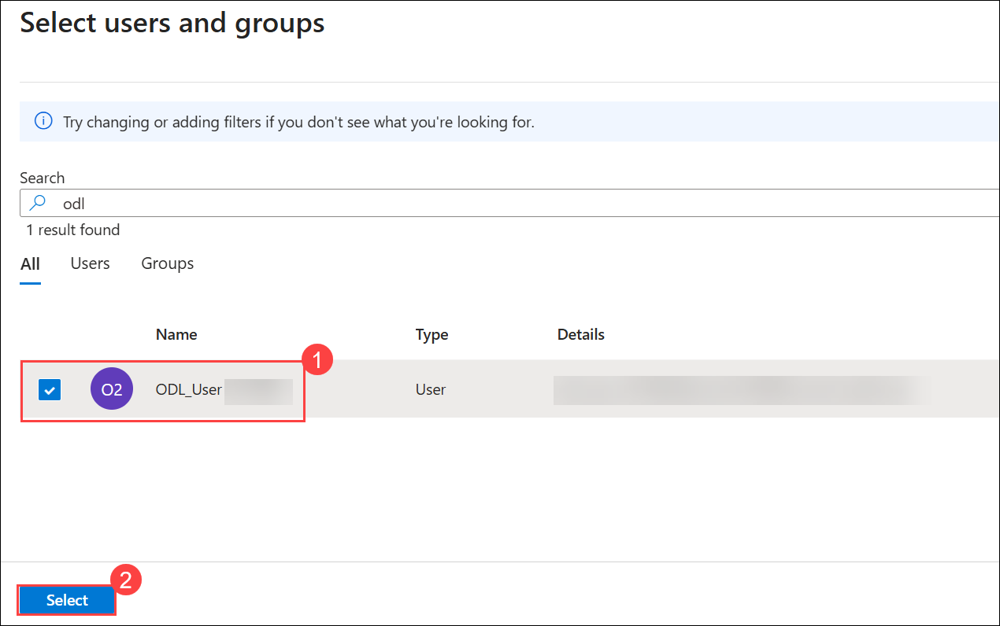

3. In order to implement sign in reauthentication frequency to a specific app for the user, execute the following configurations while creating the conditional access policy:
    
    - Under the **Target resources** section, click on **No target resources selected (1)**.
    - Ensure to have **Resources (formerly cloud apps)** option selected from the dropdown list.
    - Within the **Include** tab, choose the **Select Resources (2)** radio button.
    - Click on **None (3)** which opens the Resources pane.
    - In the Select pane, search for and select **Office 365 (1)** and then click on **Select (2)**.

      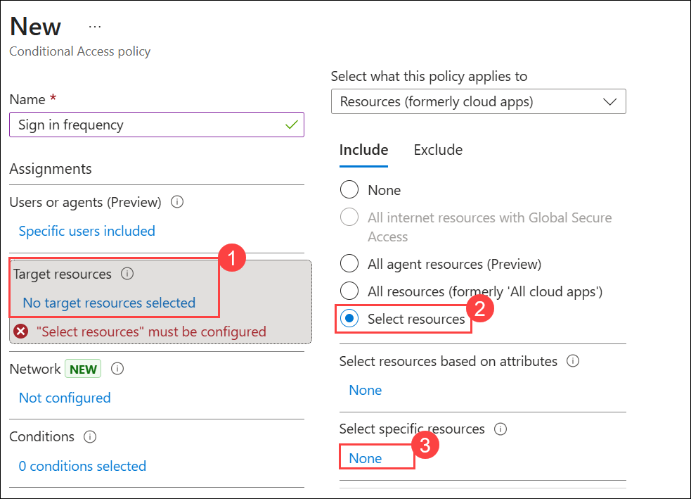

      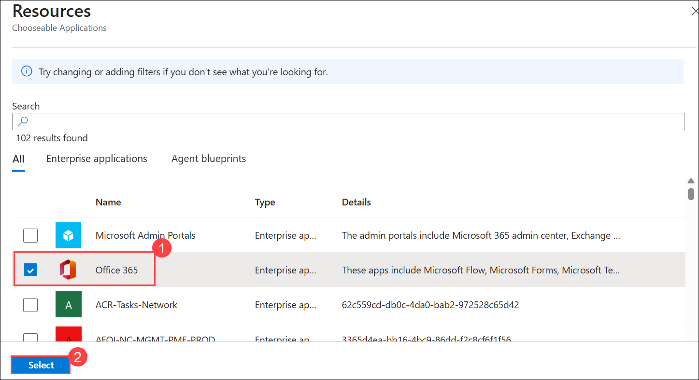

4. To set control access based on session controls to enable limited experiences within specific cloud applications, perform the following:
    
    - Under **Access controls**, select **Session (1)**.
    - In the Session pane, select the **Sign-in frequency (2)** checkbox.
    - In the value box, enter **30 (3)**.
    - Select the units menu, choose **Days (4)**.
    - Click on **Select (5)**
    - Under **Enable policy**, select **Report-only (6)**
    - Click on **Create (7)** to create the sign in frequency conditional access policy.
  
      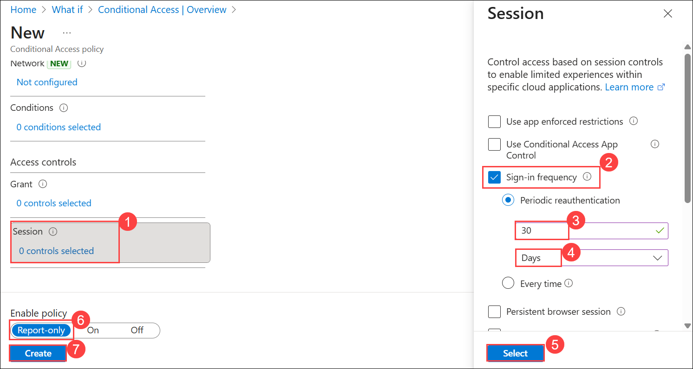

      >**Note:** Report-only mode is a new Conditional Access policy state that allows administrators to evaluate the impact of Conditional Access policies before enabling them in their environment. With the release of report-only mode:
      > - Conditional Access policies can be enabled in report-only mode.
      > - During sign-in, policies in report-only mode are evaluated but not enforced.
      > - Results are logged in the Conditional Access and Report-only tabs of the Sign-in log details.
      > - Customers with an Azure Monitor subscription can monitor the impact of their Conditional Access policies using the Conditional Access insights workbook.
   
    > **Congratulations** on completing the task! Now, it's time to validate it. Here are the steps:
    > - Hit the Validate button for the corresponding task. If you receive a success message, you can proceed to the next task. 
    > - If not, carefully read the error message and retry the step, following the instructions in the lab guide.
    > - If you need any assistance, please contact us at cloudlabs-support@spektrasystems.com. We are available 24/7 to help you out.

    <validation step="65f5da2a-6866-4584-8787-25c4f8839db5" />

## Review
In this lab, you have completed the following tasks:
- Set a conditional access policy to block an user from accessing Office 365
- Use What if to test conditional access policies
- Configure sign in frequency controls using a conditional access policy

### You have successfully completed the lab
