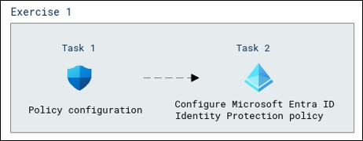
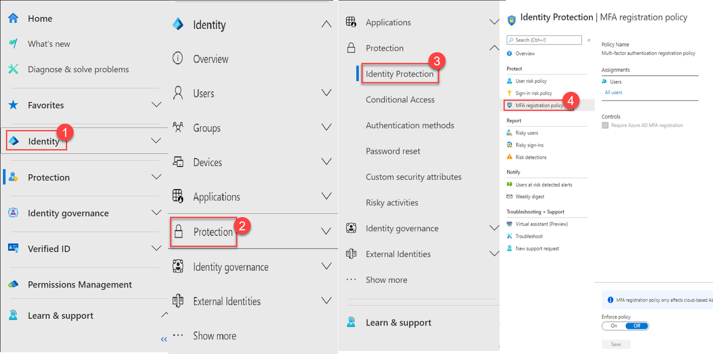
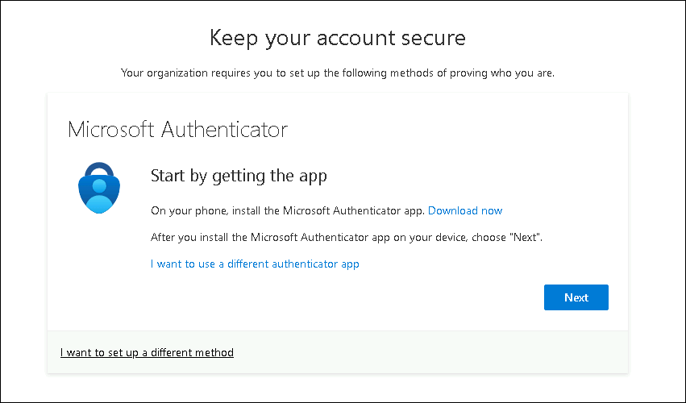

# Lab 15 - Configure a Microsoft Entra ID multi-factor authentication registration policy

## Lab scenario

Multi-factor authentication provides a means to verify who you are using more than just a username and password. It provides a second layer of security to user sign-ins. For users to be able to respond to MFA prompts, they must first register for Microsoft Entra Multi-Factor Authentication. You must configure your Microsoft Entra organization's MFA registration policy to be assigned to all users.

## Lab Objectives

After completing this lab, you will be able to:
- Task 1 - Complete Policy configuration
- Task 2 - Configure Microsoft Entra ID Identity Protection policy for MFA registration

## Architecture Diagram

## Estimated time: 10 minutes

### Exercise 1 - Set up MFA registration policy

#### Task 1 - Policy configuration

1. Sign in to the [https://entra.microsoft.com](https://entra.microsoft.com) using a Global administrator account.

2. Open the portal menu and then search for and select **Microsoft Entra ID**.

3. On the  Microsoft Entra ID page, under **Identity**, select **Protection**.

4. In the left navigation, select **Identity protection**.

5. In the Identity protection page, in the left navigation under **Protect**, select **Multifactor authentication registration policy**.

    

6. Under **Assignments**

7. Under **Assignments**, select **All users** and review the available options.

8. You can select from **All users** or **Select individuals and groups** if limiting your rollout.

9. Additionally, you can choose to exclude users from the policy.

10. Under **Controls**, notice that the **Require Microsoft Entra ID multifactor authentication registration** is selected and cannot be changed.

#### Task 2 - Configure Microsoft Entra Identity Protection policy for MFA registration

**Note**: Microsoft Entra Identity Protection requires a Microsoft Entra ID Premium P2 license to be activated. 

Now let us enable MFA registration for a single user.

1. In the Azure portal, navigate to **Microsoft Entra ID Identity Protection** in the search bar.

1. Under **Protect** in the menu, select **Multifactor authentication registration policy**.

1. Under **Assignments**, select **All users** under Users, and in the Include tab, select **Select individuals and groups**

1. Now, select the user named **Chris Green** and click on **Select**.

1. Ensure that  **Policy enforcement** is toggled to **Enabled** 

1. Select **Save**.

1. This will require the user to complete the MFA registration the next time they attempt to login.

1. From a private browser, navigate to `https://login.microsoftonline.com`. Enter a user name and password from the tenant.  Note the additional security information requirements that the user is asked to enter.

    

## Review

In this lab you have completed the following tasks:
- Completed Policy configuration
- Configured Microsoft Entra ID Identity Protection policy for MFA registration

## You have successfully completed the lab

