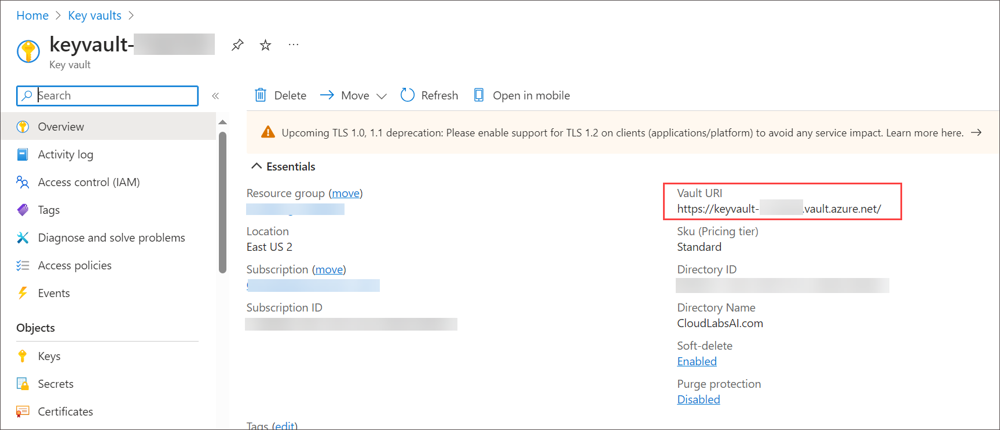
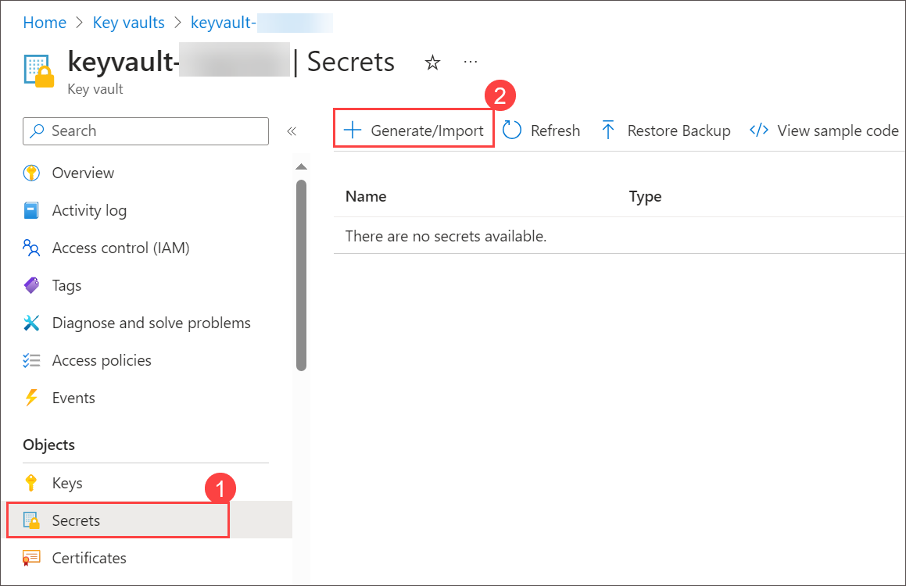
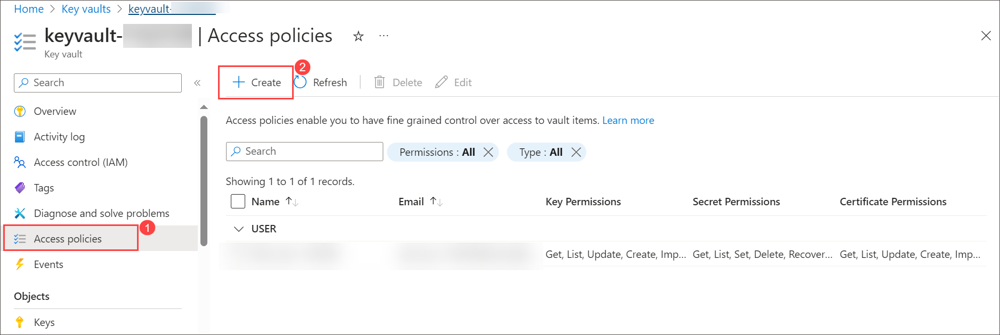
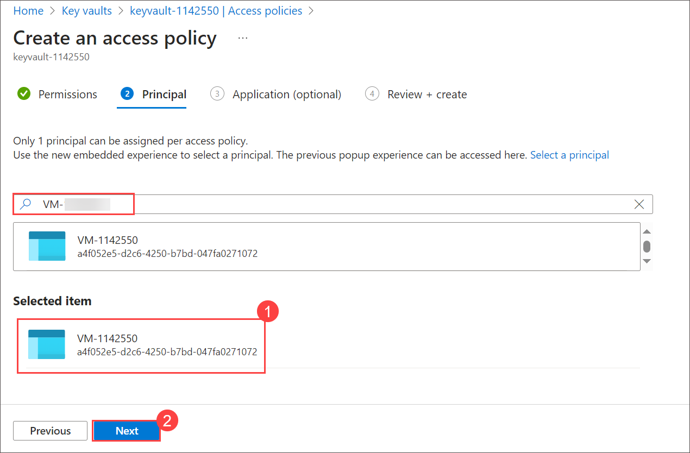

# Lab 16 - Using Azure Key Vault for Managed Identities

## Lab scenario

When you use managed identities for Azure resources, your code can get access tokens to authenticate to resources that support Azure AD authentication.  However, not all Azure services support Azure AD authentication. To use managed identities for Azure resources with those services, store the service credentials in Azure Key Vault, and use the managed identity to access Key Vault to retrieve the credentials.

## Lab objectives
In this lab, you will complete the following tasks:

- Task 1 - Create a Windows Virtual Machine
- Task 2 - Create a Key Vault
- Task 3 - Create a secret
- Task 4 - Grant access to Key Vault
- Task 5 - Access data with Key Vault secret with PowerShell

## Estimated time: 20 minutes

## Architecture Diagram

   

### Exercise 1 - Use Azure Key Vault to manage Virtual Machine identities
Use Azure Key Vault to securely manage and rotate secrets, keys, and certificates for Virtual Machine identities in Azure, enhancing security and access control.

#### Task 1 - Create a Windows Virtual Machine

1. Select **+ Create a resource**.

    

1. In **Search services and marketplace**, type and search for **Windows Client**.
   

1. On the **Marketplace** page, under **Windows Client**, select **Create (2)** drop-down and from the plan dropdown choose **Windows 10 Enterprise N x64 (3)**.

    

1. On the **Create a virtual machine** page, follow the instruction to create a virtual machine, after filling all the details, select **Next : Disks >**:-

    | Settings | Values |
    | -------- | ------ |
    | Resource group | Select **sc-300-rg-<inject key="DeploymentID" enableCopy="false"/>** |
    | Virtual machine name | **VM-<inject key="DeploymentID" enableCopy="false"/>** |
    | Region | **<inject key="Region" enableCopy="false"/>** |
    | Availbility options | **No infrastructure redundancy required** |
    | Security type | Keep it as default |
    | Image | see all images > Microsoft windows 10 > choose **Select** drop-down > select **Windows 10 Enterprise, version 22H2 - x64 Gen 1** |
    | Size | **see all sizes > Standard_B2s - 2 vcpus, 4 GiB memory** |
    | Username | **azureuser** |
    | Password | **Password@..!!** |
    | Confirm Password | **Password@..!!** |
    | Licensing | check the box |

1.  On disk page, follow the instruction, after this select **Next : Disk >**:-

    | Settings | Values |
    | -------- | ------ |
    | OS disk type | **Standard HDD (locally-redundant storage)** |

1. Select **Next : Management >**.

1. On the **Management** tab, select the check the box for **Enable system assigned managed identity**.

1. Select **Review + Create**.

1. Select **Create**.

   >**Note**: Please wait till the deployment is successful.
   
   > **Congratulations** on completing the task! Now, it's time to validate it. Here are the steps:
   > - Navigate to the Lab Validation Page, from the upper right corner in the lab guide section.
   > - Hit the Validate button for the corresponding task. You can proceed to the next task if you receive a success message.
   > - If not, carefully read the error message and retry the step, following the instructions in the lab guide.
   > - If you need any assistance, please contact us at labs-support@spektrasystems.com. We are available 24/7 to help you out.

#### Task 2 - Create a Key Vault

1. Select **+ Create a resource**.

   

1. In **Search services and marketplace**, type and search for **Key Vault**.
   

1. Select **Create > Key vault**.

   

1. Fill out all required information as shown below. Select **Next**.

    | Settings | Values |
    | -------- | ------ |
    | Resource group | **sc-300-rg-<inject key="DeploymentID" enableCopy="false"/>** |
    | Key vault name | **keyvault-<inject key="DeploymentID" enableCopy="false"/>** |
    | Region | **<inject key="Region" enableCopy="false"/>** |
    | Access Configuration | select the **Vault Access Policy** radio button. |

1. Select **Review + create**.

1. Select **Create**.

1. Once deloyement is completed click on **Go to resources**

1. On **keyvault-<inject key="DeploymentID" enableCopy="false"/>** page copy the url and paste that URL in notepad you need this values in further tasks.
   
         
   > **Congratulations** on completing the task! Now, it's time to validate it. Here are the steps:
   > - Navigate to the Lab Validation Page, from the upper right corner in the lab guide section.
   > - Hit the Validate button for the corresponding task. You can proceed to the next task if you receive a success message.
   > - If not, carefully read the error message and retry the step, following the instructions in the lab guide.
   > - If you need any assistance, please contact us at labs-support@spektrasystems.com. We are available 24/7 to help you out.

#### Task 3 - Create a secret

1. Navigate to your newly created Key Vault.

1. From the left-hand navigation pane, under **Objects**, select **Secrets** and click on  **+ Generate/Import**.

   
   
1. On the Create a secret page, follow the instruction:-

    | Settings | Values |
    | -------- | ------ |
    | Upload | **Manual** |
    | Name | **secret-<inject key="DeploymentID" enableCopy="false"/>** |
    | Secret value | **123456789** |
    | Enabled | **Yes** |

1. Select **Create** to create the secret.

1. Copy the secret name **secret-<inject key="DeploymentID" enableCopy="false"/>** , and paste it in the notepad you need this values in further tasks.

   > **Congratulations** on completing the task! Now, it's time to validate it. Here are the steps:
   > - Navigate to the Lab Validation Page, from the upper right corner in the lab guide section.
   > - Hit the Validate button for the corresponding task. You can proceed to the next task if you receive a success message.
   > - If not, carefully read the error message and retry the step, following the instructions in the lab guide.
   > - If you need any assistance, please contact us at labs-support@spektrasystems.com. We are available 24/7 to help you out.

#### Task 4 - Grant access to Key Vault

1. On the **keyvault-<inject key="DeploymentID" enableCopy="false"/> | Secrets**, from the left-hand navigation pane, select **Access policies** and click on **+ Create**.
   

1. On the **Create an access policy**, under Configure from template, choose Secret Management from the drop-down. Select **Prinicpal**.
   .png)
   
1. On the **Principal** page, in the search field enter the name **VM-<inject key="DeploymentID" enableCopy="false"/>**, and select it. Select **Next**.

   
   
1. On the **Application (optional) page**, select **Next**.

1. On the **Review + Create** page, select **Create**.

#### Task 5 - Access data with Key Vault secret with PowerShell

1. In **Search, resources, services and docs** search and select **Virtual machines**.

1. Select the virtual machine that you created in Task-1, that is **VM-<inject key="DeploymentID" enableCopy="false"/>**.

1. Select **Connect**, under **Most common**, choose **Select**, and select **Download RDP file**. Open the downloaded file, select **Connect**, and enter the VM credentials, that is username which is **azureuser**, and password which is **Password@..!!**, select **OK**. Select **Yes** on the certificate pop-up.
    

1. In the virtual machine, from the **start meanu** search and select **Windows PowerShell**.  

    

1. In PowerShell, run the following command to invoke the web request on the tenant to get the token for the local host in the specific port for the VM.  

    ```
    $Response = Invoke-RestMethod -Uri 'http://169.254.169.254/metadata/identity/oauth2/token?api-version=2018-02-01&resource=https%3A%2F%2Fvault.azure.net' -Method GET -Headers @{Metadata="true"}
    ```

1. Next, run the following command to extract the access token from the response.  

    ```
    $KeyVaultToken = $Response.access_token
    ```

1. Use PowerShell’s Invoke-WebRequest command to retrieve the secret you created earlier in the Key Vault, passing the access token in the Authorization header.  You’ll need the URL of your Key Vault, which is in the Essentials section of the Overview page of the Key Vault.  Reminder - URI for Key Vault is on the Overview tab.
   >**Note:** Replace **your-key-vault-URI** to the Key Vault URI that you copied in Task-2, and replace **secret-name** with the secret name that you copied in Task-3.

    ```
    Invoke-RestMethod -Uri <your-key-vault-URI>secrets/<secret-name>?api-version=2016-10-01 -Method GET -Headers @{Authorization="Bearer $KeyVaultToken"}
    ```

    >**Important-note:** It will look similar to this:- **Invoke-RestMethod -Uri https://keyvault-1131297.vault.azure.net//secrets/secret-1131297?api-version=2016-10-01 -Method GET -Headers @{Authorization="Bearer $KeyVaultToken"}**

1. You should receive a response that looks like the following: 
    
    

1. This secret can be used to authenticate to services that require a name and password.

### Review
In this lab, you have completed:
- Created a Windows Virtual Machine
- Created a Key Vault
- Created a secret
- Granted access to Key Vault
- Accessed data with Key Vault secret with PowerShell

### You have successfully completed the lab
