# Lab 18 - Defender for Cloud Apps Access and Session Policies

## Lab scenario

Microsoft Defender for Cloud Apps  allows us to create additional Conditional Access policies specific to the cloud apps that we are monitoring.  Creating these policies can be done from within the Control menu within the Microsoft Defender for Cloud Apps  portal.

## Estimated time: 30 Minutes

## Lab objectives

After completing this lab, you will be able to complete the following exercises:

+ Exercise 1 - Create and test the Conditional Access App Contol policy
+ Exercise 2 - Setup alerts in Microsoft Defender for Cloud Apps

## Architecture Diagram

   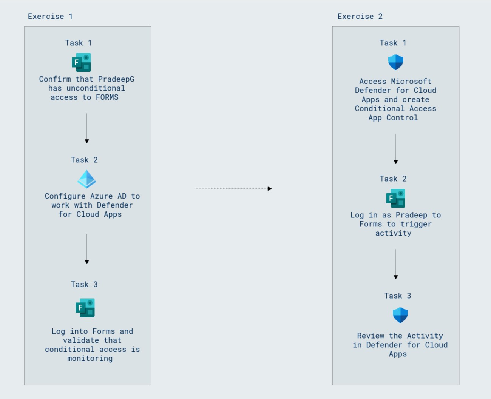

## Exercise 1 - Create and test the Conditional Access App Control policy
  
  In this lab, you will learn to create and test a Conditional Access App Control policy. 

### Task 1 - Confirm that PradeepG has unconditional access to FORMS

In this task, you will confirm that Pradeep Gupta has unconditional access to Microsoft Forms by logging in through an InPrivate browsing window and verifying that the application opens without any warning messages. You will also manage Pradeep's credentials in the Azure portal if necessary.

1. Open a Microsoft Edge browser, launch a new **InPrivate** browsing window, and browse to [https://forms.microsoft.com](https://forms.microsoft.com).

   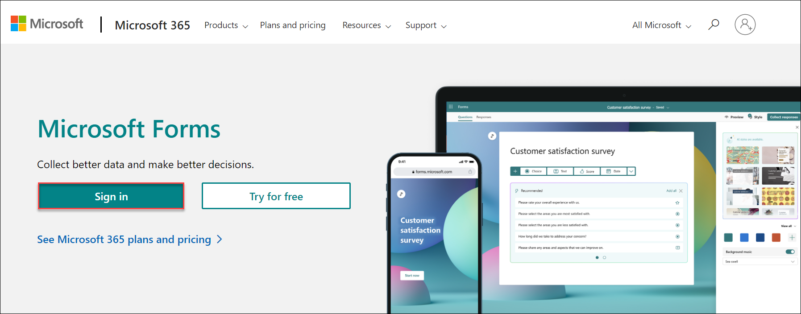

1. Select **Sign in** and log in as Pradeep Gupta.
    
   | **Setting**| **Value**|
   | :--- | :--- |
   | Username |**<inject key="User 01 UPN"></inject>**|
   | Password|**<inject key="User 01 Password"></inject>**|
    
1. Confirm that Microsoft Forms opens and that you do not get any warning messages.

   >**Note:** You will not have access to Microsoft Forms.

1. Close the InPrivate browsing window.

### Task 2 - Configure Microsoft Entra ID to work with Defender for Cloud Apps

In this task, you will configure Microsoft Entra ID to work with Defender for Cloud Apps by creating a Conditional Access policy to monitor Pradeep's usage of Microsoft Forms. You will also disable security defaults to enable the new policy and finalize the configuration.

1. Navigate to Azure Portal, in **Search resources, services and docs (1)** search and select for **Microsoft Entra ID (2)**.

   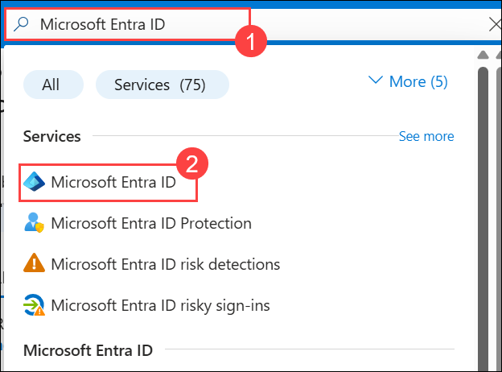

1. From the left-hand navigation pane, under **Manage (1)**, select **Security (2)**.

    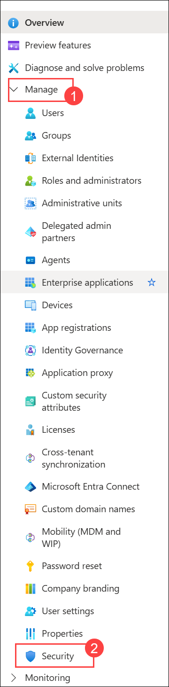

1. From the left-hand navigation pane, under **Protect (1)**, select **Conditional Access (2)**.

   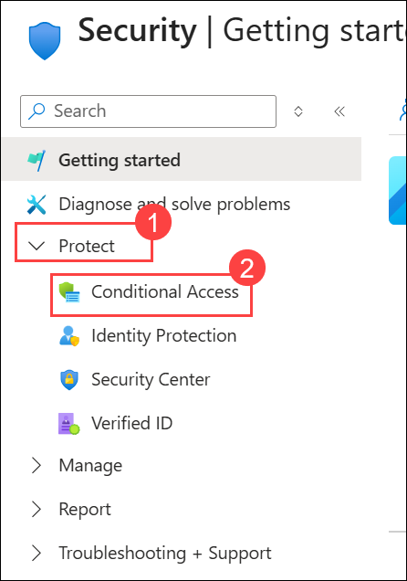

1. Select **+ Create new policy**.

   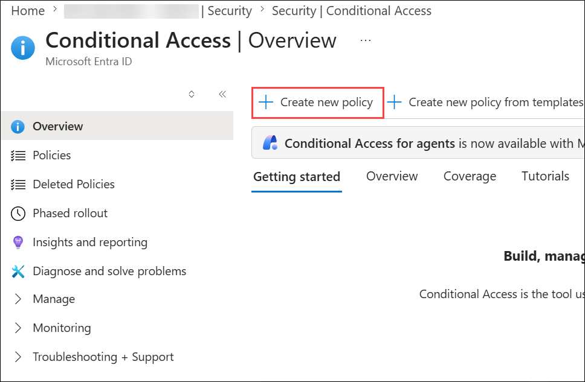

1. Enter a policy name, **Monitor Pradeep using Forms (1)**.

1. Under **Users (2)**, select **0 users and groups selected**, under **Include**, select **Select users and groups**, and select **Users and groups**. Choose **Pradeep Gupta** account for the lab tenant and select **Select**.

1. Under Target resources, select **No target resources selected**, under **Include**, select **All resources (formerly 'All cloud apps') (3)**. 

1. Under **Access controls**, under **Session**, select **0 controls selected**.

1. Select the **Use Conditional Access App Control (4)** box, select the drop-down and select **Monitor only (Preview)**, and select **Select**.

1. Under **Enable policy (5)**, select **On**, Select **Create (6)**
    
    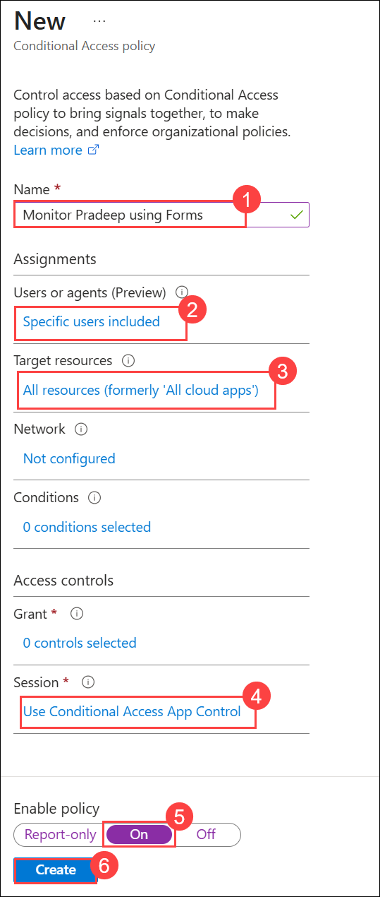

    > **Congratulations** on completing the task! Now, it's time to validate it. Here are the steps:
    > - Hit the Validate button for the corresponding task. If you receive a success message, you can proceed to the next task.
    > - If not, carefully read the error message and retry the step, following the instructions in the lab guide. 
    > - If you need any assistance, please contact us at cloudlabs-support@spektrasystems.com. We are available 24/7 to help you out.

       <validation step="63811d93-2f19-414a-8080-7af5209c23db" />

### Task 3 - Log into Forms and validate that conditional access is monitoring

In this task, you will log into Microsoft Forms as Pradeep Gupta in an InPrivate browsing window to validate that the conditional access policy is monitoring access.

1. Launch a new InPrivate browsing window and browse to [https://forms.microsoft.com](https://forms.microsoft.com).

1. Select **Sign in** and log in as Pradeep Gupta.

   | **Setting**| **Value**|
   | :--- | :--- |
   | Username |**<inject key="User 01 UPN"></inject>**|
   | Password|**<inject key="User 01 Password"></inject>**|
    
   >**Note:** Copy the username for Pradeep from the notepad file as mentioned in the previous task.
   
1. Confirm that you get a new message as shown below:

   - Access to Microsoft Forms is monitored.
   
     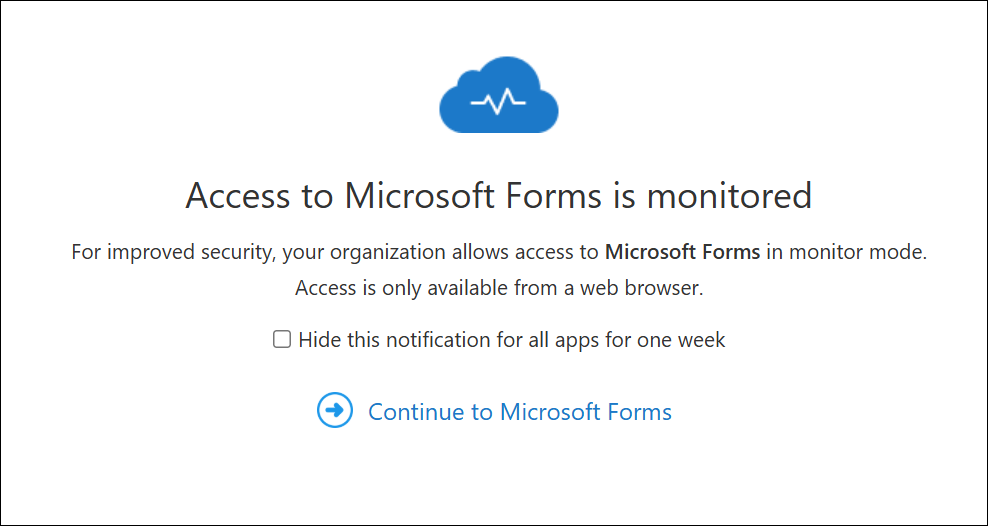

1. Close the InPrivate browsing window.

   >**Note:** If the above message does not appear as expected, verify if the conditional access policy has been created. If it has, refresh the page and wait for a while for the message to appear.

## Exercise 2 - Setup alerts in Microsoft Defender for Cloud Apps

Registering your application establishes a trust relationship between your app and the Microsoft identity platform. The trust is unidirectional: Your app trusts the Microsoft identity platform—not the other way around.

### Task 1 - Access Microsoft Defender for Cloud Apps and create Conditional Access App Control

In this task, you will access Microsoft Defender for Cloud Apps to create a Conditional Access App Control policy, configuring it to monitor Microsoft Forms access and setting up alerts for email notifications.

1. Open a new tab and browse to the [https://security.microsoft.com](https://security.microsoft.com).

   >**Note:** If you get  **Whats new in Microsoft 365 Defender** page close it.

1. In the **Microsoft Defender** portal menu, from the left-hand navigation pane, click on **Show navigation (1)**  under **Cloud apps (2)**, select **Policies (3)** drop-down, and select **Policy management (4)**.

   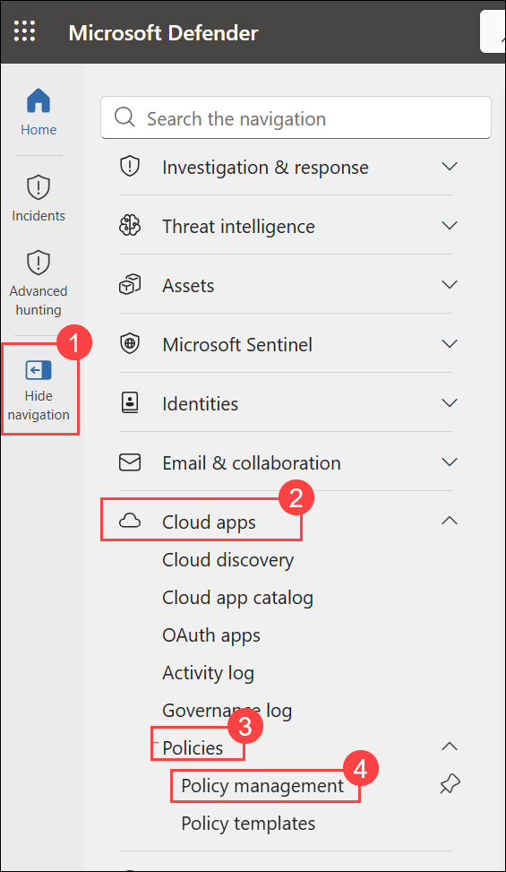

   >**Note:** If you don't see the Cloud apps option, please wait for 5–6 minutes. It should appear shortly.

1. Click on the **Enable Office 365 Cloud App Security (2)** to allow your subscription to use Office 365 Cloud App Security.

   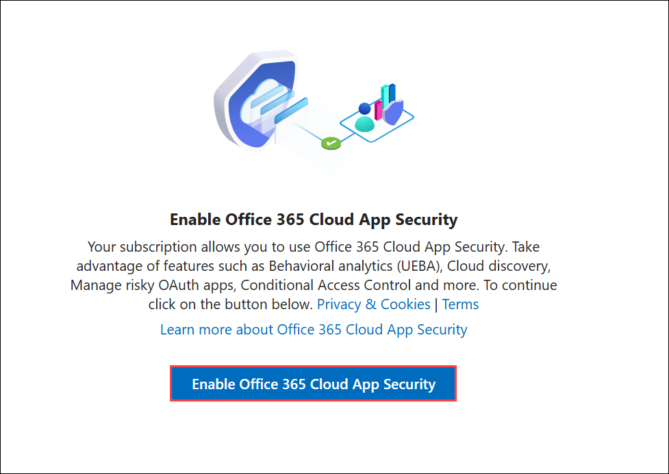

1. Select **+ Create policy (1)**. Select **Access policy (2)**.

   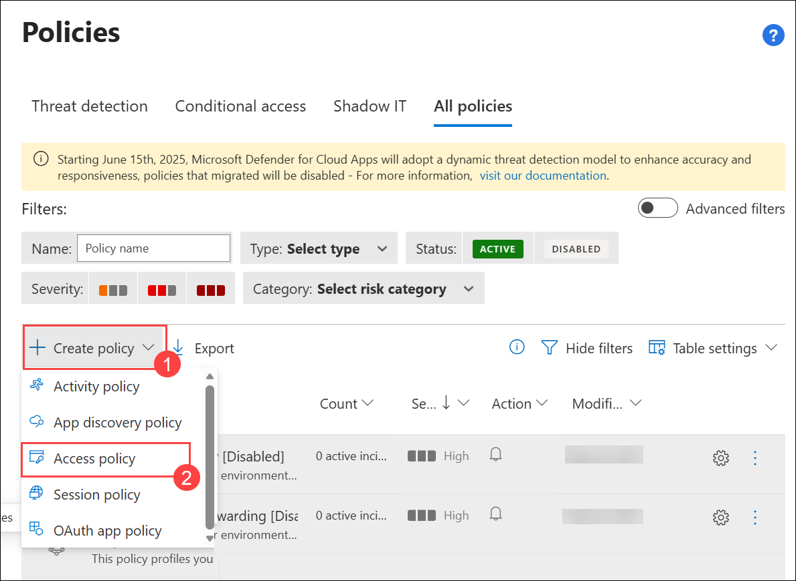

   >**Note:** If you encounter a situation where no conditional access policy appears to be active even though one has been created, please try refreshing the page or logging out and back in.

1. Enter a name for the policy, **Monitor Microsoft Forms access (1)**.

1. Leave the **Category** as **Access control (2)**.

1. Under **Activities matching all of the following**, select the drop-down for **Intune compliant, Microsoft Entra Hybrid joined (3)** and unselect **Microsoft Entra Hybrid joined (4)**.

1. Select the drop-down for **Select apps (5)**, select **Microsoft Forms (6)**.

1. On **Actions**, select **Test (7)**.

1. Under **Alerts**, leave **Create an alert... (8)** checked and select **Send alert as email (9)**.

1. Enter and select **<inject key="AzureAdUserEmail"></inject>**.

1. Select **Create (10)** to create the access policy.

   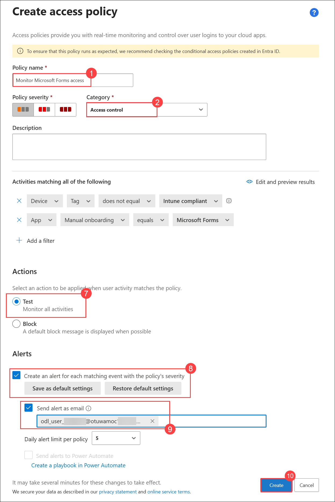

   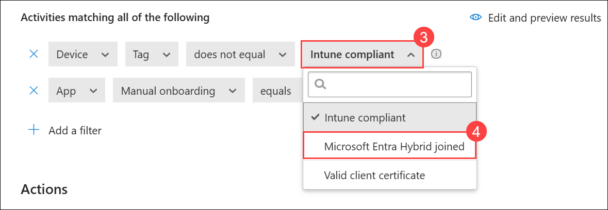

   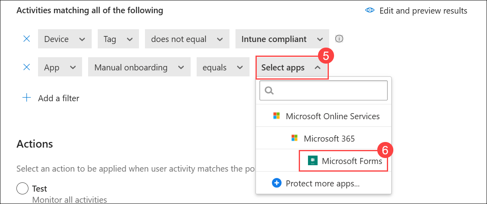

### Task 2 - Log in as Pradeep to Forms to trigger activity

In this task, you will log in to Microsoft Forms as Pradeep Gupta to trigger activity, ensuring the account access is monitored.

1. Launch a new InPrivate browsing window and browse to [https://forms.microsoft.com](https://forms.microsoft.com).

1. Select **Sign in** and log in as Pradeep Gupta.

   | **Setting**| **Value**|
   | :--- | :--- |
   | Username |**<inject key="User 01 UPN"></inject>**|
   | Password|**<inject key="User 01 Password"></inject>**|
    
   >**Note:** Copy the username for Pradeep from the notepad file as mentioned in the previous task.

1. Confirm that you get a new message as shown below:

   - Access to Microsoft Forms is monitored.

     

1. Close the InPrivate browsing window.

### Task 3 - Review the Activity in Defender for Cloud Apps

In this task, you will review activity in Defender for Cloud Apps by accessing the activity log, filtering for Microsoft Forms, and checking sign-on records.

1. Return to the browser running Microsoft Defender.

1. Refresh the browser to ensure the most recent data is downloaded.

1. From the left-hand navigation pane, under **Cloud apps**, select **Activity log**.

1. Using the **App: filter (1)** pick **Microsoft Forms (2)** from the list.

   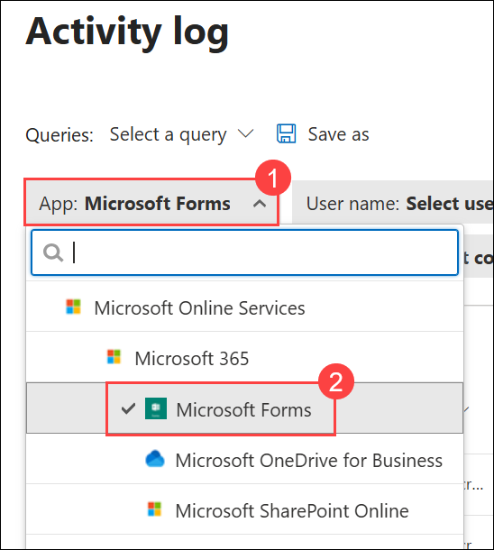

1. Notice the sign-on records for Pradeep.

   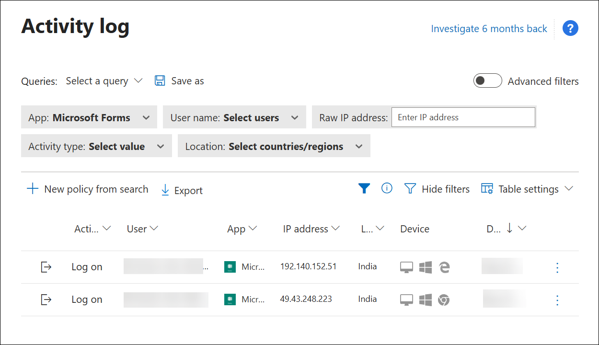

   >**Note:** Please log out and log back in for the logs to appear. It may take 1-2 hours for the logs to generate, so it's possible they might not be visible within the duration of the lab session.

### Review

In this lab, you have completed the following exercises:
- Created and tested the Conditional Access App Control policy
- Setup alerts in Microsoft Defender for Cloud Apps

### You have successfully completed the lab
