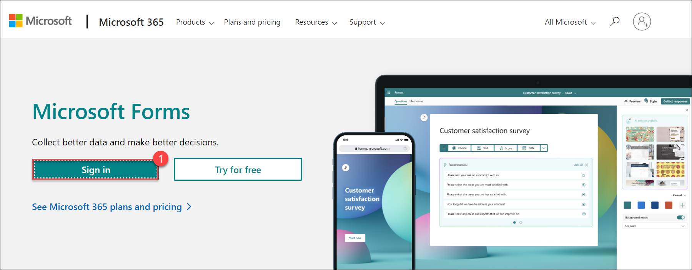
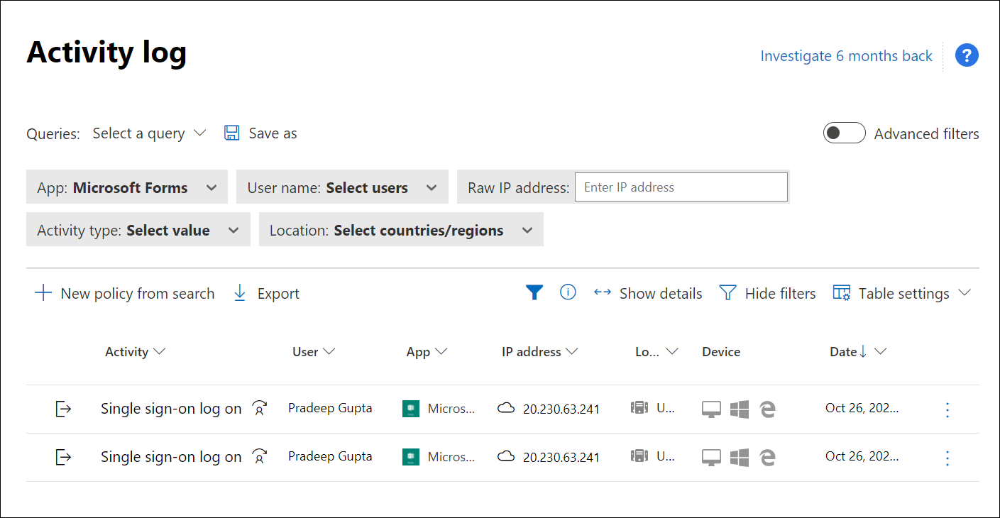

# Lab 18 - Defender for Cloud Apps Access and Session Policies

## Lab scenario

Microsoft Defender for Cloud Apps  allows us to create additional Conditional Access policies specific to the cloud apps that we are monitoring.  Creating these policies can be done from within the Control menu within the Microsoft Defender for Cloud Apps  portal.

## Lab objectives
In this lab, you will complete the following tasks:

+ Exercise 1 - Create and test the Conditional Access App Contol policy
+ Exercise 2 - Setup alerts in Microsoft Defender for Cloud Apps

## Estimated time: 20 minutes

## Architecture diagram

### Exercise 1 - Create and test the Conditional Access App Contol policy

#### Task 1 - Confirm that PradeepG has unconditional access to FORMS

1. Open an Edge browser, launch a new InPrivate browsing window, and browse to [https://forms.microsoft.com](https://forms.microsoft.com).

1. Select **Sign in** and log in as Pradeep Gupta.
   - Username = pradeep.gupta@yourtenant.onmicrosoft.com

      >**Note:** Replace **yourtenant**, with the tenant name, copy it from the **Environment Details** page.
   - Password = Copy it from the **Environment Details** page.

   

1. Confirm that Microsoft Forms opens and that you do not get any warning messages.

1. Close the InPrivate browsing window.

#### Task 2 - Configure Azure AD to work with Defender for Cloud Apps

1. Navigate to Azure Portal, in **Search resources, services and docs** search and select for **Microsoft Entra ID**.

   

2. From the left-hand navigation pane, under **Manage**, select **Security**.

3. From the left-hand navigation pane, under **Protect**, select **Conditional Access**.

4. Select **+ Create new policy**.

5. Enter a policy name, **Monitor Pradeep using Forms**.

6. Under **Users**, select **0 users and groups selected**, under **Include**, select **Select users and groups**, and select **Users and groups**.
Choose the **Pradeep Gupta** account for the lab tenant and select **Select**.

8. Under Target resources, select **No target resources selected**, under **Include**, select **Select apps**,under **Select** choose **None**, and then choose **Microsoft Forms**, and select **Select**. 

9. Under **Access controls**, under **Session**, select **0 controls selected**.

10. Select the **Use Conditional Access App Control** box, select the drop-down and select **Monitor only (Preview)**, and select **Select**.

11. Under **Enable policy**, select **On**, and select **Create**.

#### Task 3 - Log into Forms and validate that conditional access is monitoring

1. Launch a new InPrivate browsing window, and browse to [https://forms.microsoft.com](https://forms.microsoft.com).

1. Select **Sign in** and log in as Pradeep Gupta.
   - Username = pradeep.gupta@yourtenant.onmicrosoft.com

      >**Note:** Replace **yourtenant**, with the tenant name, copy it from the **Environment Details** page.
   - Password = Copy it from the **Environment Details** page.

1. Confirm that Pradeep has access and that you get a new message:
   - Access to Microsoft Forms is monitored.

1. Close the InPrivate browsing window.

### Exercise 2 - Setup alerts in Microsoft Defender for Cloud Apps

#### Task 1 - Access Microsoft Defender for Cloud Apps and create Conditional Access App Control

Registering your application establishes a trust relationship between your app and the Microsoft identity platform. The trust is unidirectional: Your app trusts the Microsoft identity platform—not the other way around.

1. Open a new tab, and browse to the [https://security.microsoft.com](https://security.microsoft.com).

   >**Note:** Close the **Your new endpoint protection home** page.

1. From the left-hand navigation pane, scroll to the bottom and select **More resources**.

1. In the **More resources** window, locate and select **Open** under **Microsoft 365 Defender**.  This will take you to the **Microsoft 365 Defender** portal.

1. In the **Microsoft 365 Defender** portal menu, from the left-hand navigation pane, under **Cloud apps** select **Policies** drop-down, and select **Policy management**.

1. Select **+ Create policy**. Select **Access policy**.

1. Enter a name for the policy, **Monitor Microsoft Forms access**.

1. Leave the **Category** as **Access control**.

1. Under **Activities matching all of the following**, select the drop-down for **Intune compliant, Hybrid Azure AD joined** and unselect **Hybrid Azure AD joined**.

1. Select the drop-down for **Select apps**, select **Microsoft Forms**.

1. Leave **Actions** as **Test**.

1. Under **Alerts**, leave **Create an alert...** checked and select **Send alert as email**.

1. Enter and select **<inject key="AzureAdUserEmail"></inject>**.

1. Select **Create** to create the access policy.

#### Task 2 - Log in as Pradeep to Forms to trigger activity

1. Launch a new InPrivate browsing window, and browse to [https://forms.microsoft.com](https://forms.microsoft.com).

1. Select **Sign in** and log in as Pradeep Gupta.
   - Username = pradeep.gupta@yourtenant.onmicrosoft.com

      >**Note:** Replace **yourtenant**, with the tenant name, copy it from the **Environment Details** page.
   - Password = Copy it from the **Environment Details** page.

1. Confirm that Pradeep has access and that you get a new message:
   - Access to Microsoft Forms is monitored.

1. Close the InPrivate browsing window.

#### Task 3 - Review the Activity in Defender for Cloud Apps

1. Return to the browswer running Microsoft 365 Defender.

2. Refresh the browser to ensure the most recent data is downloaded.

3. From the left-hand navigation pane, under **Cloud apps**, select **Activity log**.

4. Using the **App: filter** pick **Microsoft Forms** from the list.

5. Notice the sign-on records for Pradeep.

   

### Review
In this lab, you have completed:
- Created and test the Conditional Access App Contol policy
+ Setup alerts in Microsoft Defender for Cloud Apps

### You have successfully completed the lab