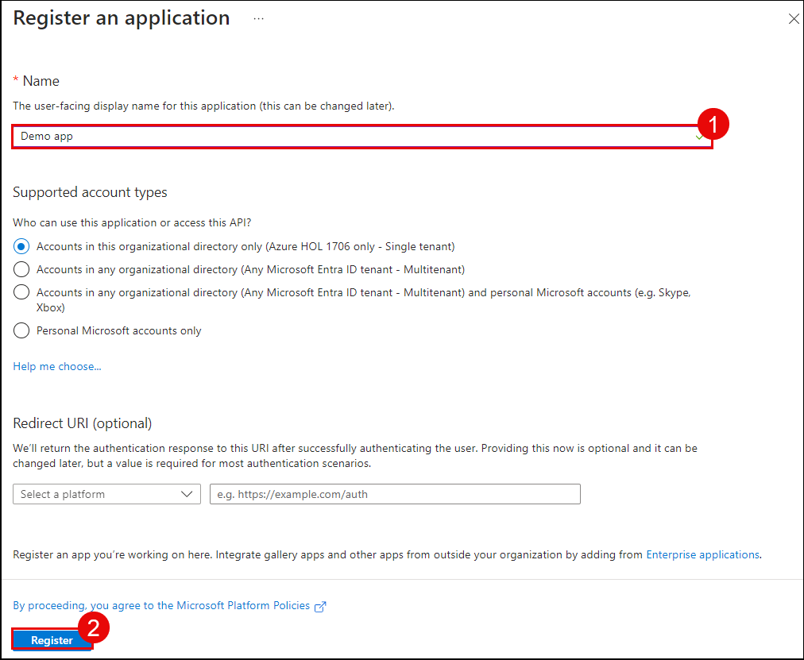
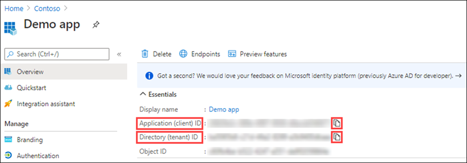
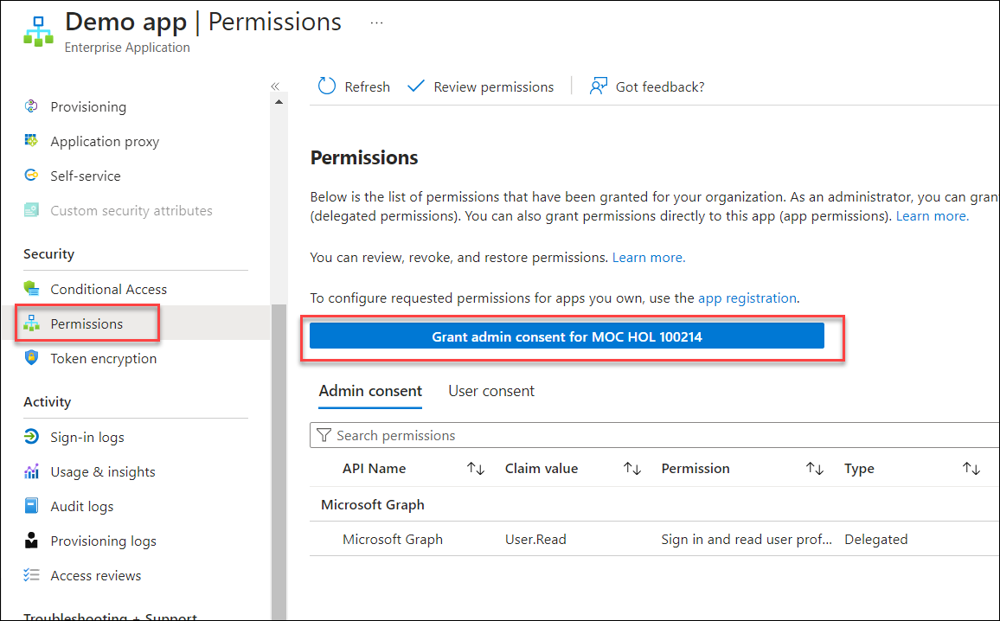

# Lab 21: Grant tenant-wide admin consent to an application

## Lab scenario

For applications your organization has developed or for those that are registered directly in your Azure AD tenant, you can grant tenant-wide admin consent from App registrations in the Azure portal.

## Lab Objectives
After completing this lab, you will be able to complete the following tasks:

- Task 1 - App registration
- Task 2 - Grant admin consent in App registrations
- Task 3 - Grant admin consent in Enterprise apps

## Architecture Diagram

## Estimated time: 30 minutes

#### Task 1 - App registration

Registering your application establishes a trust relationship between your app and the Microsoft identity platform. The trust is unidirectional: Your app trusts the Microsoft identity platform—not the other way around.

1. Sign in to the [https://entra.microsoft.com](https://entra.microsoft.com) using a Global administrator account. The odl user account provided in the Environment will be having Global administrator role assigned. 

2. Open the portal menu and then select **Identity**.

3. On the Identity menu, under **Applications (1)**, select **App registrations (2)** and click on **+ New registration (3)**.

   

4. On the **Register an application** blade, register an app named **Demo app (1)** using the default values. You do not need to enter the redirect URI and click on **Register (2)**.

    

5. When complete, you will be directed to the **Demo app** blade.

     > **Congratulations** on completing the task! Now, it's time to validate it. Here are the steps:
     > - Hit the Validate button for the corresponding task. If you receive a success message, you can proceed to the next task. 
     > - If not, carefully read the error message and retry the step, following the instructions in the lab guide.
     > - If you need any assistance, please contact us at labs-support@spektrasystems.com. We are available 24/7 to help

     <validation step="8bc7c83f-773b-44c7-ba7a-567f0d85f110" />

#### Task 2 - Grant admin consent in App registrations

   >**Warning** - Granting tenant-wide admin consent to an application will grant the app and the app's publisher access to your organization's data. Carefully review the permissions the application is requesting before granting consent.

The Global Administrator role is required in order to provide admin consent for application permissions to the Microsoft Graph API.

1. In Microsoft Azure, browse to **Microsoft Entra ID**, then select **App registrations**, and then select **Demo app** under **All Applications tab**.

2. On the **Demo app** page, locate and copy and save each **Application (client) ID** and **Directory (tenant) ID** values so that you can use them later.

    

3. In the left navigation, under **Manage**, select **API permissions**.

4. Under **Configured permissions**, select **Grant admin consent**.

    

5. Review the dialogue box, and then select **Yes.**

   >**Warning** - Granting tenant-wide admin consent through App registrations will revoke any permissions that had previously been granted tenant-wide. Permissions previously granted by users on their own behalf will not be affected.

#### Task 3 - Grant admin consent in Enterprise apps

You can grant tenant-wide admin consent through Enterprise applications if the application has already been provisioned in your tenant.

1. In Microsoft Entra admin center, browse to **Identity > Applications > Enterprise applications > Demo app.**

2. On the **Demo app** page, in the left navigation, under **Security,** select **Permissions.** Under **Permissions,** select **Grant admin consent.**

    

   >**Warning** - Granting tenant-wide admin consent through App registrations will revoke any permissions that had previously been granted tenant-wide. Permissions previously granted by users on their own behalf will not be affected.

4. When prompted, sign in using your Global Administrator account.

5. In the **Permissions requested** dialog box, review the information and then select **Accept**.

## Review

In this lab you have completed the following tasks:
- Performed App registration
- Granted admin consent in Enterprise apps

## You have successfully completed the lab
