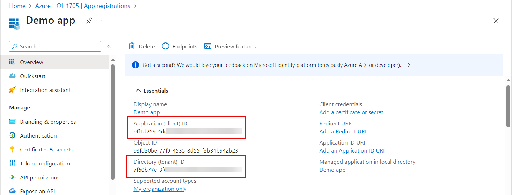
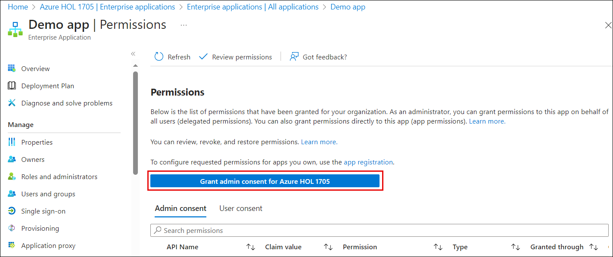

# Lab 21: Grant tenant-wide admin consent to an application

## Lab scenario

For applications your organization has developed or for those that are registered directly in your Azure AD tenant, you can grant tenant-wide admin consent from App registrations in the Azure portal.

## Lab Objectives
After completing this lab, you will be able to:
- Task 1 - App registration
- Task 2 - Grant admin consent in Enterprise apps

#### Estimated time: 15 minutes

### Exercise 1 - Admin Consent

#### Task 1 - App registration

Registering your application establishes a trust relationship between your app and the Microsoft identity platform. The trust is unidirectional: Your app trusts the Microsoft identity platform—not the other way around.

1. Sign in to [https://portal.azure.com](https://portal.azure.com) using a Global Administrator account.

2. Open the portal menu and then search for and select **Microsoft Entra ID**.

3. On the **Microsoft Entra ID** blade, under **Manage**, select **App registrations.**

4. On the **App registrations** page, on the menu, select **+ New registration**.

5. On the **register an application** blade, register an app named **Demo app** using the default values. You do not need to enter the redirect URI.

    

6. When complete, you will be directed to the **Demo app** blade.

#### Task 2 - Grant admin consent in App registrations

   >**Warning** - Granting tenant-wide admin consent to an application will grant the app and the app's publisher access to your organization's data. Carefully review the permissions the application is requesting before granting consent.

The Global Administrator role is required in order to provide admin consent for application permissions to the Microsoft Graph API.

1. In a previous task, you created an app named Demo app. If necessary, in Microsoft Azure, browse to **Microsoft Entra ID**, then select **App registrations**, and then select **Demo app**.

2. On the **Demo app** page, locate and copy and save each **Application (client) ID** and **Directory (tenant) ID** values so that you can use them later.

    

3. In the left navigation, under **Manage**, select **API permissions**.

4. Under **Configured permissions**, select **Grant admin consent**.

    

5. Review the dialogue box, and then select **Yes.**

   >**Warning** - Granting tenant-wide admin consent through App registrations will revoke any permissions that had previously been granted tenant-wide. Permissions previously granted by users on their own behalf will not be affected.

#### Task 3 - Grant admin consent in Enterprise apps

You can grant tenant-wide admin consent through Enterprise applications if the application has already been provisioned in your tenant.

1. In Microsoft Azure, browse to **Microsoft Entra ID > Enterprise applications > Demo app.**

2. On the **Demo app** page, in the left navigation, under **Security,** select **Permissions.**

3. Under **Permissions,** select **Grant admin consent.**

    

   >**Warning** - Granting tenant-wide admin consent through App registrations will revoke any permissions that had previously been granted tenant-wide. Permissions previously granted by users on their own behalf will not be affected.

4. When prompted, sign in using your Global Administrator account.

5. In the **Permissions requested** dialog box, review the information and then select **Accept**.

## Review

In this lab you have completed the following tasks:
- Performed App registration
- Granted admin consent in Enterprise apps

## You have successfully completed the lab
