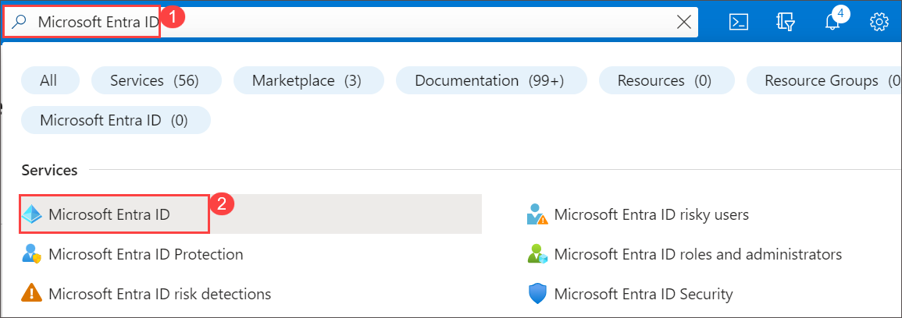
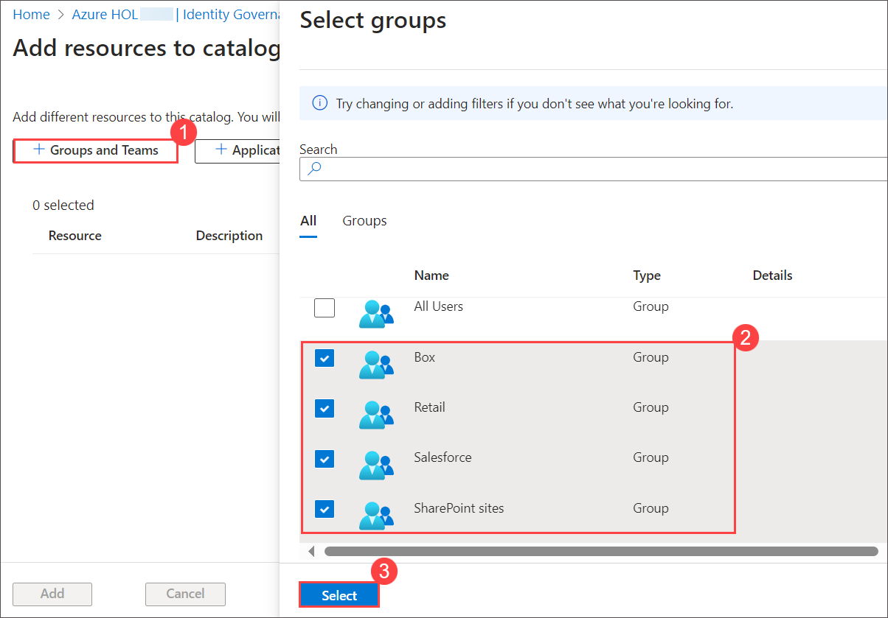
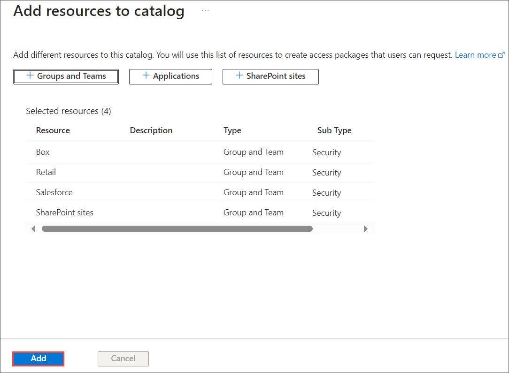
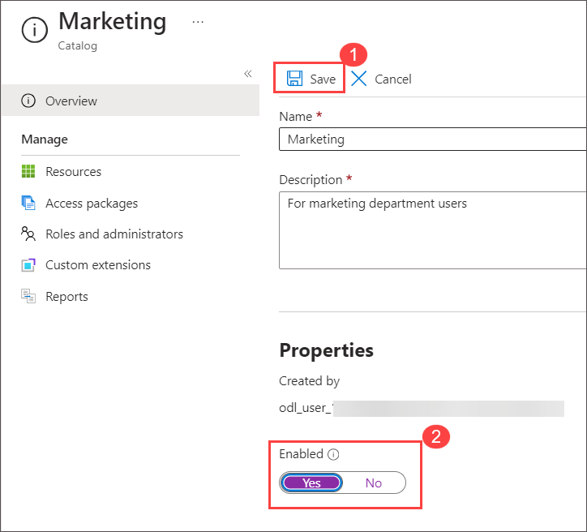
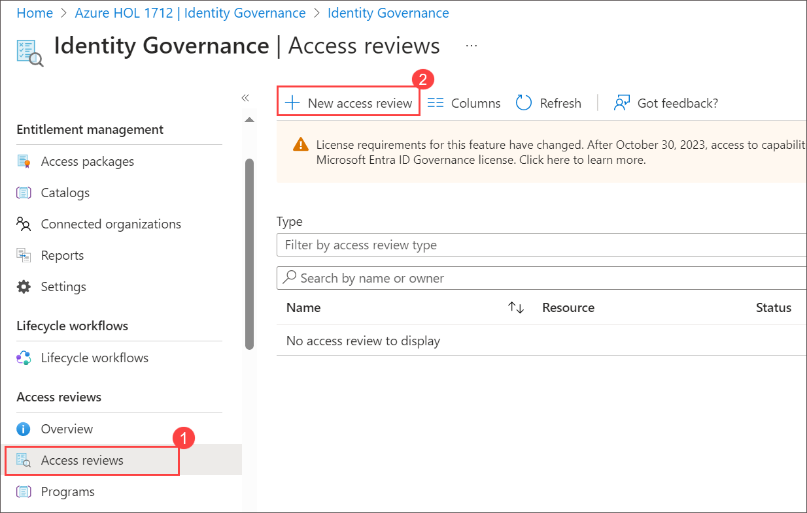
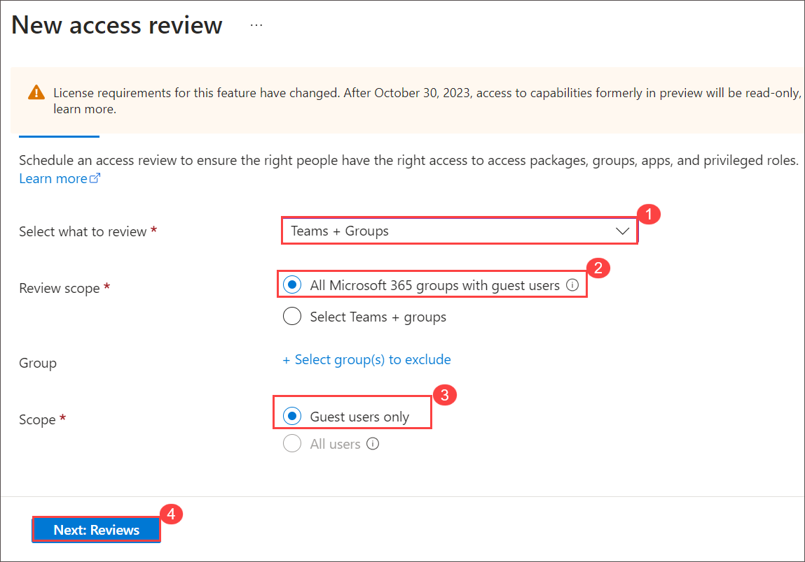

# Lab 22: Create and manage a catalog of resources in Azure AD entitlement management

## Lab scenario

A catalog is a container of resources and access packages. You create a catalog when you want to group related resources and access packages. Whoever creates the catalog becomes the first catalog owner. A catalog owner can add additional catalog owners. You must create and configure a catalog in your organization.

## Lab objectives
In this lab, you will complete the following tasks:

+ Task 1 - Create a catalog
+ Task 2 - Create a groups
+ Task 3 - Add resources to a catalog
+ Task 4 - Add additional catalog owners
+ Task 5 - Edit a catalog
+ Task 6 - Create Access reviews for guest users
+ Task 7 - Delete a catalog

## Estimated time: 15 minutes

### Architecture Diagram

   

### Exercise 1 - Building out resources in Entitlement Management
Building out resources in Entitlement Management involves defining and structuring the catalog of resources and services available to users, streamlining access management within an organization.

#### Task 1 - Create a catalog

1. In **Search, resources, services and docs**, search and select for **Microsoft Entra ID**.

    

1. Under **Manage** section, select **Identity Governance**.

    

1. From the left-hand navigation menu, under **Entitlement management**, select **Catalogs** and on the top menu, select **+ New Catalog**.

    

1. In the New catalog pane, specify the following details and click on **Create (4)**.

   | **Option**                          | **Value**                               |
   | ----------------------------------- | --------------------------------------- |
   | **Name**                            | **Marketing**.                     |
   | **Description**                     | Enter **For marketing department users**.                 |
   | **Enabled**                         | **No**. |
   |||

   .png)

1. You may choose to enable the catalog for immediate use or disable if you intend to stage it or keep it unavailable until you intend to use it. For this exercise, the catalog does not need to be enabled.

#### Task 2 - Create a groups

1. In **Search, resources, services and docs**, search and select for **Microsoft Entra ID**.

1. From the left-hand navigation pane, select **Groups**. On **Groups | All groups**, select **New Group**.

1. Now, follow these instruction to create a groups:-

    | Settings | Value |
    | -------- | ------ |
    | Group type | **Security** |
    | Group name | **Retail** |
    | Group description | **Groups and Teams** |

1. Select **Create**.

1. On **Groups | All groups**, select **New Group**.

1. Now, follow these instruction to create a groups:-

    | Settings | Value |
    | -------- | ------ |
    | Group type | **Security** |
    | Group name | **Box** |
    | Group description | **Applications** |

1. Select **Create**.

1. On **Groups | All groups**, select **New Group**.

1. Now, follow these instruction to create a groups:-

    | Settings | Value |
    | -------- | ------ |
    | Group type | **Security** |
    | Group name | **Salesforce** |
    | Group description | **Applications** |

1. Select **Create**.

1. On **Groups | All groups**, select **New Group**.

1. Now, follow these instruction to create a groups:-

    | Settings | Value |
    | -------- | ------ |
    | Group type | **Security** |
    | Group name | **SharePoint sites** |
    | Group description | **SharePoint** |

1. Select **Create**.

     > **Congratulations** on completing the task! Now, it's time to validate it. Here are the steps:
     > - Hit the Validate button for the corresponding task. If you receive a success message, you can proceed to the next task. 
     > - If not, carefully read the error message and retry the step, following the instructions in the lab guide.
     > - If you need any assistance, please contact us at labs-support@spektrasystems.com. We are available 24/7 to help

     <validation step="37c693fb-cab4-469c-855b-5e0afd7108df" />

#### Task 3 - Add resources to a catalog

To include resources in an access package, the resources must exist in a catalog. The types of resources you can add are groups, applications, and SharePoint Online sites. The groups can be cloud-created Microsoft 365 Groups or cloud-created Azure AD security groups. The applications can be Azure AD enterprise applications, including both SaaS applications and your own applications federated to Azure AD. The sites can be SharePoint Online sites or SharePoint Online site collections.

1. In **Search, resources, services and docs**, search and select for **Microsoft Entra ID**.

1. Under **Manage** section, select **Identity Governance**.

1. On the Identity Governance page, select **Catalogs**.

1. In the **Catalogs** list, select **Marketing**.

1. From the left-hand navigation pane, under **Manage**, select **Resources** and on the menu, select + **Add resources**.
   

1. Select **+ Groups and Teams**. In the Add resources to catalog page, review the available options. Add the following items: **Box**, **Retail**, **Salesforce**, and **SharePoint sites**.
   

1. Back on **Add recources to catalog** page and click on **Add**, these resources can now be included in access packages within the catalog.
     

   **Note**: For this exercise, it is okay to choose any resource you may have available.

#### Task 4 - Add additional catalog owners

The user that created a catalog becomes the first catalog owner. To delegate management of a catalog, you add users to the catalog owner role. This helps share the catalog management responsibilities.

1. If necessary, in the Azure portal, browse to **Microsoft Entra ID**, from the left-hand navigation pane, select **Identity Governance** and select **Catalogs** and then select **Marketing**.

2. In the Marketing catalog page, from the left-hand navigation pane, select **Roles and administrators (1)**, select **+ Add catalog owner (2)** and Select members pane opens, select your **Adele Vance** and then select **Select**.
  

5. Review the newly added role in the Roles and administrators list.

#### Task 5 - Edit a catalog

You can edit the name and description for a catalog. Users see this information in an access package's details.

1. On the Marketing page, from the left-hand navigation pane, select **Overview**.

2. On the top menu, select **Edit**.

3. Review the setting and, under **Properties** > **Enabled**, select **Yes** and click  **Save**.

    

#### Task 6 - Create Access reviews for guest users

1. Navigate back to the **Identity Governance**.

1. Access reviews can manage the access lifecycle.  Azure AD Identity Governance provides an overview dashboard showing the status of access reviews.

1. From the left-hand navigation pane, select **Access reviews** under **Access reviews**and select **+ New access review** to create your guest user access review.  The tile will open to configure the access review for guest users.

    

1. On **New access review** blade, specify the following detail and click on **Next: Reviews**.
    | Settings | Value |
    | -------- | ------ |
    | **Select what to review** | **Teams + Groups** |
    | **Review scope** | select **All Microsoft 365 groups with guest users** |
    | **Scope** | **Guest users only** |
    |||
    

1. The next tile is where you configure who reviews and approves access, how often access will be reviewed, and when access will expire.

1. Under **Select reviewers**, select **Group owners** as these reviewers. 

    >**Note**: Guest users should not be allowed to review their own access as a good identity governance practice.

1. Enter a **Duration (in days)**, default is 3, choose a **Review recurrence** and **Start date** for the review.

1. Select **Next: Settings** and configure the settings for how the review will take place and what happens when the guest user responds or does not respond.  A good practice is to select **Auto apply results to resource** and select **Remove access** for **If reviewers don't respond** and click on **Next: Review + create**,
    

1. Select **Create** to create the new **Access review**.

### Review
In this lab, you have completed:
- Created a catalog
- Create a groups
- Added resources to a catalog
- Added additional catalog owners
- Edited a catalog
- Created Access reviews for guest users

### You have successfully completed the lab
