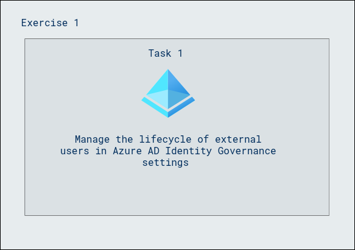
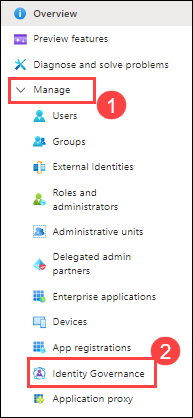

# Lab 24: Manage the lifecycle of external users in Microsoft Entra ID Identity Governance settings  

## Lab scenario

You can select what happens when an external user, who was invited to your directory through an access package request being approved, no longer has any access package assignments. This can happen if the user relinquishes all their access package assignments, or their last access package assignment expires. By default, when an external user no longer has any access package assignments, they are blocked from signing in to your directory. After 30 days, their guest user account is removed from your directory.

## Lab Objectives

In this lab you will be performing the following task:

- Task 1 - Manage the lifecycle of external users in Azure AD Identity Governance settings

## Estimated time: 30 minutes

## Architecture Diagram

   

### Exercise 1 - Microsoft Entra ID Identity Governance settings

#### Task 1 - Manage the lifecycle of external users in Azure AD Identity Governance settings

1. In the Azure Portal, in **Search resources, services and docs** type **Microsoft Entra ID** and select it.

2. From the left navigation pane, choose **Identity Governance (2)** under the **Manage (1)** section.

   

3. In the left navigation menu, under **Entitlement management**, select **Settings (1)**.

4. On the top menu, select **Edit (2)**.

    

5. In the **Manage the lifecycle of external users** section, review the different settings for external users.

6. When an external user loses their last assignment to any access packages, if you want to block them from signing in to this directory, set the **Block external user from signing in to this directory** to **Yes (1)**.

7. If a user is blocked from signing in to the directory, the user will be unable to re-request the access package or request additional access in this directory. Do not configure blocking them from signing in if they will subsequently need to request access to other access packages.

8. Once an external user loses their last assignment to any access packages, if you want to remove their guest user account in this directory, set **Remove external** user to **Yes (2)**.

    **Note** - Entitlement management only removes accounts that were invited through entitlement management. Also, note that a user will be blocked from signing in and removed from this directory even if that user was added to resources in this directory that were not access package assignments. If the guest was present in this directory prior to receiving access package assignments, they will remain. However, if the guest was invited through an access package assignment, and after being invited was also assigned to a OneDrive for Business or SharePoint Online site, they will still be removed.

9. If you want to remove the guest user account in this directory, you can set the number of days before it is removed. If you want to remove the guest user account as soon as they lose their last assignment to any access packages, set **Number of days before removing external user from this directory** to **0 (3)**.

10. If you’ve made any changes, select **Save (4)**.

    

    > **Congratulations** on completing the task! Now, it's time to validate it. Here are the steps:
    > - Hit the Validate button for the corresponding task. If you receive a success message, you can proceed to the next task.
    > - If not, carefully read the error message and retry the step, following the instructions in the lab guide. 
    > - If you need any assistance, please contact us at labs-support@spektrasystems.com. We are available 24/7 to help you out.

   <validation step="ba4b2d32-214b-4e01-80e3-1ce188effb11" />

## Review

In this lab, you have performed  the following task:

- Manage the lifecycle of external users in Microsoft Entra ID Identity Governance settings.
  
## You have successfully completed the lab
