# Lab 25 - Creating Access Reviews for Internal and External Users  

## Lab scenario

Privileged user access should be regularly reviewed in a similar manner. Since these are elevated access assignments, the review of these should be done on a consistent basis as identified by the company.  Unused and unnecessary privileged assignments should be removed.  Automated removal should also be configured for users that are no longer with the company or have changed departments within the company.

## Estimated time: 5 Minutes

## Lab Objectives

After completing this lab, you will be able to:

+ Exercise 1 - Create an internal Access review

## Architecture Diagram

   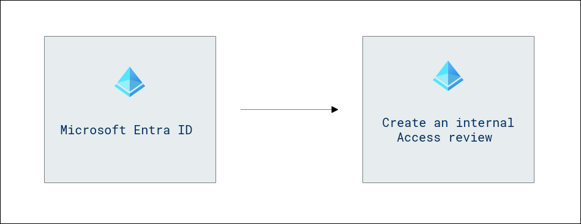

### Exercise 1 - Create an internal Access review
In this Exercise you'll learn creating an internal Access review involves regularly evaluating and validating the access permissions of users and roles within your organization to maintain security and compliance.

1. Select the **Show portal menu (1)** hamburger icon and then select **Microsoft Entra ID (2)**.

    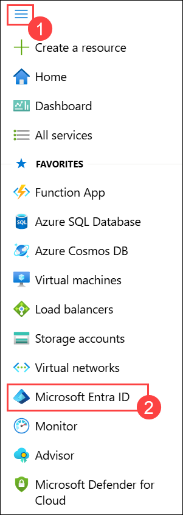

1. From the left-hand navigation pane, under **Manage (1)** option,select **Groups (2)**.

   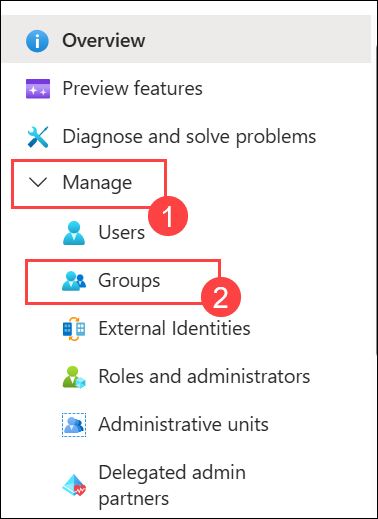

1. On **Groups | All groups**, select **New group**. 

   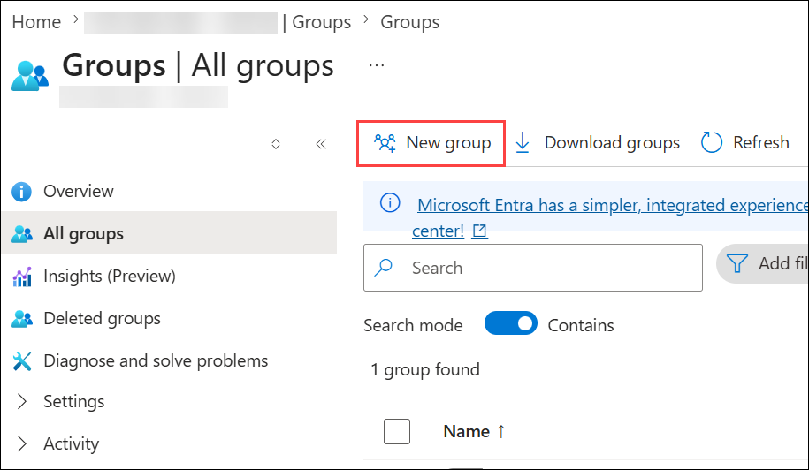

1. Now, follow the instructions for creating the groups, and select **Create**:

    |Settings|Value|
    |--------|-----|
    |Group type| **Security (1)**|
    |Group name| **Sales and Marketing (2)**|
    |Group description| **Sales and Marketing (3)**|
    |Owners| click on **No owners selected (4)** > Select **ODL_User <inject key="DeploymentID" enableCopy="false"/> (5)** and click on **select (6)**|

   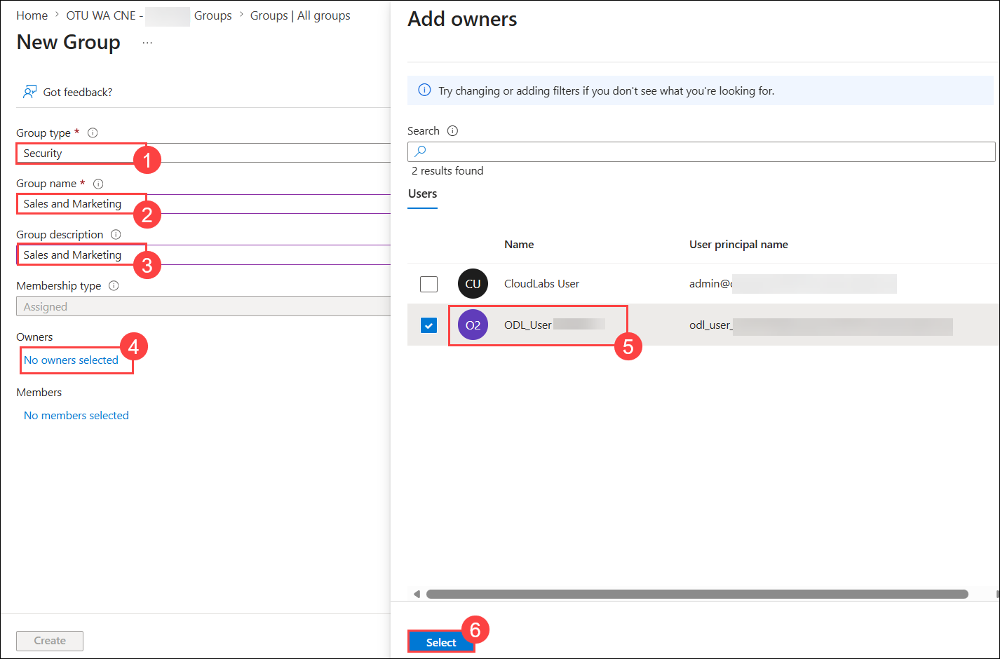

1. Return back to **Microsoft Entra ID** page, from the left-hand navigation pane, under the **Manage** section select **Identity Governance**.

1. On **Identity Goverance** blade, under **Access reviews** section, select **Access reviews** from left panel.

   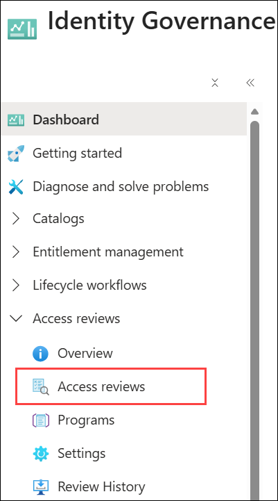
   >**Note**: Access reviews can manage the access lifecycle.

1. On **Identity Governance | Access reviews** blade Select **+ New access review**.

   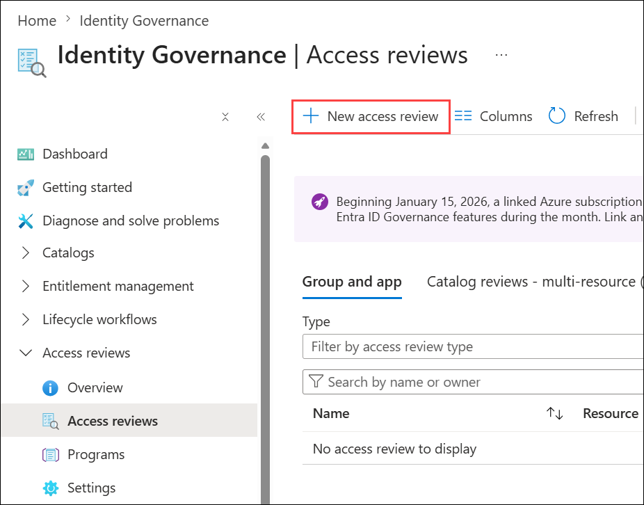

1. On create an access review page, under the Review access to a resource type tile, click on **Select**

   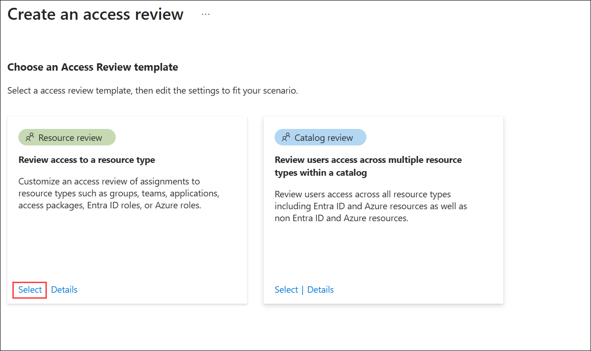

1. In the **Select what to review** box choose **Teams + Groups (1)** from the dropdown and for **Review scope** select **Select Teams + groups (2)**.

   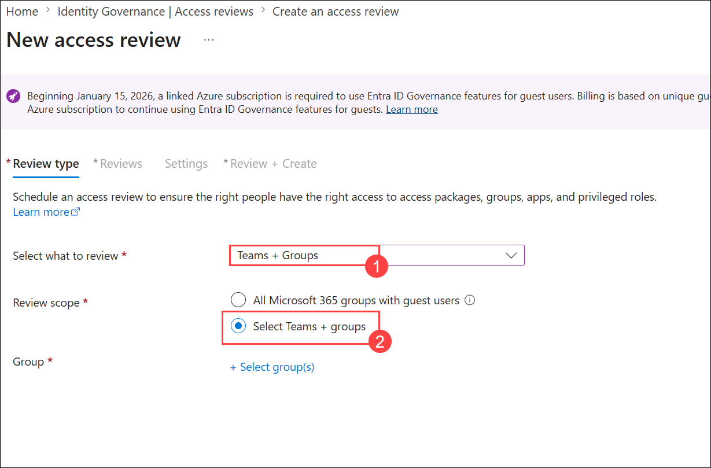

1. For **Groups** select **+Select group(s) (1)**, on **Select group** window select **Sales and Marketing (2)** group from the list, and hit **Select (3)**.

    .png)
   
1. Back on **New access review**, set the **Scope** to **All users (1)** and select **Next: Reviews (2)** option for move forward in the wizard.

   .png)

1. The next step is to determine the reviewers. These reviewers can be the member themselves to do a self-review or can be assigned to supervisors if reviewing access for an entire department. You can also set the action when a reviewer does not respond to automatically remove that privileged access from the member.

1. On the **Reviews** page, follow the instruction, and select **Next: Settings (6)**:

    |Settings|Value|
    |--------|-----|
    |Select reviewers| **Selected user(s) or group(s) (1)**|
    |Users or groups| Click on **+ Select reviewers** and select **ODL_User <inject key="DeploymentID" enableCopy="false"/> (2)**|
    |**Specify recurrence of review**| 
    |**Duration in days**| **Keep it as default (3)**|
    |Review recurrence| **Select the options of your choice (4)**|
    |Start date| **Select the options of your choice (5)**|

    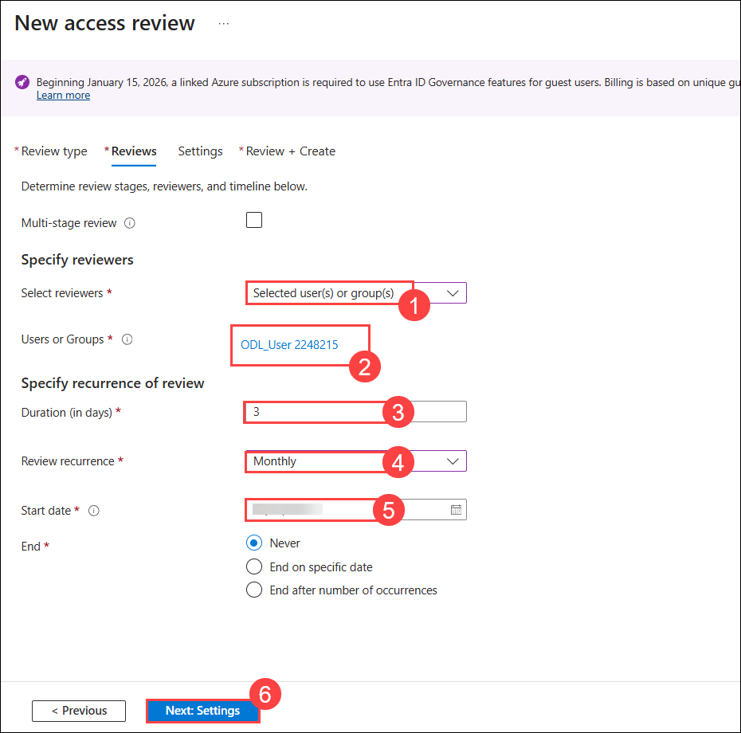
    
1. The advanced settings allow you to put a message as part of the review. On **Settings** page, keep it as default.

1. Select **Next: Review and Create** to finalize the access review.

1. On the **Review and Create** tab enter **SC300 Access Review Test** for Review name and  click on **Create**.

   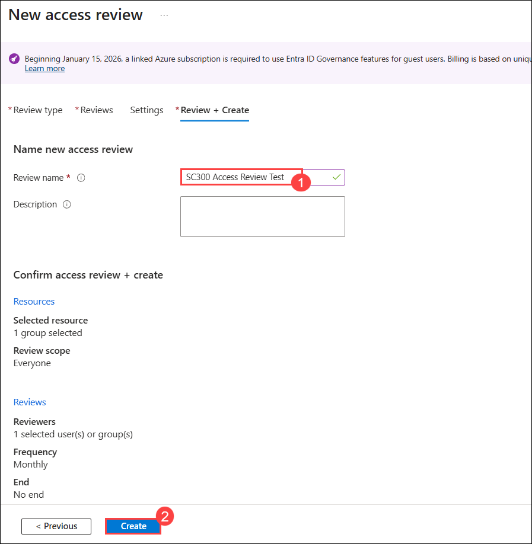

1. Back on **Identity Governance | Access reviews** page refresh page and the access review list will populate with the roles and owners of the reviews.

   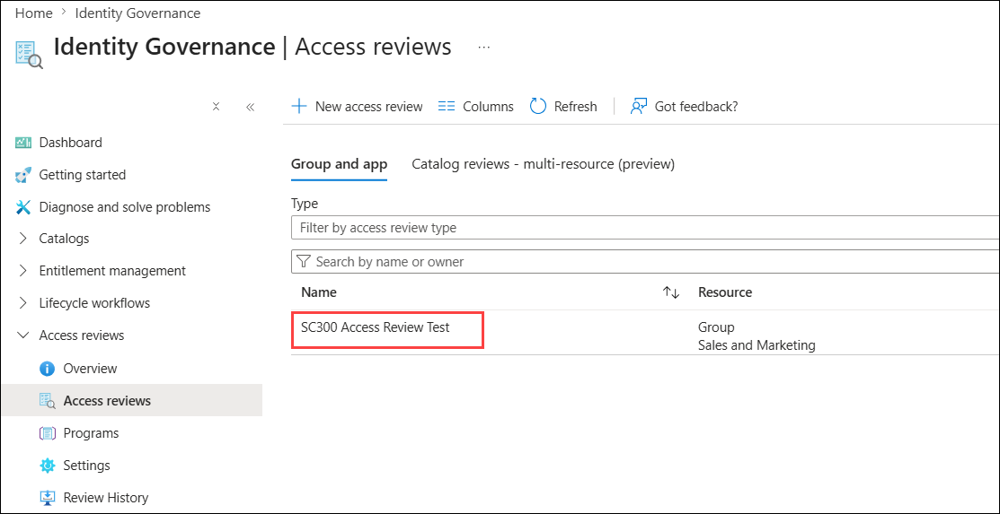

1. Members that are being reviewed will receive an email when the review is initiated.

1. Selecting an access review of one of the roles will provide status on these access reviews.

    > **Congratulations** on completing the task! Now, it's time to validate it. Here are the steps:
    > - Hit the Validate button for the corresponding task. If you receive a success message, you can proceed to the next task.
    > - If not, carefully read the error message and retry the step, following the instructions in the lab guide. 
    > - If you need any assistance, please contact us at cloudlabs-support@spektrasystems.com. We are available 24/7 to help you out.

   <validation step="44cd7747-25c1-45c5-9f23-21f401b3e680" />

## Review

In this lab you have completed the following tasks:
- Created an internal Access review.

## You have successfully completed the lab
