# Lab 27 OPTIONAL - Microsoft Sentinel Kusto Queries for Microsoft Entra ID data sources

## Lab Scenario

Microsoft Sentinel is Microsoft's cloud-native SIEM and SOAR solution.  Through connecting data sources from Microsoft and third-party security solutions, you have the ability to execute security operations tasks.  In this lab exercise, you will create a Microsoft Sentinel workspace with data connectors to Microsoft Entra ID for executing hunting queries using Kusto Query Language (KQL). 

## Estimated time: 60 Minutes

## Lab Objectives

In this lab, you will be performing the following tasks:

- Task 1 - Create a Microsoft Sentinel workspace
- Task 2 - Add Microsoft Entra ID as a Data source
- Task 3 - Run Kusto query on User activity

## Architecture Diagram

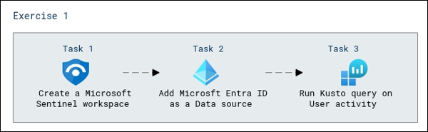

## Exercise 1 - Configure Microsoft Sentinel for Kusto Queries
Configuring Microsoft Sentinel for Kusto Queries enables advanced log and security data analysis within the Azure Sentinel platform, enhancing threat detection and response capabilities.

### Task 1 - Create a Microsoft Sentinel workspace

1. In **Search resources, services, and docs** search for **Microsoft Sentinel (1)** and select for **Microsoft Sentinel (2)**. 

   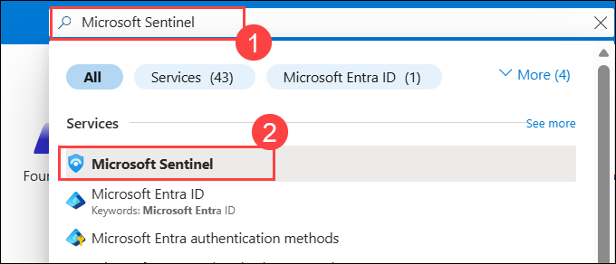

1. On the **Microsoft Sentinel** page, select **+ Create**.

1. In the **Add Microsoft Sentinel to a workspace** tile, select **+ Create a new workspace**.

1. On the **Create Log Analytics workspace** page,

   - Subscription: Leave the default **(1)**

   - In **Resource group**, select **sc-300-rg (2)**

   - Name the workspace as **SentinelLogAnalytics (3)**

   - Select Region as **<inject key="Region" enableCopy="false"/> (4)**

   - Select **Review + Create (5)**

     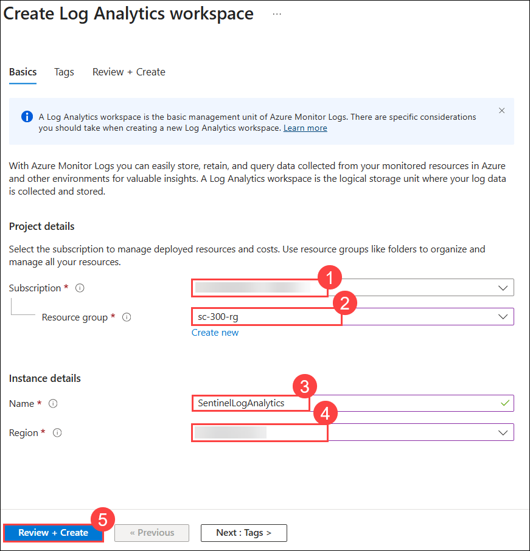

1. Then **Create** and while until the deployment completes.

1. Now, in the Azure portal, navigate to **Microsoft Sentinel** resource.

   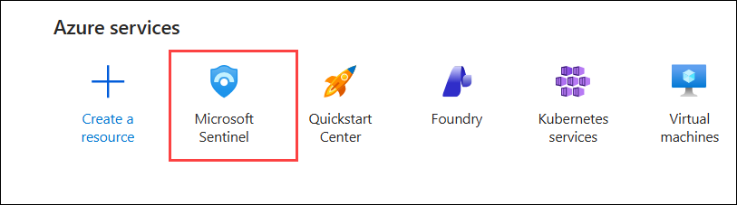

1. Click on **+Create** Microsoft Sentinel.

1. Select **SentinelLogAnalytics (1)** and click on **Add (2)**.This will add the workspace to Microsoft Sentinel and open Microsoft Sentinel.

   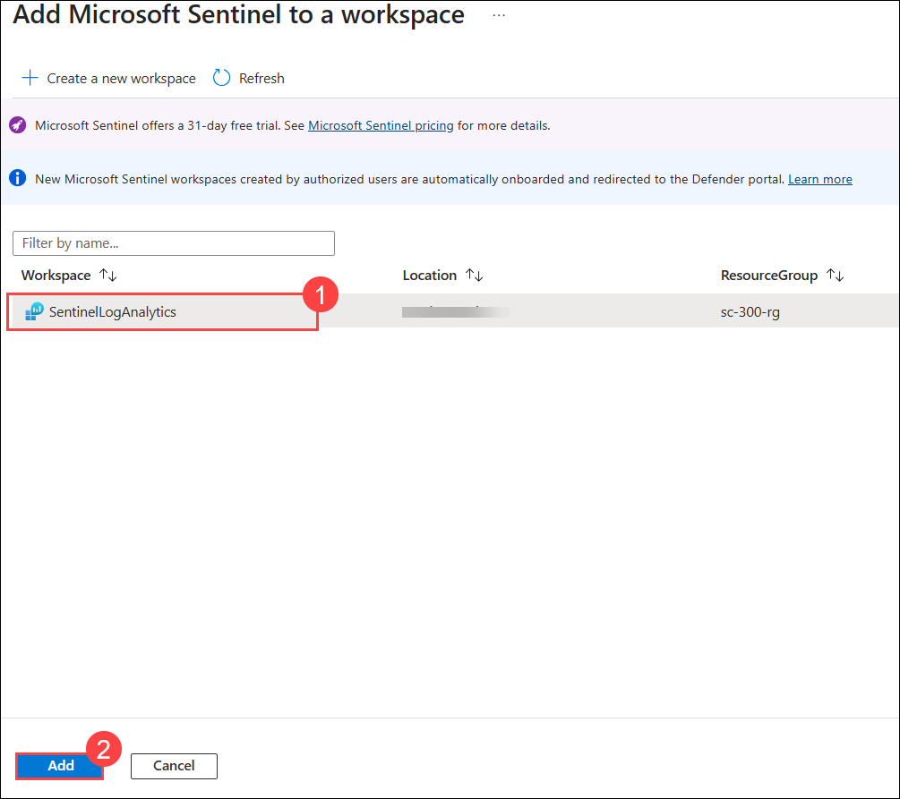

1. If prompted, select **OK** to activate the Microsoft Sentinel free trial.

    > **Congratulations** on completing the task! Now, it's time to validate it. Here are the steps:
    > - Hit the Validate button for the corresponding task. If you receive a success message, you can proceed to the next task.
    > - If not, carefully read the error message and retry the step, following the instructions in the lab guide. 
    > - If you need any assistance, please contact us at cloudlabs-support@spektrasystems.com. We are available 24/7 to help you out.

   <validation step="4e426e86-3c79-41e6-b8e8-1c53996176e3" />

### Task 2 - Add Microsoft Entra ID as a Data source

1. On the **Microsoft Sentinel**, in the left navigation menu, expand the **Content management (1)**, and select **Content hub (2)**.

   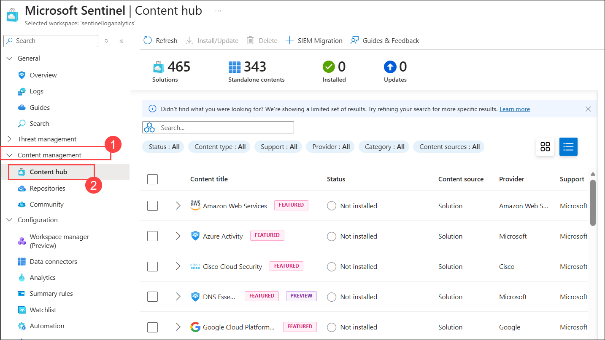

1. Use the search box to look for **Entra (1)** in the list of connectors, locate **Microsoft Entra ID** and mark the checkbox **(2)**. To the right, a preview tile will open. Select **Install (3)**.

   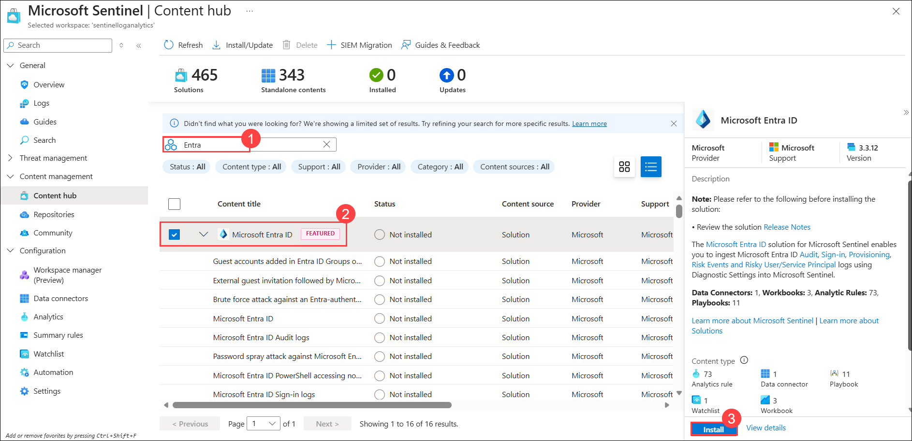

1. After the install finishes, in the left navigation menu, expand the **Configuration (1)**, and select **Data connectors (2)**.

   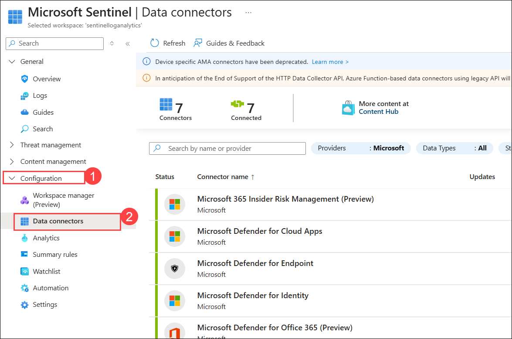

1. Select **Microsoft Entra ID**.

   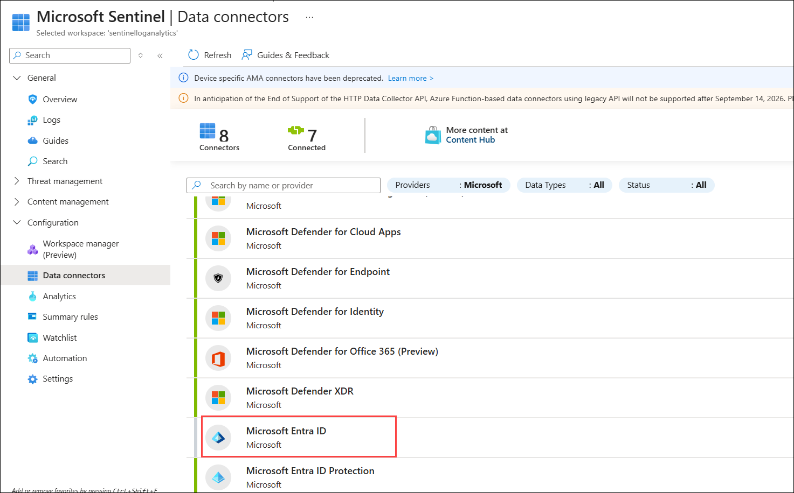

1. Then select **Open connector page**.   

   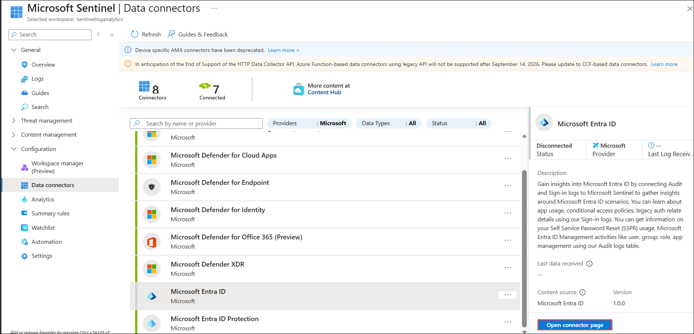

1. In the connector page, the instructions and next steps will be provided for the data connector. Verify that a check-mark is next to each of the **Prerequisites** to continue with the **Configuration**.

   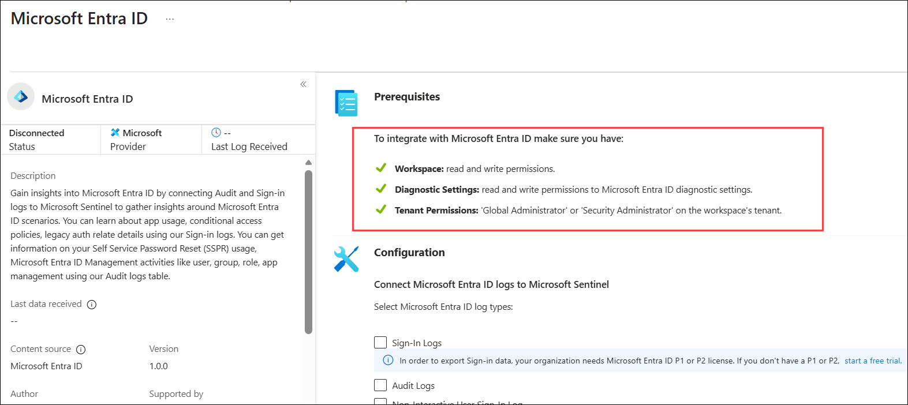

1. Under **Configuration**, check the boxes for **Sign-in logs (1)** and **Audit logs (2)**. Additional log sources are available but are currently in **Preview** and out of scope for this course.

   - Select **Apply Changes (3)**

     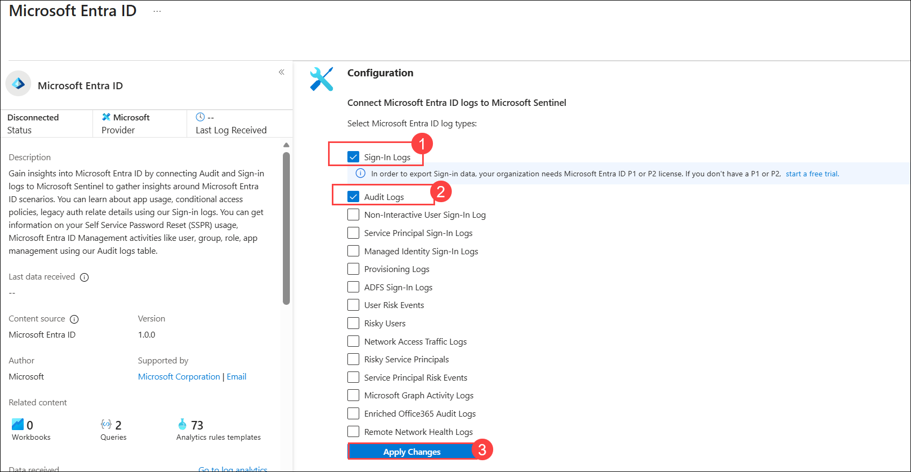

1. Notification will be provided that the changes were applied successfully. Navigate to the **Microsoft Sentinel** workspace by selecting the **X** on the top right of the connector page.

1. Select **Refresh** on the **Microsoft Sentinel | Data connectors** tile and the number `8` will show in the **Connected** count.

    > **Note** - The Microsoft Entra ID data connector may take about 15  minutes to show in the active count.

    > **Note** - If the Connected count isn't displayed after a few minutes, try deleting the connector and then adding it again.
    
    > **Note** - You may experience a delay in the "Connected" count. If it takes more than 20 minutes, please do not wait further and proceed with the next steps. The Microsoft team is currently working on updates for this lab, which is why it has been marked as optional.

### Task 3 - Run Kusto query on User activity

1. In **Microsoft Sentinel** page, from the left-hand navigation page select **Logs** under the **General** menu section.

1. Close the **Welcome to Log Analytics** window.

1. A window will open with sample queries, select **Audit (1)**, search and scroll to find **User IDs (2)**.

   - Select **Run (3)**.

   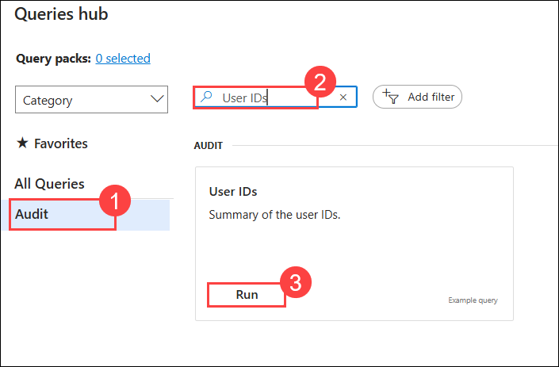

1. This will generate a list of User IDs from Microsoft Entra ID. As the workspace has just been created, you may not see any results yet. Set the query mode to **KQL mode (1)** Please take note of the query format **(2)**.

   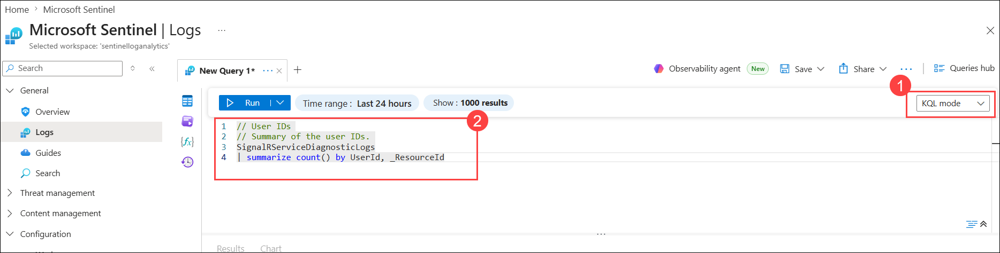

## Review

In this lab you have completed the following tasks:

- Created a Microsoft Sentinel workspace
- Added Azure AD as a Data source
- Ran Kusto query on User activity

## You have successfully completed the lab.
