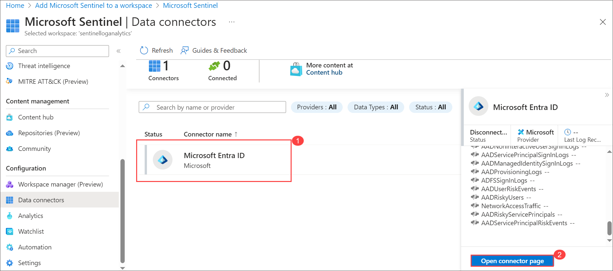
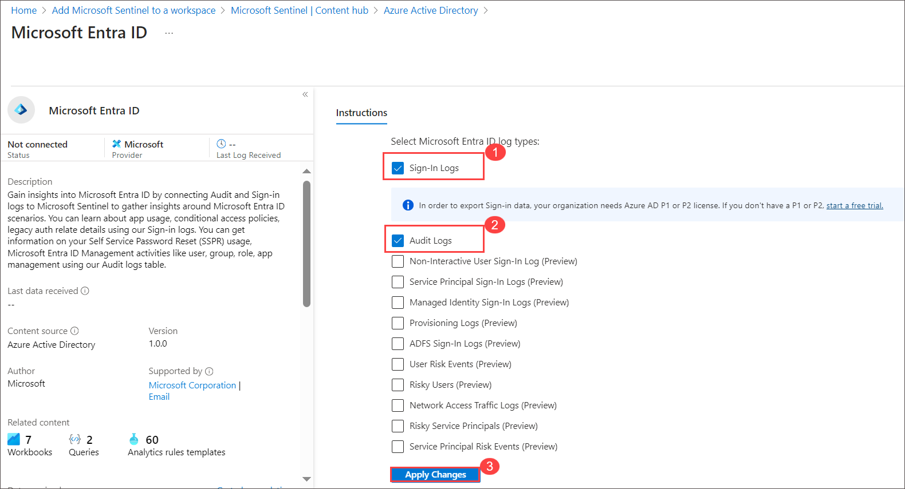
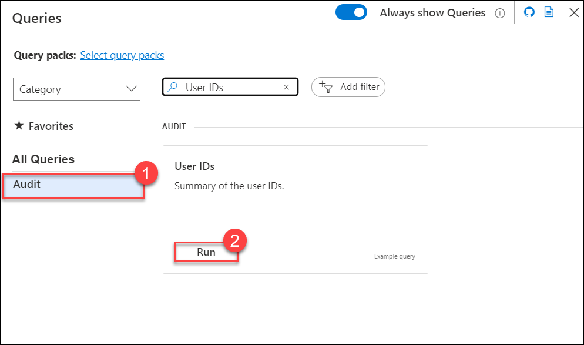

# Lab 27 - Microsoft Sentinel Kusto Queries for Microsoft Entra ID data sources

## Lab scenario

Microsoft Sentinel is Microsoft's cloud-native SIEM and SOAR solution.  Through connecting data sources from Microsoft and third-party security solutions, you have the ability to execute security operations tasks.  In this lab exercise, you will create a Microsoft Sentinel workspace with data connectors to Azure AD for executing hunting queries using Kusto Query Language (KQL). 

## Lab Objectives

In this lab, you will be performing the following tasks:

- Task 1 - Create a Microsoft Sentinel workspace
- Task 2 - Add Azure AD as a Data source
- Task 3 - Run Kusto query on User activity

## Architecture Diagram

#### Estimated time: 60 minutes

### Exercise 1 - Configure Microsoft Sentinel for Kusto Queries
Configuring Microsoft Sentinel for Kusto Queries enables advanced log and security data analysis within the Azure Sentinel platform, enhancing threat detection and response capabilities.

#### Task 1 - Create a Microsoft Sentinel workspace

1. In **Search resources, services, and docs** search and select for **Microsoft Sentinel**. 

1. On the **Microsoft Sentinel** page, select **+ Create**.

1. In the **Add Microsoft Sentinel to a workspace** tile, select **Create a new workspace**.

1. In **Resource group**, select **sc-300-rg**.

1. Name the workspace as **SentinelLogAnalytics**.

1. Select Region as **<inject key="Region" enableCopy="false"/>**.

1. Select **Review + Create** and then **Create**.

1. After the Log Analytics workspace deployment completes, choose the **Refresh** button. Then select your workspace and select **Add**.  This will add the workspace to Microsoft Sentinel and open Microsoft Sentinel.

1. If prompted, select **OK** to activate the Microsoft Sentinel free trial.

   > **Congratulations** on completing the task! Now, it's time to validate it. Here are the steps:
   > - Navigate to the Lab Validation Page, from the upper right corner in the lab guide section.
   > - Hit the Validate button for the corresponding task. You can proceed to the next task if you receive a success message.
   > - If not, carefully read the error message and retry the step, following the instructions in the lab guide.
   > - If you need any assistance, please contact us at labs-support@spektrasystems.com. We are available 24/7 to help you out.

#### Task 2 - Add Microsoft Entra ID as a Data source

1. In **Microsoft Sentinel**, from the left-hand navigate menu under the **Configuration** section, select **Data connectors**.

1. Scroll down under the Getting started section Click on **Get these data connectors**. 

1. In the list of Data connectors, locate **Azure Active Directory** and select.

1. To the right, a preview tile will open.  Select **Install**.

1. Once installation is done. navigate back to the menu to **Configuration** and select **Data connectors (1)** .

1. Select **Microsoft Entra ID** connector name and to the right, a preview tile will open click on **Open connector page**.

   

1. In the connector page, the instructions and next steps will be provided for the data connector. Verify that a check-mark is next to each of the **Prerequisites** to continue with the **Configuration**.

1. Under **Configuration**, check the boxes for **Sign-in logs** and **Audit logs**. Additional log sources are available but are currently in **Preview** and out of scope for this course and click on **Apply Changes**. 
   

1. Notification will be provided that the changes were applied successfully. Navigate to the **Microsoft Sentinel** workspace by selecting the **X** on the top right of the connector page.

1. Select **Refresh** on the **Microsoft Sentinel | Data connectors** tile and the number 1 will show in the **Connected** count.

   

   **Note** - The Azure AD data connector may take a few minutes to show in the active count. 

#### Task 3 - Run Kusto query on User activity

1. In **Microsoft Sentinel** page, from the left-hand navigation page select **Logs** under the **General** menu section.

1. Close the **Welcome to Log Analytics** window.

1. A window will open with sample queries, select **Audit (1)**, search and scroll to find **User IDs**.

1. Select **Run (2)**.

   

1. This will provide a list of User IDs on Azure AD.  Since we have just created the workspace, you may not see results. Copy the format of the query and paste it in notepad you need this in next step.

1. From the left-hand navigation menu, under **Threat management** section, select **Hunting**.

1. Select **Queries** from the tab and click on **+ New query** from top.

1. Enter the name as **Anomalous sign-in location by user account and authenticating application** and paste the query which you have copied earlier in this task.

1. This query over Microsoft Entra ID sign-in considers all user sign-ins for each Microsoft Entra ID application and picks out the most anomalous change in location profile for a user within an individual application. The intent is to hunt for user account compromise, possibly via a specific application vector. 

1. Select **View query results** to run the query.

1. This may not provide results with the new workspace, but you now have seen how queries can be run to gather information or for hunting potential threats.

## Review

In this lab you have completed the following tasks:

- Create a Microsoft Sentinel workspace
- Add Azure AD as a Data source
- Run Kusto query on User activity

## You have successfully completed the lab.
