# Lab 28 - Monitor and manage security posture with Identity Secure Score

## Lab scenario

Microsoft Entra Identity Protection provides automated detection and remediation to identity-based risks, and provides data in the portal to investigate potential risks. Microsoft Entra Identity Protection also provides an Identity Secure Score to monitor and improve your identity security posture.  In the same manner as Microsoft Defender XDR and Microsoft Defender for Cloud, Identity Secure Score provides improvement actions and recommendations that can improve your overall security posture for identity in Microsoft Entra ID.  This lab will explore this capability. 

>**Note:** Since this lab is running on a new created tenant environment, you will probably get an Identity Secure Score of 30% or less.  It takes about 24 hours for viable data to enter the calculation to give you a valid score.

## Estimated time: 15 minutes

## Lab objectives

In this lab, you will complete the following tasks:

+ Task 1 - Review Identity Secure Score and improvement actions
+ Task 2 - Execute an improvement action

## Architecture Diagram

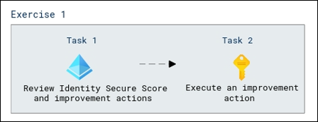

## Exercise 1 - Using Identity Secure Score to monitor and manage identity security posture

### Task 1 - Review Identity Secure Score and improvement actions

In this task, you will review the Identity Secure Score in Microsoft Entra and explore the improvement actions that enhance your organization's identity security posture. You'll navigate the dashboard to assess focused actions for boosting your overall tenant security.

1. Open a new tab, and sign in to the [https://entra.microsoft.com/](https://entra.microsoft.com/).

1. Sign in using below credentials :

   | Setting | Value |
   | :--- | :--- |
   | Username | **<inject key="AzureAdUserEmail" enableCopy="true" />** |
   | Password | **<inject key="AzureAdUserPassword" enableCopy="true" />** |

1. In the left navigation menu, under **Entra ID (1)**, select **Identity Secure Score (2)**.

   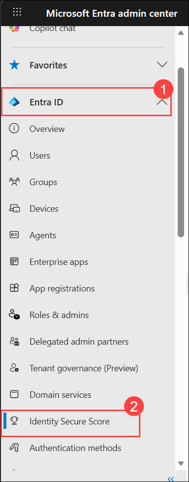

1. On the **Security | Identity Secure Score**, review the information provided.

1. Notice the value to **Identity Secure Score**, your **Score History** and other information.

   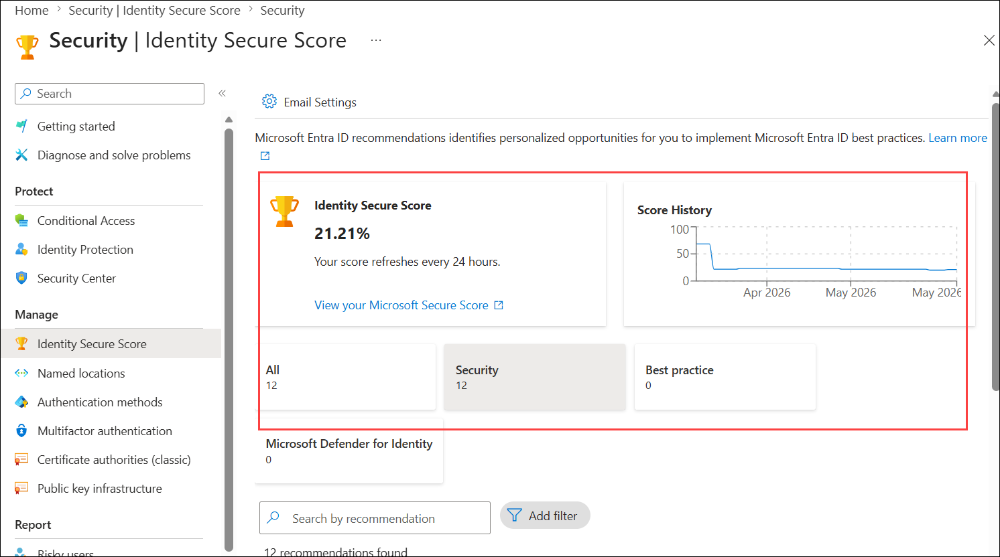

1. Scroll down to view the **Recommendations**.

   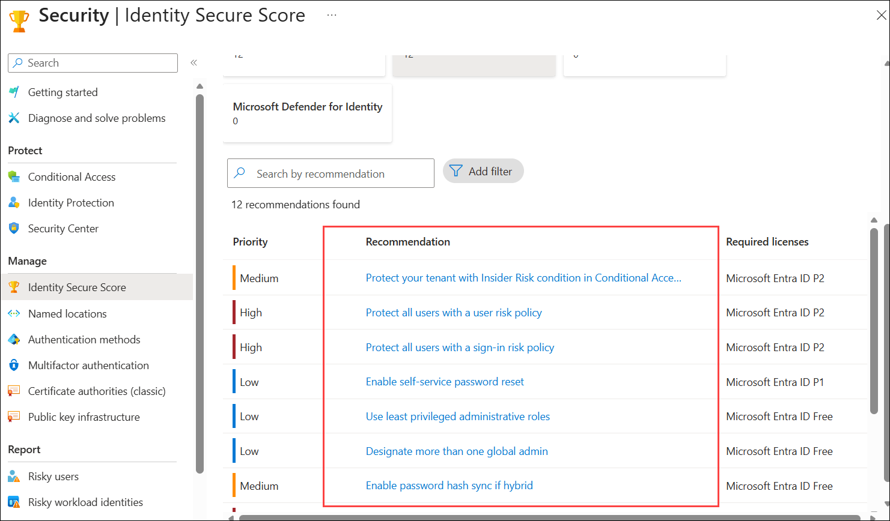

    >**Note** - In contrast to the recommendations in Microsoft Defender for Cloud and Microsoft Defender XDR, these actions are specific to identity.  This provides a more focused list of potential actions to your security posture management for identity. Any recommendations initiated from this list will also provide an impact to your overall tenant security posture. 

### Task 2 - Execute an improvement action

In this task, you will execute an improvement action by enabling Microsoft Entra ID Identity Protection sign-in risk policies. You'll create a new conditional access policy to strengthen identity security, configuring users, resources, and access controls.

1. To improve one area of the identity security posture, select **Protect all users with a user risk policy**.

   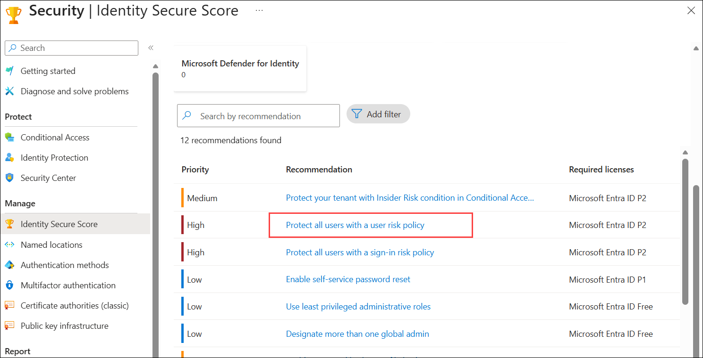

1. In the page that opens, review the risk. Additionally, you see an **Action plan** on how to resolve the threat.

1. Select the link **Follow these steps to create a Conditional Access policy from scratch or by using a template**. Review the steps in the article.

   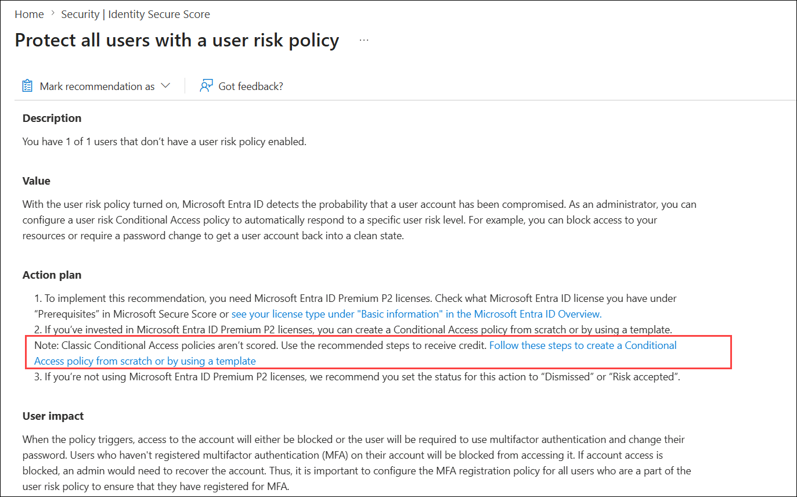

1. Close the article tab, and return to the tab with **Microsoft Entra ID** opened.

1. From the menu on the left, select **Conditional Access**.

   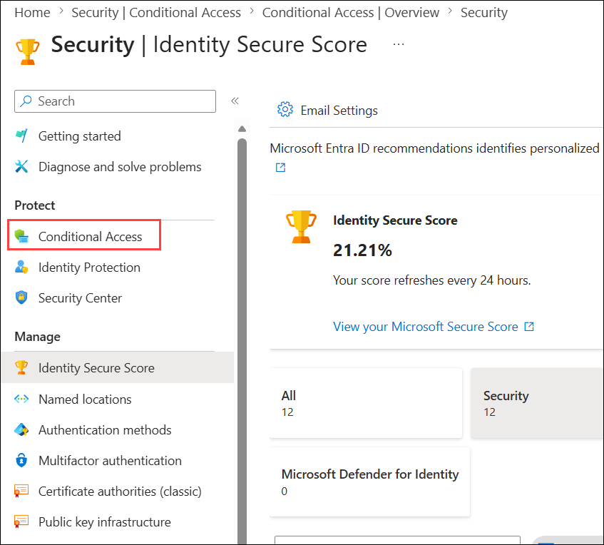

1. Select **+ Create new policy**.

   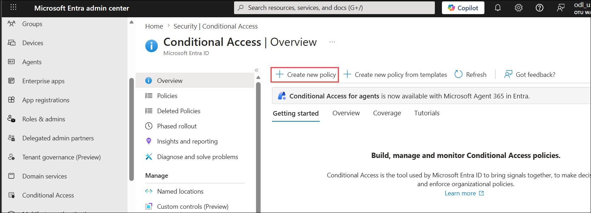

1. Use the following values to create the policy:

   - Name: **User risk protection policy (1)**

   - Assignments: Select **0 users or agents (Preview) selected (2)**

     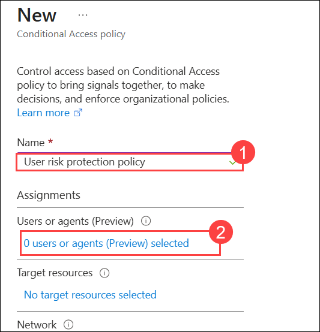

   - On the **Include (1)** tab mark **All users (2)**     

     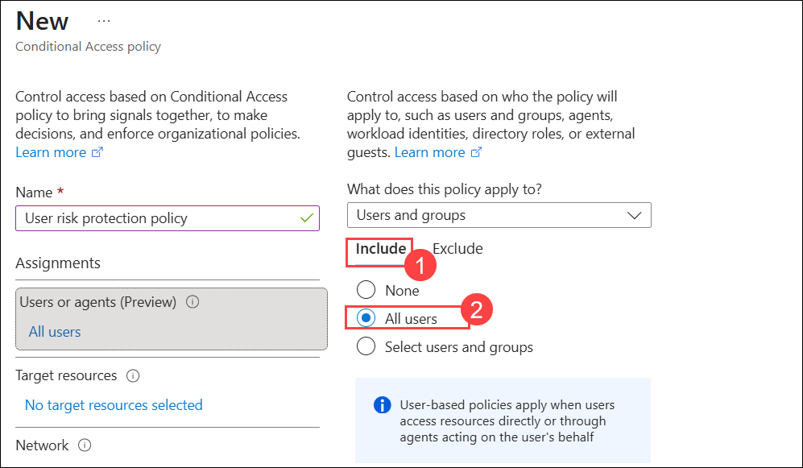

   -  On the **Exclude (1)** tab, use the **Users and groups (2)**  

     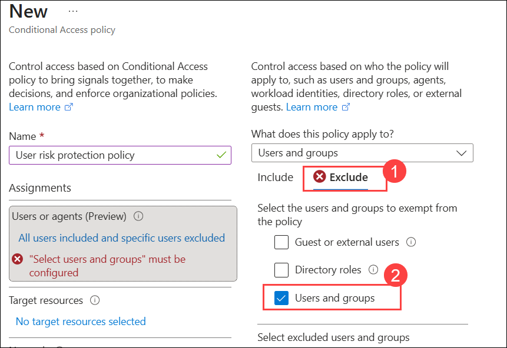   

   - Choose any accounts that must maintain the ability to use legacy authentication. Microsoft recommends you exclude at least one account to prevent yourself from being locked out. For now select **Spektra Systems** and **ODL_User <inject key="DeploymentID"></inject> (3)** and then click **Select (2)**.

     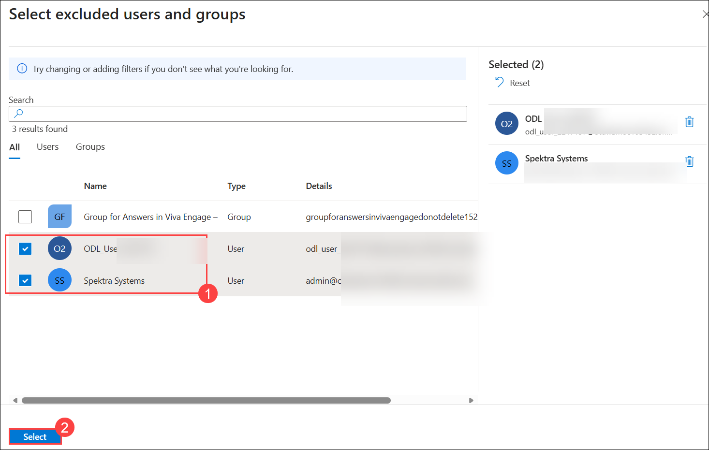  

   - Under Target resources, Select **No target resource selected (1)**, and then select **All resources (formerly 'All cloud apps') (2)**.

     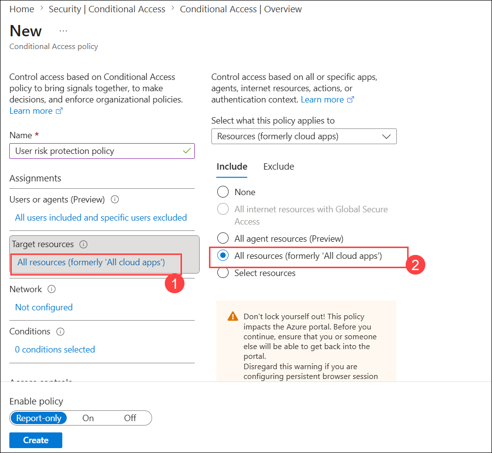

   - **Network:** Leave at default

   - Under Conditions select **0 conditions selected (1)** > Under **User risk** select the **Not configured (2)** link, set **Configure** to **Yes (3)**. Mark the box next to **High** and **Medium** **(4)** and then **Done (5)**.

     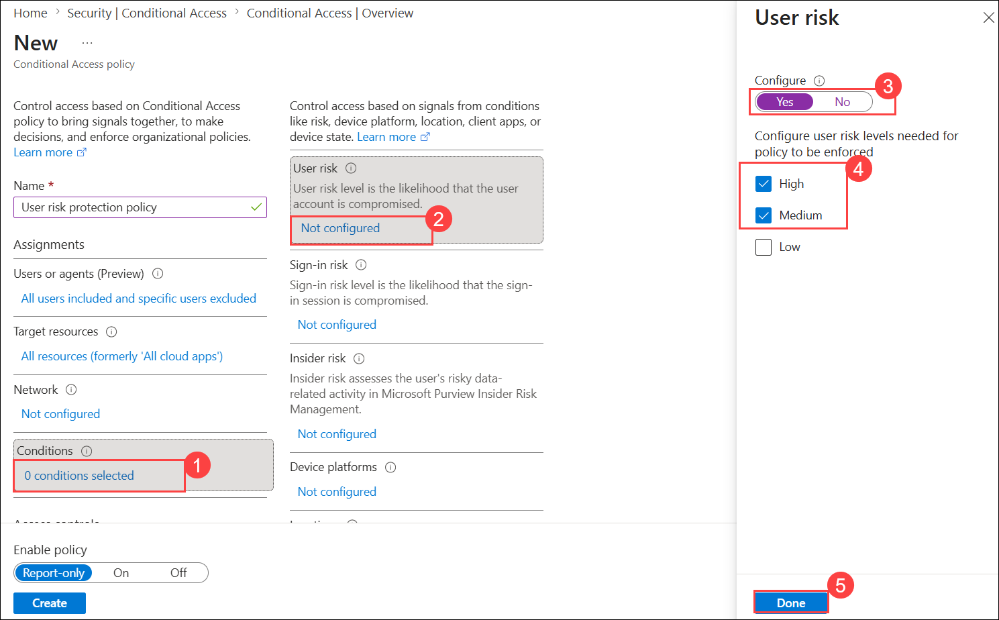
   
   - **Access controls:**  Under **Grant** select **0 controls selected (1)**,Select **Require risk remediation (2)**

     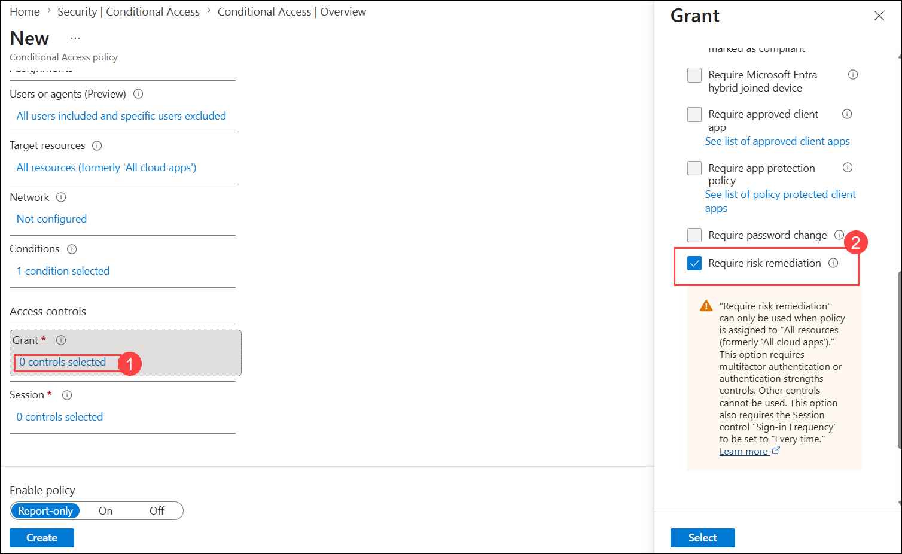

   - Under the **Require authentication strength** select **Phishing-resistant MFA (1)** and then **Select (2)**.

     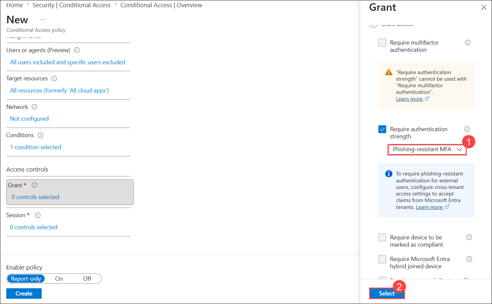

   - Confirm your settings and set Enable policy to **Report-only (1)**.

   - Select **Create (2)** to create to enable your policy.

     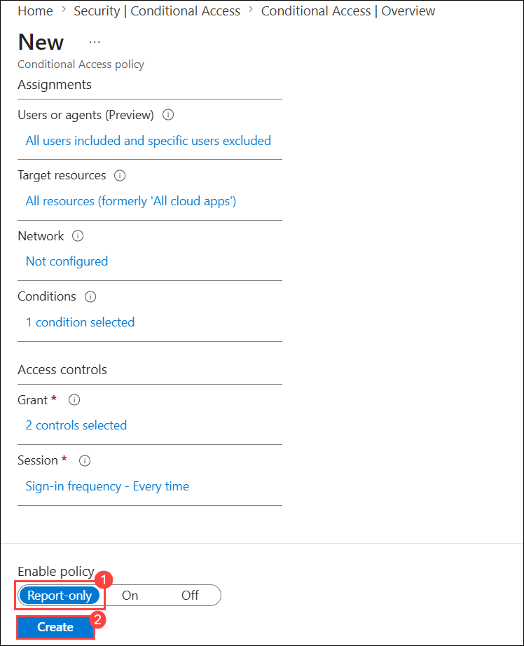

## Review

In this lab, you have completed:
- Reviewed Identity Secure Score and improvement actions
- Executed an improvement action

## You have successfully completed the lab
