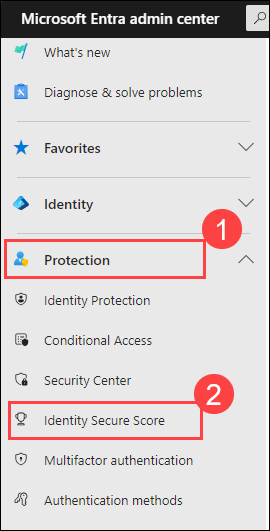
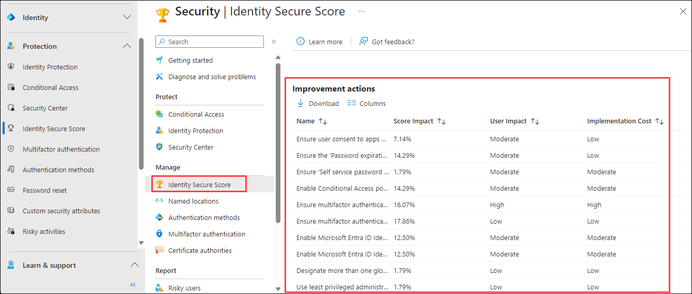
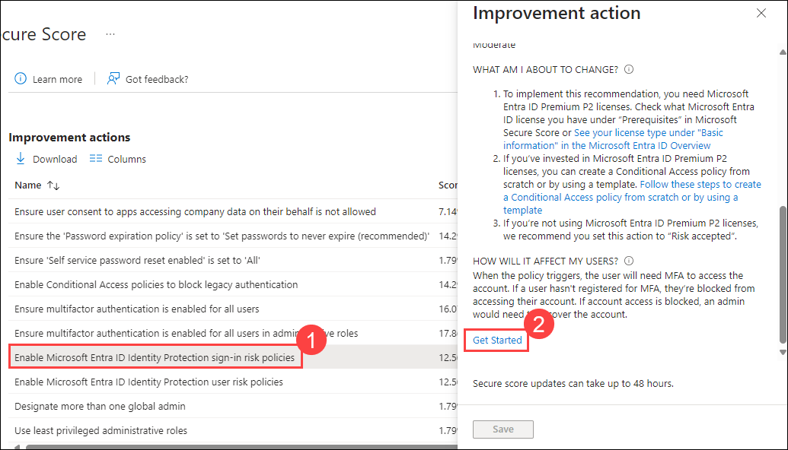
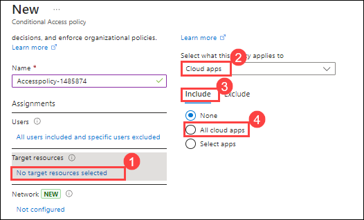
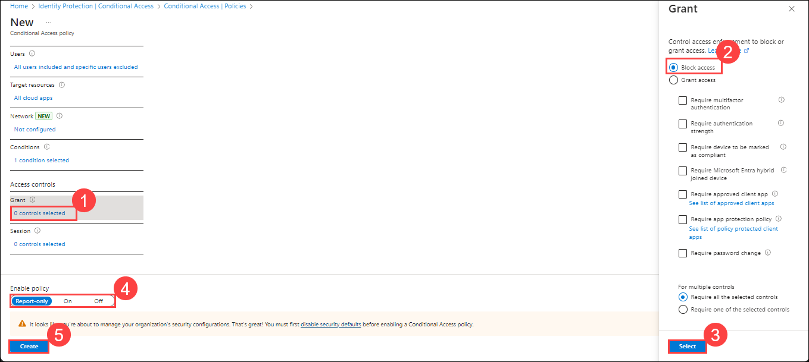

# Lab 28 - Monitor and manage security posture with Identity Secure Score

## Lab scenario

Microsoft Entra Identity Protection provides automated detection and remediation to identity-based risks, and provides data in the portal to investigate potential risks. Microsoft Entra Identity Protection also provides an Identity Secure Score to monitor and improve your identity security posture. In the same manner as Microsoft Defender XDR and Microsoft Defender for Cloud, Identity Secure Score provides improvement actions and recommendations that can improve your overall security posture for identity in Microsoft Entra ID. This lab will explore this capability.

## Lab objectives
In this lab, you will complete the following tasks:

+ Task 1 - Review Identity Secure Score and improvement actions
+ Task 2 - Execute an improvement action

## Architecture Diagram

## Estimated time: 15 minutes

## Architecture diagram

### Exercise 1 - Using Identity Secure Score to monitor and manage identity security posture

#### Task 1 - Review Identity Secure Score and improvement actions

In this task, you will review the Identity Secure Score in Microsoft Entra and explore the improvement actions that enhance your organization's identity security posture. You'll navigate the dashboard to assess focused actions for boosting your overall tenant security.

1. Open a new tab, and sign in to the [https://entra.microsoft.com/](https://entra.microsoft.com/).

2. Sign in using below credentials :

   | Setting | Value |
   | :--- | :--- |
   | Username | **<inject key="AzureAdUserEmail" enableCopy="true" />** |
   | Password | **<inject key="AzureAdUserPassword" enableCopy="true" />** |

3. From the left-hand navigation pane, select **Protection (1) > Identity Secure Score (2)** to view the dashboard.

4. Select **Identity Secure Score**. This will take you to the Identity Secure Score dashboard.

   

5. Scroll down to view the **Improvement actions**.

   

6. In contrast to the improvement actions in Microsoft Defender for Cloud and Microsoft Defender XDR, these improvement actions are specific to identity. This provides a more focused list of potential actions to your security posture management. Any improvement actions initiated from this list will also provide an impact to your overall tenant security posture.

#### Task 2 - Execute an improvement action

In this task, you will execute an improvement action by enabling Microsoft Entra ID Identity Protection sign-in risk policies. You'll create a new conditional access policy to strengthen identity security, configuring users, resources, and access controls.

1. To improve one area of the identity security posture, select **Enable Microsoft Entra ID Identity Protection sign-in risk policies (1)**.

1. In the tile that opens, scroll down and select **Get Started (2)**.

   

1. A new tab will open for **Identity Protection**. Select **Conditional Access** under Protect from the left tab.

   

   **Note**: By default the Get Started button will open in Azure Portal. You can use the portal or return to the Entra admin center. Either will work.

1. Select **+ New policy**.

1. Give your policy a name as **Accesspolicy-<inject key="DeploymentID" enableCopy="false"/> (1)**. We recommend that organizations create a meaningful standard for the names of their policies.

1. Under **Assignments|Users**, select **0 users and groups selected (2)**. Under **Include (3)**, select **All users (4)**.

   

1. Under **Exclude (1)**, select **Users and groups (2)** and choose any accounts that must maintain the ability to use legacy authentication. Microsoft recommends you exclude at least one account to prevent yourself from being locked out. For now select **Spektra Systems** and **ODL_User <inject key="DeploymentID"></inject> (3)** and then click **Select (4)**.

   

1. Under Target resources, select **No target resources selected (1)** > **Cloud apps (2)** > under **Include (3)**, select **All cloud apps (4)**.

   

1. Under Conditions select **0 conditions selected (1)** > under **Client apps** select **Not configured (2)**, set **Configure** to **Yes (3)**. Check only the boxes **Exchange ActiveSync clients** and **Other clients (4)**. Select **Done (5)**.

   

1. Under Access controls|Grant select **0 controls selected (1)**, select **Block access (2)**. Choose **Select (3)**.

1. Confirm your settings and set Enable policy to **Report-only (4)**.

1. Select **Create (5)** to create to enable your policy.

   

### Review
In this lab, you have completed:
- Review Identity Secure Score and improvement actions
- Execute an improvement action

### You have successfully completed the lab
