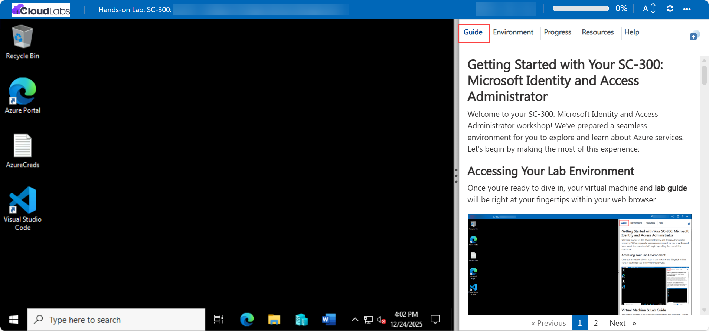
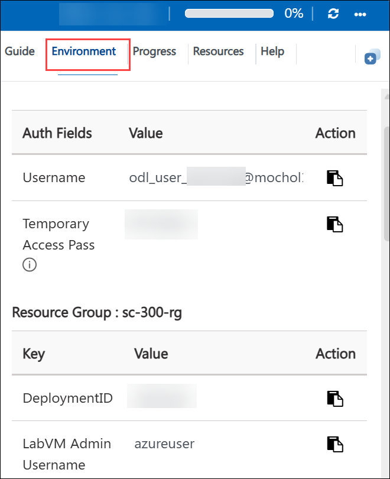
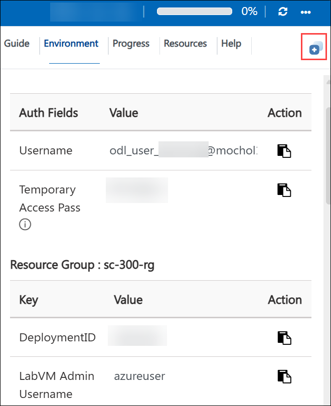
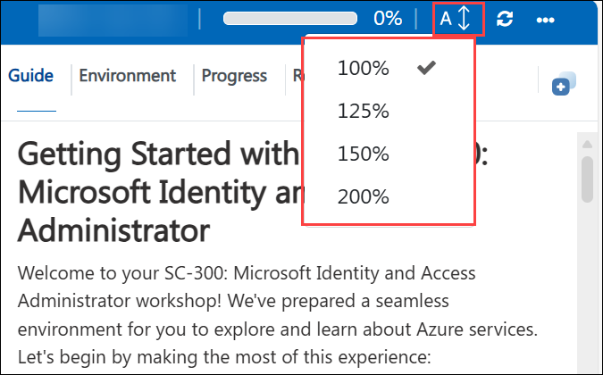
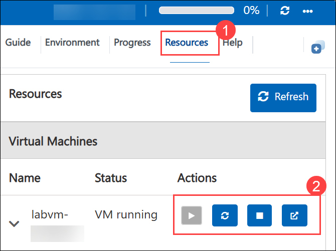
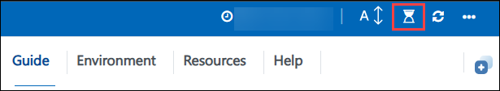
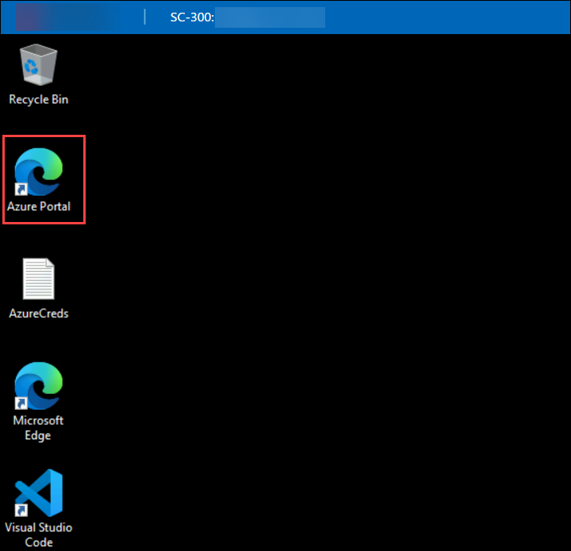
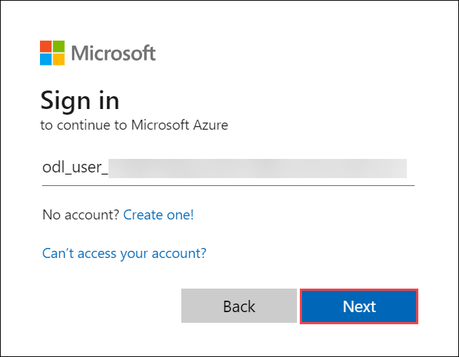
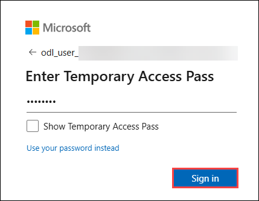
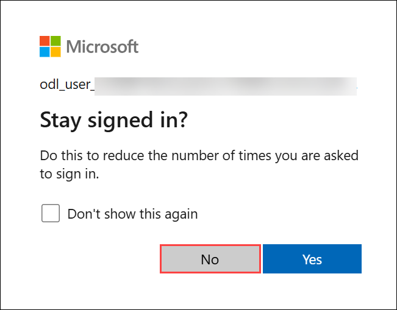

# Getting Started with Your SC-300: Microsoft Identity and Access Administrator
 
Welcome to your SC-300: Microsoft Identity and Access Administrator  workshop! We've prepared a seamless environment for you to explore and learn about Azure services. Let's begin by making the most of this experience:
 
## Overview

This workshop covers the Microsoft SC-300 identity and access administration lab series. Across the labs, you will work with Microsoft Entra ID to manage users, groups, roles, guest access, external collaboration, application identities, and security policies. You will also configure identity governance, conditional access, privileged identity management, risk-based protections, and monitoring to help secure your Azure identity environment.

## Objectives

By the end of these labs, you will be able to:

1. Manage Microsoft Entra ID users, groups, directory roles, licenses, and guest accounts.
2. Configure tenant properties, external collaboration settings, federation, and hybrid identity integration.
3. Enable and validate multi-factor authentication, self-service password reset, conditional access, and sign-in risk policies.
4. Register and manage applications, configure app permissions, consent, and tenant-wide admin consent.
5. Use Microsoft Entra Identity Governance to create catalogs, access packages, lifecycle policies, terms of use, and access reviews.
6. Configure Privileged Identity Management for role activation, resource role assignments, and role lifecycle management.
7. Discover and protect cloud apps with Microsoft Defender for Cloud Apps and apply access and session controls.
8. Monitor identity security posture using Identity Secure Score, Microsoft Sentinel queries, and audit-based insights.
9. Protect credentials and access secrets using Azure Key Vault and managed identities for Azure resources.
10. Apply identity best practices to secure access, govern user lifecycle, and monitor compliance across your directory.

## Pre-requisites

- Familiarity with Azure and the Azure Portal.
- Basic understanding of identity and access management concepts, including users, groups, roles, and authentication.
- Knowledge of multi-factor authentication, conditional access, and access governance is helpful.
- Access to the lab environment credentials and the Microsoft Entra admin center.
- General comfort navigating Azure services and following step-by-step Azure portal tasks.

## Architecture

The lab architecture demonstrates Microsoft Entra ID identity and access management patterns that protect users, applications, and external collaborators.

1. **Microsoft Entra ID :** Central directory service for users, groups, roles, guest accounts, and authentication.
2. **Identity Governance:** Catalogs, access packages, lifecycle settings, terms of use, and access reviews help manage access for internal and external users.
3. **Conditional Access and MFA:** Policies enforce secure sign-ins, multi-factor authentication, device conditions, and risk-based access controls.
4. **Privileged Identity Management:** Just-in-time elevation and role activation secure privileged administration tasks.
5. **Application Identity and Consent:** App registrations, app roles, and tenant-wide consent manage trusted application access.
6. **Defender for Cloud Apps:** Cloud app discovery and access policies help enforce security controls for SaaS and cloud resources.
7. **Monitoring and Compliance:** Identity Secure Score and Sentinel query monitoring provide visibility into identity security posture and audit activity.
8. **Key Vault and Managed Identities:** Secure storage and access to secrets support managed identity use for Azure resources.

## Explanation of Components

1. **Microsoft Entra ID :** The core directory used to create users, invite guests, assign roles, manage authentication methods, and enforce access policies.
2. **Users and Groups:** Used to organize identities, assign licenses, apply policies, and control who can access resources.
3. **Directory Roles and PIM:** Built-in and custom roles define administrative privileges, while Privileged Identity Management enables time-bound role activation and approval workflows.
4. **External Collaboration:** Guest user invitations, collaboration settings, and lifecycle management control how external partners access your directory.
5. **Conditional Access and Authentication Policies:** Enforce sign-in security using policies for MFA, device state, locations, user risk, application access, and registration requirements.
6. **Application Registrations and Access Management:** Register applications, configure redirect URIs, manage permissions, and control tenant-wide consent for app access.
7. **Identity Governance:** Catalogs and access packages let you deliver resource access with governance, while terms of use and access reviews help maintain compliance.
8. **Defender for Cloud Apps:** Provides visibility into cloud app usage, enforces access restrictions, and protects sessions and data in cloud applications.
9. **Identity Secure Score and Sentinel Monitoring:** Assess identity security posture, identify improvement actions, and investigate identity events with Azure Sentinel queries.
10. **Azure Key Vault and Managed Identities:** Store secrets securely and allow Azure resources to authenticate without embedded credentials, improving identity security for managed applications.

## Accessing Your Lab Environment
 
Once you're ready to dive in, your virtual machine and **Guide** will be right at your fingertips within your web browser.
 

# Virtual Machine & Lab Guide
 
Your virtual machine is your workhorse throughout the workshop. The lab guide is your roadmap to success.
 
## Exploring Your Lab Resources
 
To get a better understanding of your lab resources and credentials, navigate to the **Environment** details tab.
 

 
## Utilizing the Split Window Feature
 
For convenience, you can open the lab guide in a separate window by selecting the **Split Window** button from the Top right corner.
 

 
## Utilizing the Zoom In/Out Feature

To adjust the zoom level for the environment page, click the A↕ : 100% icon located next to the timer in the lab environment.

## Managing Your Virtual Machine
 
Feel free to **Start, Stop, or Restart (2)** your virtual machine as needed from the **Resources (1)** tab. Your experience is in your hands!
 

 
## Lab Duration Extension

1. To extend the duration of the lab, kindly click the **Hourglass** icon in the top right corner of the lab environment. 

    

    >**Note:** You will get the **Hourglass** icon when 10 minutes are remaining in the lab.

2. Click **OK** to extend your lab duration.
 
   

3. If you have not extended the duration prior to when the lab is about to end, a pop-up will appear, giving you the option to extend. Click OK to proceed.
   
## Let's Get Started with Azure Portal
 
1. On your virtual machine, click on the Azure Portal icon as shown below:
 
    

2. You'll see the **Sign into Microsoft Azure** tab. Here, enter your credentials:
 
   - **Email/Username:** <inject key="AzureAdUserEmail"></inject>
 
     
 
3. Next, provide your password:
 
   - **Password:** <inject key="AzureAdUserPassword"></inject>
 
     

4. If you get a pop-up appears **Stay signed in**, then select **No**.
 
   

## Support Contact

The CloudLabs support team is available 24/7, 365 days a year, via email and live chat to ensure seamless assistance at any time. We offer dedicated support channels tailored specifically for both learners and instructors, ensuring that all your needs are promptly and efficiently addressed.

Learner Support Contacts:

- Email Support: cloudlabs-support@spektrasystems.com

- Live Chat Support: https://cloudlabs.ai/labs-support

Now, click on Next from the lower right corner to move on to the next page.
   
   

## Happy Learning!!